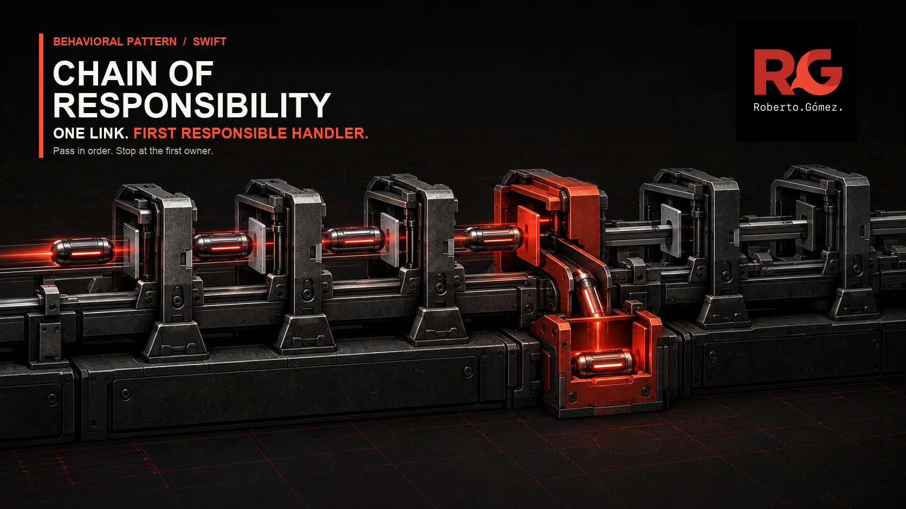
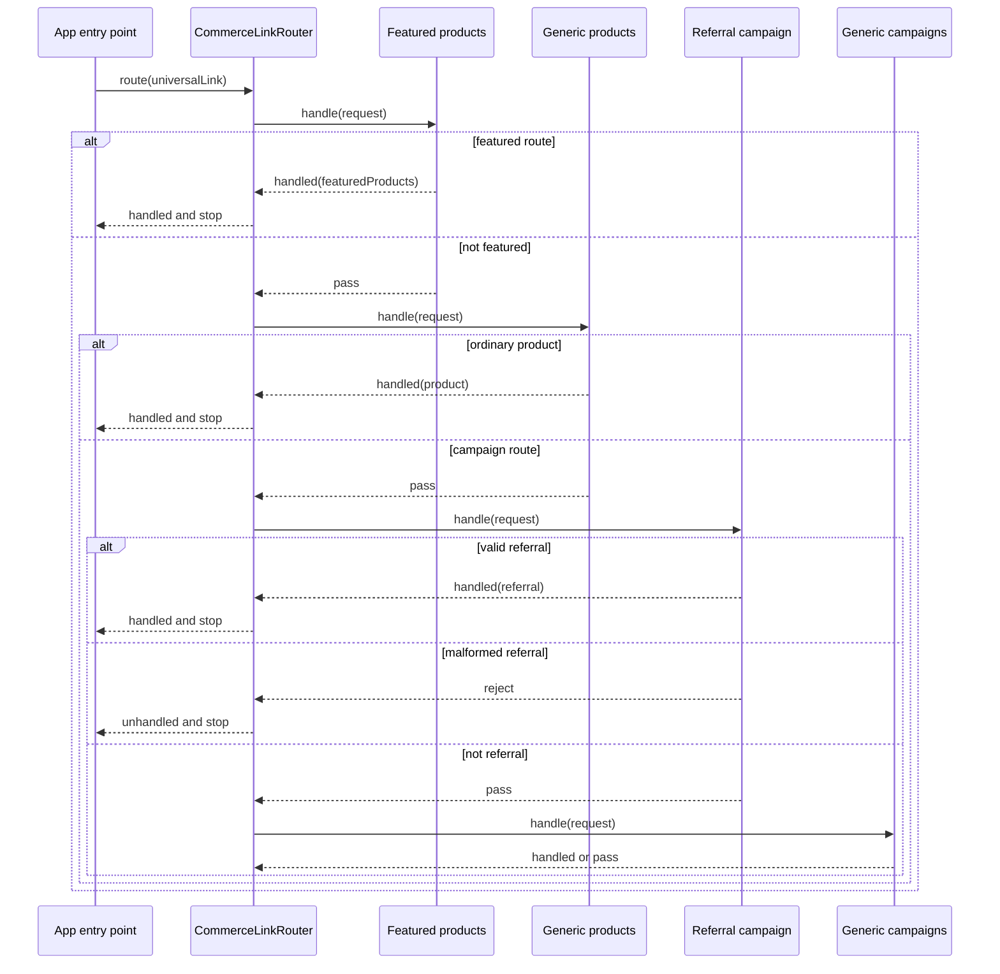

# 🔗 Chain of Responsibility



> **Caption:** One universal link moves through an explicit feature order and
> stops as soon as a responsible handler accepts or rejects it.

**Category:** Behavioral

## 🎯 The app problem

A commerce app receives universal links for products, orders, campaigns,
account recovery, and stores. Each feature can own its routing decision, but
the app must still preserve one deterministic rule: ask handlers in order and
stop after the first terminal answer.

Two routes make that order observable. Featured products must run before the
generic product handler, and referral campaigns must run before generic
campaigns. A malformed referral is owned but invalid; it must stop as
unhandled rather than becoming a campaign whose slug happens to be `referral`.

### Requirements

- Accept only HTTPS links for the configured commerce host.
- Let each feature decide whether a link belongs to it.
- Ask the next handler only after an explicit pass.
- Stop after the first handled destination.
- Stop an owned but invalid route without falling through to a generic sibling.
- Keep authentication inside the order feature's decision.
- Return `.unhandled` when every feature passes or one feature rejects.
- Make specialized-before-generic order visible at composition time.

## 🪶 Start with direct Swift

[`UniversalLinkDirect.swift`](../../Sources/DesignPatterns/ChainOfResponsibility/UniversalLinkDirect.swift)
uses one `DirectCommerceLinkRouter` and one exhaustive switch. For four stable
route families owned together, that is the clearest design: the compiler-visible
branch set, authentication guard, and terminal result fit in one place.

The direct version deliberately has no handler protocol, linked nodes,
middleware array, type erasure, or dependency container. Several switch cases
do not justify a pattern by themselves.

## ⚡ The turning point

[`UniversalLinkPressure.swift`](../../Sources/DesignPatterns/ChainOfResponsibility/UniversalLinkPressure.swift)
adds featured products, referral campaigns, and retail stores. The central
router then contains measurable coordination pressure:

- five independently changing feature families in one switch;
- eight handling clauses plus the default pass-through;
- three new feature-owned decisions editing the same type;
- two specialized-before-generic precedence constraints;
- two query-validation branches; and
- two authentication outcomes for one order route.

The switch still works, but its source order has become cross-feature policy.
A merchandising change can shadow ordinary products, while a growth route can
turn malformed referrals into valid campaign pages. This is the point where an
explicit ordered chain gives ownership back to features without hiding order.

## 🧭 Pattern intent

Chain of Responsibility passes a request through ordered handlers until one of
them produces a terminal decision. The sender knows the chain boundary and its
order, not which concrete feature will accept a given link.

This example uses an array instead of mutable `next` references. The behavioral
contract is the same, while composition remains readable as one ordered list
and value types need no post-initialization linking.

## 🧩 Participants and responsibilities

| App role | Swift type | Responsibility |
| --- | --- | --- |
| Request | [`CommerceLinkRequest`](../../Sources/DesignPatterns/ChainOfResponsibility/UniversalLinkChain.swift) | Carries the validated URL, two path segments, and current authentication state to each handler. |
| Handler boundary | [`CommerceLinkHandler`](../../Sources/DesignPatterns/ChainOfResponsibility/UniversalLinkChain.swift) | Returns `.pass`, `.handled(destination)`, or terminal `.reject` for one request. |
| Chain | [`CommerceLinkRouter`](../../Sources/DesignPatterns/ChainOfResponsibility/UniversalLinkChain.swift) | Validates the app boundary, asks handlers in array order, and stops on the first terminal decision. |
| Specialized handlers | `FeaturedProductsLinkHandler` and `ReferralCampaignLinkHandler` | Claim exact routes before their generic siblings; malformed owned referrals reject terminally. |
| Generic handlers | `ProductLinkHandler` and `CampaignLinkHandler` | Accept remaining links in their feature families after specialized handlers pass. |
| Independent handlers | `OrderLinkHandler`, `AccountRecoveryLinkHandler`, and `StoreLinkHandler` | Own authentication, token validation, and retail routing without editing sibling handlers. |

The protocol has several immediate implementations because the pressure is
independent feature ownership. The array uses Swift's protocol existential
directly; there is no custom type-erased box or general-purpose pipeline type.

## ⚙️ How the Swift implementation works

1. `CommerceLinkRouter.route(_:isAuthenticated:)` rejects an insecure or
   foreign-host URL before constructing a request.
2. The router requires the two-segment shape shared by this teaching unit and
   creates one `CommerceLinkRequest`.
3. It asks each handler in the configured array order.
4. `.pass` continues to the next handler.
5. `.handled(destination)` returns that destination immediately.
6. `.reject` also terminates, but the app-facing result is `.unhandled`. This
   distinguishes an unrelated URL from a malformed URL already owned by a
   feature, so a generic sibling cannot reinterpret it.
7. If every handler passes, the router returns `.unhandled`.

The composition root makes precedence reviewable:

```swift
let router = CommerceLinkRouter(
    supportedHost: "shop.example.com",
    handlers: [
        FeaturedProductsLinkHandler(),
        ProductLinkHandler(),
        OrderLinkHandler(),
        ReferralCampaignLinkHandler(),
        CampaignLinkHandler(),
        AccountRecoveryLinkHandler(),
        StoreLinkHandler()
    ]
)
```

Putting `ProductLinkHandler` first would deliberately interpret
`/products/featured` as an ordinary product. The order is therefore data at the
composition boundary rather than incidental case order inside one router.

## 🗺️ Diagram



Observe that only `.pass` advances the request. A handled product never reaches
campaign handlers, and a malformed referral stops before the generic campaign
handler can reinterpret it. The remaining order, recovery, and store handlers
follow the same contract after the branches shown.

**Accessible description:** The app gives one validated universal link to an
ordered router. The featured-products handler sees it first. If that handler
passes, the generic product handler gets a chance. Campaign handlers are asked
later in the same specialized-before-generic order. A handled or rejected link
stops immediately; only an explicit pass reaches the next feature.

## ▶️ Run the example

From the repository root:

```sh
swift test -Xswiftc -warnings-as-errors --filter ChainTests
```

The suite uses local URLs and value types. It needs no navigation framework,
authentication backend, web fallback, analytics service, or network access.

## 🧪 Tests

```sh
swift test -Xswiftc -warnings-as-errors --filter ChainTests
swift test -Xswiftc -warnings-as-errors --filter ChainProblemTests
swift test -Xswiftc -warnings-as-errors --filter ChainPressureTests
```

[`ChainTests.swift`](../../Tests/DesignPatternsTests/ChainTests.swift) proves:

- specialized handlers win when they precede generic siblings;
- an ordinary product or campaign advances after a specialized handler passes;
- reversing handler order changes the observable result;
- malformed owned referrals reject before generic fallback;
- unknown and foreign-host links remain unhandled;
- authenticated orders open directly; and
- signed-out orders retain their destination through sign-in.

The problem and pressure suites preserve the direct baseline and the centralized
branching evidence that earned the handler boundary.

## ⚖️ Trade-offs

### What improves

- Each feature owns its route matching, validation, and dependencies.
- Adding a store-like feature adds one handler and one composition entry instead
  of another branch to the central switch.
- Precedence is visible in one array and executable in focused tests.
- Only an explicit pass advances the request.
- Terminal rejection prevents malformed specialized routes from falling into
  generic handlers.

### What it costs

- The final design adds one protocol, one request value, one decision enum, one
  chain type, and seven focused handlers.
- An existential array trades compile-time concrete composition for a small
  runtime dispatch cost and heterogeneous storage.
- The compiler cannot prove that specialized handlers precede generic ones;
  tests and composition review enforce that invariant.
- Route families split across modules still need one owner for the final order.
- `.reject` must remain rare and precisely defined; using it as a generic error
  channel would obscure failures.

## 🔀 Alternatives considered

| Alternative | Prefer it when | Why it does not meet this example now |
| --- | --- | --- |
| One exhaustive switch | One team owns a small, closed route set. | Five feature families and two precedence pairs now change independently at the same source point. |
| Ordered free functions | Handlers are module-private and do not need a shared injection or test boundary. | This is the closest smaller alternative; the protocol earns its cost because features already need heterogeneous composition and independent tests. |
| Parsed route enum plus switch | URL parsing is the risky part and feature decisions remain centrally owned. | It improves parsing exhaustiveness but keeps every feature decision and precedence branch together. |
| Dictionary of closures | Routes are exact keys with no overlap or contextual validation. | Product and campaign routes overlap, order depends on session state, and referrals validate query data. |
| Decorator | Every wrapper should add behavior around the same operation and several wrappers may all run. | This chain selects one responsible feature; later handlers must not run after a terminal decision. |
| Middleware pipeline | Cross-cutting stages should transform, observe, or wrap a request/response flow. | These handlers compete for ownership. They do not all process the link, call `next`, or wrap downstream results. |
| Observer | Several independent subscribers should receive the same event. | A universal link opens at most one destination. |

Decorator and a typical middleware pipeline may also be ordered, but order alone
does not define this pattern. Decorators compose behavior around one known
operation. Middleware commonly performs cross-cutting work before or after a
downstream stage. This chain asks “which feature owns this link?” and stops at
the first terminal answer.

## 🚫 When not to use it

- Keep the exhaustive switch while the route set is small, stable, and owned by
  one team.
- Prefer an enum switch when compile-time exhaustiveness matters more than
  independently deployed feature ownership.
- Prefer ordered functions when no shared handler boundary or heterogeneous
  storage is needed.
- Do not create one handler type per trivial condition merely to remove a
  readable switch.
- Do not use a chain when every consumer must observe the event; use
  Observation, `AsyncStream`, or another broadcast mechanism.
- Do not hide precedence in runtime registration, dependency injection, or
  mutable `next` links when one explicit array is sufficient.
- Do not convert parsing failures or feature errors into `.pass`; only genuinely
  unowned links should continue.

## 🗂️ Source map

- [`UniversalLinkChain.swift`](../../Sources/DesignPatterns/ChainOfResponsibility/UniversalLinkChain.swift) — request, handler decisions, ordered router, and feature-owned handlers.
- [`UniversalLinkDirect.swift`](../../Sources/DesignPatterns/ChainOfResponsibility/UniversalLinkDirect.swift) — destinations and original direct router.
- [`UniversalLinkPressure.swift`](../../Sources/DesignPatterns/ChainOfResponsibility/UniversalLinkPressure.swift) — expanded central switch that exposes ownership and precedence pressure.
- [`ChainTests.swift`](../../Tests/DesignPatternsTests/ChainTests.swift) — final chain order, pass, handle, reject, and authentication tests.
- [`ChainProblemTests.swift`](../../Tests/DesignPatternsTests/ChainProblemTests.swift) — direct baseline acceptance tests.
- [`ChainPressureTests.swift`](../../Tests/DesignPatternsTests/ChainPressureTests.swift) — specialized-route and feature-growth evidence.
- [`chain-of-responsibility-problem.md`](../../Documentation/chain-of-responsibility-problem.md) — initial requirements, direct-design decision, and visual thesis.
- [`chain-of-responsibility-pressure.md`](../../Documentation/chain-of-responsibility-pressure.md) — measured central branching and pattern boundary.
- [`chain-of-responsibility-header.png`](../../Documentation/Assets/Patterns/behavioral/chain-of-responsibility-header.png) — editorial header.
