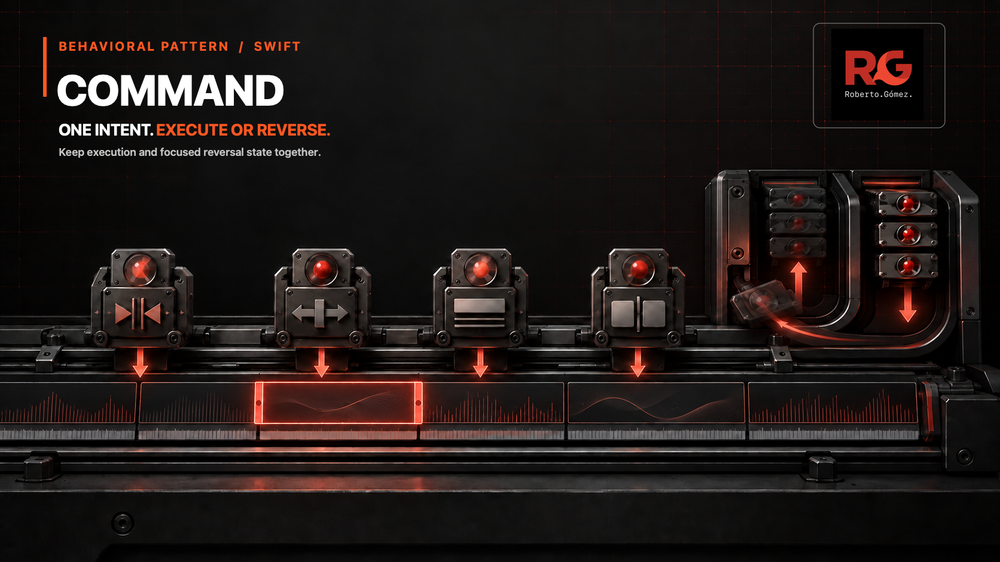
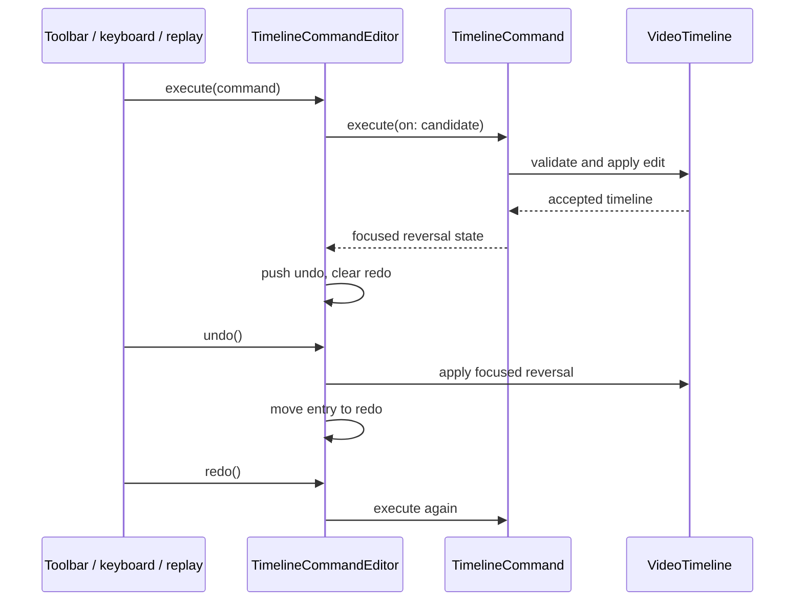

# 🎮 Command



*One portable edit intent moves forward to execute or backward with only the
focused state needed to reverse it.*

**Category:** Behavioral

## 🎯 The app problem

A mobile video editor lets creators trim footage, move clips, split one clip in
two, and update captions. The same edits can arrive from toolbar buttons,
keyboard shortcuts, or an offline collaboration queue. Accepted edits need
bounded multi-step undo and redo without retaining a complete copy of a large
timeline for every history entry.

### Requirements

- Toolbar, keyboard, and offline replay use the same edit vocabulary.
- Undo and redo preserve edit order and discard the redo branch after a new
  accepted edit.
- Rejected and no-op edits leave the timeline and both history stacks intact.
- Offline records serialize portable intent, never local undo state.
- History remains bounded and grows with edit count rather than timeline size.

## 🪶 Start with direct Swift

[`VideoTimelineDirect.swift`](../../Sources/DesignPatterns/Command/VideoTimelineDirect.swift)
starts with `TimelineClip` and `VideoTimeline` values plus focused editor
methods. One optional previous timeline provides atomic one-step undo. This is
the clearer design while the editor has one input path and shallow history:
there is no reusable operation type, invoker, or reversal protocol.

[`VideoTimelinePressure.swift`](../../Sources/DesignPatterns/Command/VideoTimelinePressure.swift)
then extends that direct approach with bounded full-timeline snapshots. Swift
value semantics keep restoration safe, but the retained structure grows with
`timeline size × undo depth`.

## ⚡ The turning point

The concrete pressure is both executable and measured. A four-entry history on
a 1,000-clip timeline retains 4,000 clip entries. Toolbar, keyboard, and offline
replay also repeat four edit cases and four dispatch branches each: 12 branches
describe the same four operations.

A shared routing enum alone would remove duplicated cases, but execution and
reversal would still live elsewhere. Once the value owns how intent is applied
and produces the exact prior state needed for reversal, it is the smallest
useful Swift form of Command.

## 🧭 Pattern intent

Command makes a timeline edit a portable value. The value carries the intent
and arguments required to execute; a successful execution creates one private
history entry with only the prior fields needed to undo that edit. The editor
owns ordering, the history limit, redo invalidation, and the current timeline.

## 🧩 Participants and responsibilities

| App role | Swift type | Responsibility |
| --- | --- | --- |
| Portable edit intent | [`TimelineCommand`](../../Sources/DesignPatterns/Command/VideoTimelineCommand.swift) | Describes one trim, move, caption, or split; executes against a candidate timeline; and remains `Codable`. |
| Invoker and history owner | [`TimelineCommandEditor`](../../Sources/DesignPatterns/Command/VideoTimelineCommand.swift) | Commits accepted edits, bounds undo history, orders undo and redo, and invalidates stale redo entries. |
| Domain receiver | [`VideoTimeline`](../../Sources/DesignPatterns/Command/VideoTimelineDirect.swift) | Enforces clip identity, source-range, position, and split invariants. |
| Local reversal record | `ExecutedTimelineCommand` | Keeps the command with private focused reversal state; it is deliberately not serialized. |

There is no command protocol or class per edit. The closed, four-operation
vocabulary needs exhaustive value semantics, equality, and `Codable`, so one
enum is more honest than a protocol hierarchy.

## ⚙️ How the Swift implementation works

1. Any input surface creates the same `TimelineCommand` value and passes it to
   `TimelineCommandEditor.execute(_:)`.
2. The command reads only the state its inverse needs, then asks a candidate
   `VideoTimeline` to apply the edit. Timeline validation remains the single
   domain authority.
3. A rejected command throws before the editor changes its timeline or
   history. A no-op candidate creates no history entry.
4. An accepted command stores focused reversal data: two frame values for a
   trim, one position for a move, the previous optional caption, or one original
   clip for a split. The editor clears redo and enforces its history limit.
5. Undo applies that private reversal to a candidate timeline and moves the
   entry to redo. Redo executes the portable command again and captures a fresh
   reversal for the current state.

`TimelineCommand` is serializable because it contains only portable intent.
The private reversal enum is `Sendable` but not `Codable`, preventing local
undo state from accidentally becoming part of an offline collaboration record.

## 🗺️ Diagram



Notice that all input surfaces stop at one command value. `VideoTimeline`
continues to own validation, while the editor owns only history order and
limits. Undo uses local reversal state; redo replays the portable intent.

**Accessible description:** A toolbar, keyboard shortcut, or offline replay
sends one `TimelineCommand` to the editor. The command validates and edits a
candidate timeline, then returns focused reversal state for the undo stack.
Undo applies that state and moves the entry to redo. Redo executes the original
command again.

## ▶️ Run the example

From the repository root:

```sh
swift build -Xswiftc -warnings-as-errors
swift test -Xswiftc -warnings-as-errors --filter CommandTests
```

The package has no media or UI dependency. Frame indexes make every edit,
reversal, and validation outcome deterministic.

## 🧪 Tests

[`CommandTests.swift`](../../Tests/DesignPatternsTests/CommandTests.swift)
proves:

- one shared four-command sequence executes, fully undoes, and fully redoes;
- split retains enough focused state to restore and recreate both clips;
- a four-entry history stays at four reversal records on a 1,000-clip timeline;
- history eviction, redo invalidation, and rejected-command atomicity;
- no-op commands preserve existing undo and redo state;
- the portable command vocabulary survives a `Codable` round trip.

The earlier problem and pressure suites remain executable so the direct
one-step design and full-snapshot cost do not become unverified prose.

## ⚖️ Trade-offs

### What improves

- Three input-specific edit enums and 12 dispatch branches become one command
  vocabulary and one execution path.
- Move, trim, and caption history retain only primitive prior values; split
  retains one original clip rather than the complete timeline.
- Portable intent and local reversal state cannot be serialized together by
  accident.
- Candidate mutation keeps rejected commands atomic.
- Undo ownership, redo invalidation, and history eviction have one explicit
  owner.

### What it costs

- Command adds a public edit enum, an invoker, and two private history types.
- Every new command case must define both execution and its focused inverse.
- Undo correctness assumes changes pass through the editor; out-of-band
  timeline mutation would invalidate stored reversal state.
- The enum is intentionally closed. Third-party runtime command registration
  would require a different representation and a concrete product need.
- Focused reversals can be harder to evolve across persisted document schema
  changes, so they remain local and ephemeral.

## 🔀 Alternatives considered

| Alternative | Prefer it when | Why it does not meet this example now |
| --- | --- | --- |
| One previous value | Only the latest edit needs undo. | It cannot provide multi-step redo or portable intent. |
| Bounded full snapshots | Timelines are small and restoring whole state is safer than authoring inverses. | Retained clip entries grow with timeline size, and snapshots do not remove duplicated input routing. |
| Shared routing enum without reversal | Input paths need one vocabulary but no undo history. | This editor needs edit-specific prior state and ordered reversal. |
| `UndoManager` | Apple UI integration and closure registration are the primary requirements. | Registered closures are not an equatable, codable offline replay format. |
| Memento | The main requirement is opaque whole-state capture and restoration. | This example must serialize user intent and avoid retaining whole timelines per edit. |

Command represents *what to do* and how to reverse that accepted operation.
Memento represents a snapshot of *what state existed*. The Day 040 direct
history is therefore closer to Memento; the final design earns Command only
because reusable intent and focused reversal solve both measured pressures.

## 🚫 When not to use it

- Keep a direct method call when an action has one caller and no need for undo,
  queuing, logging, or replay.
- Keep one previous value when a small model needs only one-step undo.
- Prefer bounded snapshots when state is compact and a correct inverse would be
  riskier than copying the value.
- Do not create a protocol and concrete type per trivial setter when a closed
  enum communicates the complete operation vocabulary.
- Do not add a command bus, middleware, runtime registration, or remote conflict
  model until the product demonstrates those requirements.

## 🗂️ Source map

- [`VideoTimelineCommand.swift`](../../Sources/DesignPatterns/Command/VideoTimelineCommand.swift) — portable commands, focused reversals, and bounded history owner.
- [`VideoTimelineDirect.swift`](../../Sources/DesignPatterns/Command/VideoTimelineDirect.swift) — timeline domain invariants and one-step direct baseline.
- [`VideoTimelinePressure.swift`](../../Sources/DesignPatterns/Command/VideoTimelinePressure.swift) — full-snapshot and duplicated-input pressure evidence.
- [`CommandTests.swift`](../../Tests/DesignPatternsTests/CommandTests.swift) — execution, reversal, history, rejection, and serialization tests.
- [`CommandProblemTests.swift`](../../Tests/DesignPatternsTests/CommandProblemTests.swift) — direct baseline acceptance tests.
- [`CommandPressureTests.swift`](../../Tests/DesignPatternsTests/CommandPressureTests.swift) — measured snapshot and routing pressure.
- [`command-problem.md`](../../Documentation/command-problem.md) — requirements, invariants, and initial no-pattern decision.
- [`command-pressure.md`](../../Documentation/command-pressure.md) — evidence that earns the final abstraction.
- [`command-header.png`](../../Documentation/Assets/Patterns/behavioral/command-header.png) — editorial header.
