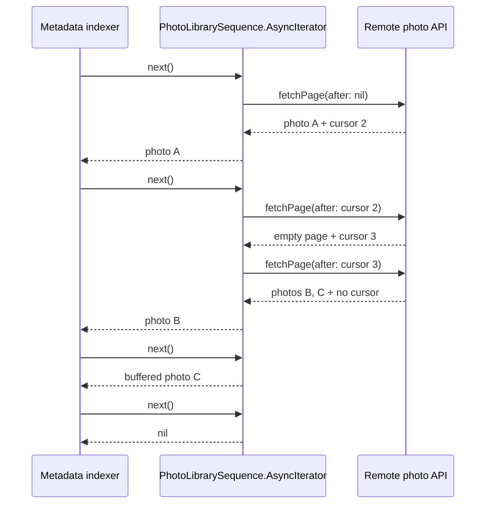

# 🔁 Iterator


> **Caption:** Cursor-linked cartridges become one ordered film ribbon, so the
> consumer sees photos rather than operating pagination.

**Category:** Behavioral

## 🎯 The app problem

A photo-backup app reads an album from a remote API that returns partial pages
and opaque continuation cursors. The service, not the client, decides each page
size. An empty page may still point to another page, and only a missing cursor
means the album has ended.

One grid screen originally requested a single page whenever the traveller
scrolled. Keeping its cursor beside the visible photos was the clearest direct
solution. The pressure changed when a background indexer needed the whole
album and a selection workflow needed only the first few photos. All three
clients then repeated the same cursor advancement and termination rules while
retaining different retry and early-exit policies.

### Requirements

- Present photos incrementally in stable remote order.
- Keep opaque cursors out of consuming features.
- Continue across empty intermediate pages that still have a cursor.
- End only after the first page without a continuation cursor.
- Avoid fetching another page while buffered photos remain.
- Propagate source errors without advancing the cursor.
- Check cooperative cancellation before remote work.
- Let a consumer stop early without draining or prefetching the album.
- Keep retry-versus-fail policy at the consumer boundary.

## 🪶 Start with direct Swift

[`PhotoLibraryDirect.swift`](../../Sources/DesignPatterns/Iterator/PhotoLibraryDirect.swift)
uses one `DirectPhotoLibraryScreen`. Its `loadNextPage()` method guards terminal
state, fetches with the current cursor, appends a successful page, and stores
the returned cursor. For one user-driven page request, that explicit state is
smaller and easier to inspect than an asynchronous iterator.

An already-loaded `[LibraryPhoto]` also needs no pattern. Swift's `Collection`
iteration already provides the traversal boundary, and returning an array is
preferable when every caller genuinely needs all values in memory.

## ⚡ The turning point

[`PhotoLibraryPressure.swift`](../../Sources/DesignPatterns/Iterator/PhotoLibraryPressure.swift)
adds a complete metadata-indexing traversal and an early selection traversal.
Across the three direct consumers, the repository measures:

- three consumer-owned cursor properties;
- three completion flags or decisions;
- three page requests using a current cursor;
- three successful cursor-advance assignments;
- two multi-page fetch loops; and
- five explicit cancellation checkpoints.

The retry policies deliberately differ: the screen surfaces every rate limit,
the indexer fails its run, and interactive selection retries once. Iterator has
earned the stable traversal mechanics, not the right to absorb those product
decisions.

## 🧭 Pattern intent

Iterator exposes elements one at a time without making the consumer understand
the source's traversal representation. Here Swift's native `AsyncSequence` and
`AsyncIteratorProtocol` are the pattern boundary: clients ask for the next
`LibraryPhoto`, while the concrete iterator owns page buffering, opaque cursors,
empty-page traversal, termination, and cancellation checks.

The implementation adds no app-specific iterator protocol. Using the language's
existing asynchronous iteration contract keeps `for try await` available and
avoids a second abstraction that would express the same operation.

## 🧩 Participants and responsibilities

| App role | Swift type | Responsibility |
| --- | --- | --- |
| Asynchronous aggregate | [`PhotoLibrarySequence`](../../Sources/DesignPatterns/Iterator/PhotoLibrarySequence.swift) | Stores the traversal recipe and creates a fresh concrete iterator. |
| Concrete iterator | `PhotoLibrarySequence.AsyncIterator` | Owns one API value, one opaque cursor, one page buffer, and terminal state. |
| Element | [`LibraryPhoto`](../../Sources/DesignPatterns/Iterator/PhotoLibraryDirect.swift) | Carries the photo identity and filename delivered to consumers. |
| Remote source | `ScriptedPhotoLibraryAPI` | Returns deterministic pages or errors and records cursors for executable evidence. |
| Consumers | `for try await` loops or a manually held iterator | Own accumulation, early exit, and any retry policy. |

`PhotoLibrarySequence` and its iterator are concrete values. There is no
protocol hierarchy, repository, page-loader abstraction, type erasure, actor,
or unstructured producer task because this example has one sequential remote
traversal and no shared mutable owner.

## ⚙️ How the Swift implementation works

1. `makeAsyncIterator()` copies the scripted API into a new iterator. Each
   iterator therefore starts an independent traversal at a `nil` cursor.
2. `next()` checks cancellation before returning buffered work or asking for a
   new page.
3. If the current page still has a photo, `next()` returns exactly that photo
   without issuing another request.
4. If no buffered photo remains and the terminal cursor was already observed,
   it returns `nil` without remote work.
5. Otherwise it fetches the current cursor, checks cancellation again, and only
   then commits the returned page, next cursor, and terminal state.
6. An empty nonterminal page simply repeats the loop and fetches its successor.
7. A thrown error exits before cursor assignment. A consumer that deliberately
   calls `next()` again retries the same cursor.

The iterator fetches lazily rather than running a producer task. Breaking after
three photos abandons the iterator with no later request scheduled:

```swift
var iterator = library.makeAsyncIterator()
var selected: [LibraryPhoto] = []

while selected.count < 3,
      let photo = try await iterator.next() {
    selected.append(photo)
}
```

Consumers that want the whole album use the standard syntax and never see a
page or cursor:

```swift
for try await photo in library {
    indexedPhotos.append(photo)
}
```

## 🗺️ Diagram



Observe that the indexer asks only for photos. The iterator crosses the empty
page internally, fetches no new page while photo C remains buffered, and turns
the absent final cursor into `nil`.

**Accessible description:** The metadata indexer asks an iterator for one photo
at a time. The iterator requests the first remote page without a cursor and
returns photo A. Its next request receives an empty page with another cursor,
so it continues to the final page. It returns photos B and C individually,
then returns no value after the final page's missing cursor.

## ▶️ Run the example

From the repository root:

```sh
swift build -Xswiftc -warnings-as-errors
swift test -Xswiftc -warnings-as-errors --filter IteratorTests
```

The package uses a deterministic local source. It needs no photo framework,
network access, persistence, retry scheduler, or UI runtime.

## 🧪 Tests

[`IteratorTests.swift`](../../Tests/DesignPatternsTests/IteratorTests.swift)
proves:

- `for try await` receives one ordered stream across three remote pages;
- an empty intermediate page does not terminate iteration;
- repeated calls after the terminal value issue no more requests;
- a rate-limit error leaves the cursor available for an explicit consumer retry;
- exiting after three photos avoids the unneeded final page; and
- an already-cancelled task records no remote request; and
- cancellation after one delivery prevents a buffered photo from escaping and
  does not request the next page.

The earlier problem and pressure suites remain executable. They preserve the
single-page direct solution and the measured duplication that earned this
boundary.

```sh
swift test -Xswiftc -warnings-as-errors --filter IteratorProblemTests
swift test -Xswiftc -warnings-as-errors --filter IteratorPressureTests
swift test -Xswiftc -warnings-as-errors --filter IteratorTests
```

## ⚖️ Trade-offs

### What improves

- Consumers no longer store, interpret, or advance opaque cursors.
- Empty intermediate pages and missing-cursor termination have one owner.
- `for try await` expresses complete traversal without a custom callback API.
- Lazy `next()` calls make early exit and cancellation avoid later remote work.
- Buffering is bounded to one service page instead of the complete album.
- Errors remain typed and visible to the consumer that owns retry policy.

### What it costs

- The solution adds one sequence type and one nested iterator to replace short
  loops that were previously visible in each consumer.
- A consumer that needs a custom retry must hold the iterator manually rather
  than relying only on `for try await`.
- Each iterator has independent source state; this concrete teaching source is
  replayable, but a production API must define whether repeated traversals are
  stable snapshots or fresh queries.
- Sequential iteration intentionally leaves parallel page fetching and
  speculative prefetching unsupported.
- Cancellation after a remote service has accepted a request cannot undo that
  external side effect; it only prevents the iterator from committing or
  continuing local traversal.

## 🔀 Alternatives considered

| Alternative | Prefer it when | Why it does not meet this example now |
| --- | --- | --- |
| Direct screen-owned cursor | One UI action requests one page and the cursor is local to that screen. | It remains the Day 060 solution; it does not remove repeated complete-traversal mechanics from the indexer and selector. |
| `[LibraryPhoto]` or `Collection` | Values are already loaded, or every consumer must await the complete album. | Selection must stop early and should not fetch or retain the rest of the album. |
| Async function returning an array | One bounded request produces a small complete result. | It hides incremental delivery and makes cancellation or early exit occur only after later pages were fetched. |
| Callback-based page loader | An older SDK exposes callbacks and cannot yet use Swift concurrency directly. | Callbacks add lifetime and error-channel work already represented by `AsyncSequence`. |
| `AsyncThrowingStream` | Bridging a push source, delegate, callback, or independently running producer. | Pagination is pull-driven by each `next()` call; a continuation and producer task would add ownership and buffering questions. |
| Generic paginator | Several domains share the same page and cursor semantics with proven variation points. | Only the photo domain has earned this behavior; generic page, token, transform, and retry parameters would be speculative. |

`AsyncSequence` also appears in event delivery, but pull-based iteration is not
automatically Observer. This example has one consumer advancing its own
iterator and no broadcast subscription. Observer is preferable when multiple
independent receivers must react to the same changing source over their own
lifetimes.

## 🚫 When not to use it

- Keep an array or another `Collection` when all values are already in memory.
- Keep a cursor in one screen when one explicit user action loads one page.
- Return one array when every caller needs a small complete result and early
  exit cannot save work.
- Do not wrap a single `for` loop merely to name the GoF pattern.
- Do not add `AsyncThrowingStream`, a producer task, actors, or buffering policy
  to a naturally pull-driven traversal.
- Do not hide retry, backoff, analytics, caching, or persistence inside the
  iterator unless every consumer demonstrably shares that policy.
- Do not generalize cursor and page types until another domain proves the same
  semantics rather than merely similar names.

## 🗂️ Source map

- [`PhotoLibrarySequence.swift`](../../Sources/DesignPatterns/Iterator/PhotoLibrarySequence.swift) — concrete asynchronous sequence and iterator.
- [`PhotoLibraryDirect.swift`](../../Sources/DesignPatterns/Iterator/PhotoLibraryDirect.swift) — domain values, deterministic source, and single-page direct baseline.
- [`PhotoLibraryPressure.swift`](../../Sources/DesignPatterns/Iterator/PhotoLibraryPressure.swift) — two repeated direct multi-page traversals.
- [`IteratorTests.swift`](../../Tests/DesignPatternsTests/IteratorTests.swift) — final order, buffering, termination, retry, early-exit, and cancellation evidence.
- [`IteratorProblemTests.swift`](../../Tests/DesignPatternsTests/IteratorProblemTests.swift) — direct screen acceptance tests.
- [`IteratorPressureTests.swift`](../../Tests/DesignPatternsTests/IteratorPressureTests.swift) — duplicated traversal and policy evidence.
- [`iterator-problem.md`](../../Documentation/iterator-problem.md) — initial requirements and no-pattern decision.
- [`iterator-pressure.md`](../../Documentation/iterator-pressure.md) — measured cursor and termination pressure.
- [`iterator-header.png`](../../Documentation/Assets/Patterns/behavioral/iterator-header.png) — editorial header.
