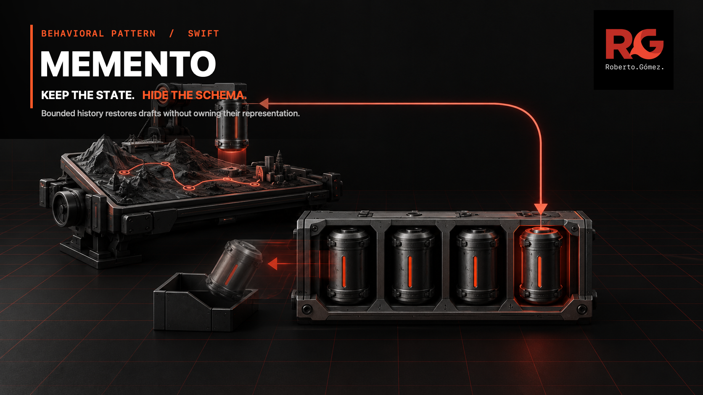
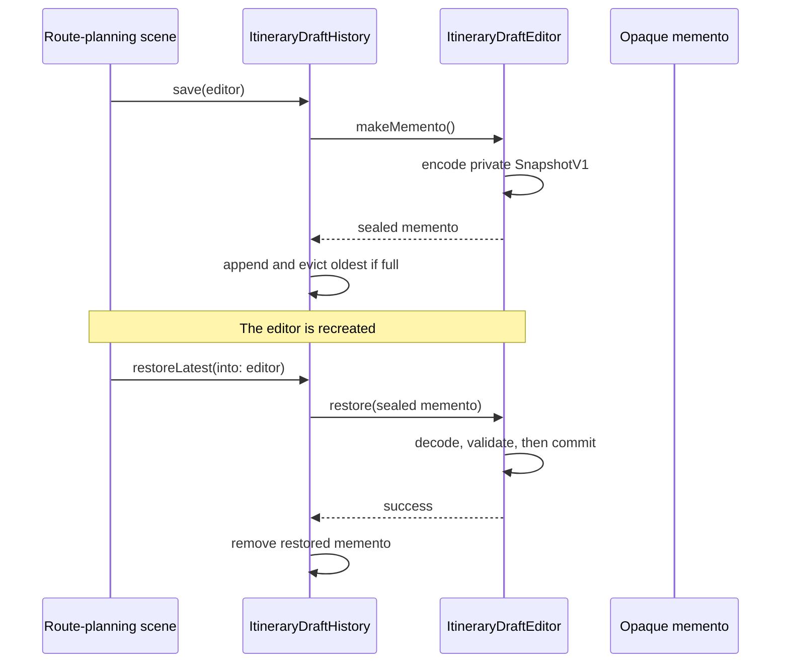

# 📸 Memento



*The history owns sealed restore points; only the itinerary editor knows what
they contain and how to restore them safely.*

**Category:** Behavioral

## 🎯 The app problem

A route-planning app edits an itinerary title, ordered stops, transport mode,
and two private routing preferences. A scene needs named checkpoints that
survive recreation of the editor, but it must not learn how those preferences
are represented or how snapshot compatibility is validated.

### Requirements

- A restore point captures every field needed to reproduce the visible draft.
- An external history owner keeps at most a configured number of checkpoints
  and restores them newest first.
- The history never reads or decodes editor state.
- Unsupported or malformed checkpoints leave both the editor and history
  unchanged.
- Full-snapshot storage remains measured instead of being hidden behind the
  abstraction.

## 🪶 Start with direct Swift

[`ItineraryDraftDirect.swift`](../../Sources/DesignPatterns/Memento/ItineraryDraftDirect.swift)
starts with the more honest design: one value-semantic editor keeps a bounded
private array of its own `DraftState` values.

```swift
public mutating func saveRestorePoint() {
    if restorePoints.count == restorePointLimit {
        restorePoints.removeFirst()
    }
    restorePoints.append(draft)
}
```

Swift's copy-on-write collections make those small checkpoints independent
without a pattern boundary. Keep this version while undo remains local to one
editor lifetime.

## ⚡ The turning point

The product then needs a scene-owned history that outlives editor recreation.
The direct pressure implementation moves JSON outside the editor, but the
archive must name, encode, and decode `DirectItineraryDraftSnapshotV1`. It
therefore knows six concrete state fields and the schema version it is supposed
to ignore.

The 250-stop fixture measures one complete direct snapshot at 8,774 encoded
bytes and four retained checkpoints at 35,096 bytes. That cost is acceptable;
schema ownership, not size, is the demonstrated problem. A delta log or
migration framework would add more risk than it removes.

## 🧭 Pattern intent

Memento lets the editor hand an external history owner a sealed restore point.
The history can retain, order, evict, and return that value, but only the editor
can encode its private representation, validate compatibility, and commit a
restored state.

## 🧩 Participants and responsibilities

| App role | Swift type | Responsibility |
| --- | --- | --- |
| Originator | [`ItineraryDraftEditor`](../../Sources/DesignPatterns/Memento/ItineraryDraftMemento.swift) | Owns private draft state, creates opaque mementos, validates their schema, and restores atomically. |
| Opaque restore point | [`ItineraryDraftMemento`](../../Sources/DesignPatterns/Memento/ItineraryDraftMemento.swift) | Carries serialized state without exposing payload, fields, or a public initializer. |
| Caretaker | [`ItineraryDraftHistory`](../../Sources/DesignPatterns/Memento/ItineraryDraftMemento.swift) | Bounds, orders, measures, and returns mementos without decoding them. |
| Read-only app view | [`ItineraryDraftPreview`](../../Sources/DesignPatterns/Memento/ItineraryDraftDirect.swift) | Exposes only the state the UI needs to compare and render. |

No participant is a protocol. There is one originator, one concrete caretaker,
and no demonstrated runtime variation or external service boundary.

## ⚙️ How the Swift implementation works

1. `ItineraryDraftHistory.save(_:)` asks the editor to make a memento.
2. The editor encodes a private `SnapshotV1` with sorted keys and returns an
   `ItineraryDraftMemento`. Its serialized payload is `fileprivate`, so the
   caretaker cannot couple itself to draft fields.
3. The history evicts the oldest entry only when its configured limit is full,
   then appends the new opaque value.
4. Restoration peeks at the newest memento and gives it back to the editor.
5. The editor decodes and version-checks a complete candidate before replacing
   `draft`. A decoding or compatibility failure therefore cannot partially
   mutate live state.
6. The history removes the restore point only after restoration succeeds.

`Data`, the memento, the editor, and the history are `Sendable` values. The
example does not claim actor isolation or thread-safe shared mutation; ownership
must still move between concurrency domains like any other mutable value.

## 🗺️ Diagram



Notice that the caretaker sees only a sealed value. Capture, schema validation,
and the atomic state replacement all remain with the originator; the caretaker
owns only retention order and its bounded storage cost.

**Accessible description:** The route-planning scene asks the history to save
an editor. The history asks the editor for an opaque memento and stores it,
evicting the oldest value when full. After editor recreation, the history
returns the newest memento to the editor. The editor decodes and validates it
before committing, and only then does the history remove that restore point.

## ▶️ Run the example

From the repository root:

```sh
swift build -Xswiftc -warnings-as-errors
swift test -Xswiftc -warnings-as-errors --filter MementoTests
```

The package has no UI or networking dependency. Tests drive the editor and
history as ordinary values and compare immutable previews.

## 🧪 Tests

[`MementoTests.swift`](../../Tests/DesignPatternsTests/MementoTests.swift)
proves:

- a complete checkpoint restores after the original editor is discarded;
- later editor mutations cannot change an already captured checkpoint;
- a two-entry history restores newest first and evicts the oldest;
- four equal full snapshots retain exactly four times one snapshot's bytes;
- past and future schema versions do not mutate the editor or consume history;
  and
- malformed payloads also leave both owners unchanged.

The earlier problem and pressure suites remain executable. They keep the
editor-owned value stack and concrete JSON coupling visible as verified steps,
not invented retrospective prose.

## ⚖️ Trade-offs

### What improves

- Six public snapshot fields and the concrete V1 decoder disappear from the
  caretaker.
- Capture and compatibility logic have one owner: the editor whose private
  representation they describe.
- Peeking before restoration makes failed checkpoints retryable and keeps
  editor mutation atomic.
- The history remains a small bounded value rather than a persistence service.
- Byte accounting keeps the cost of full snapshots observable.

### What it costs

- The solution adds three final-pattern types alongside the direct teaching
  stages.
- Every checkpoint still contains the complete itinerary; four large mementos
  retain roughly four times one memento's encoded bytes.
- JSON encoding can fail and adds work compared with copying a private value in
  memory.
- The opaque memento intentionally has no public serialization API. This
  history can outlive editor recreation in the same runtime, not an app launch.
- Changing the private schema still requires the originator to define a
  compatibility policy; opacity moves that responsibility but does not erase
  it.

## 🔀 Alternatives considered

| Alternative | Prefer it when | Why it does not meet this example now |
| --- | --- | --- |
| Private `[DraftState]` in the editor | History belongs to one editor session. | The scene must retain checkpoints while replacing the editor. |
| Public versioned document format | Checkpoints must survive launches, sync, sharing, or long-term storage. | Those requirements need explicit migrations and product retention rules; disguising them as Memento would not reduce the work. |
| Reversible operations or deltas | State is very large, edit history is deep, and measurements justify replay complexity. | Four measured full snapshots are still small enough; replay order, compaction, and partial failure are unearned. |
| Command | The app must queue, serialize, or replay user intent and define operation-specific reversal. | This scenario restores complete state and does not need portable edit intent. |

Command captures *what to do*; Memento captures *what state existed*. If the
itinerary later needs collaborative operation replay, Command or an operation
log would solve a different requirement rather than becoming a richer memento.

## 🚫 When not to use it

- Keep one previous value or a private bounded array when state is small and
  history never leaves its owner.
- Prefer Swift value assignment when the entire model is already public and no
  representation boundary exists.
- Use a durable versioned document when restore points must survive app
  upgrades, process death, synchronization, or sharing.
- Prefer reversible operations after measurements show full snapshots are too
  expensive and the team can own replay and compaction semantics.
- Do not add a generic memento protocol, caretaker hierarchy, persistence
  repository, or migration engine for one concrete editor.

## 🗂️ Source map

- [`ItineraryDraftMemento.swift`](../../Sources/DesignPatterns/Memento/ItineraryDraftMemento.swift) — opaque memento, originator, and bounded caretaker.
- [`ItineraryDraftDirect.swift`](../../Sources/DesignPatterns/Memento/ItineraryDraftDirect.swift) — domain values and editor-owned direct baseline.
- [`ItineraryDraftPressure.swift`](../../Sources/DesignPatterns/Memento/ItineraryDraftPressure.swift) — concrete JSON archive that exposes the coupling.
- [`MementoTests.swift`](../../Tests/DesignPatternsTests/MementoTests.swift) — capture ownership, restoration, bounds, storage, compatibility, and atomicity.
- [`MementoProblemTests.swift`](../../Tests/DesignPatternsTests/MementoProblemTests.swift) — direct baseline acceptance tests.
- [`MementoPressureTests.swift`](../../Tests/DesignPatternsTests/MementoPressureTests.swift) — external-history pressure and V1 coupling evidence.
- [`memento-problem.md`](../../Documentation/memento-problem.md) — requirements and initial no-pattern decision.
- [`memento-pressure.md`](../../Documentation/memento-pressure.md) — measured pressure that earns the opaque boundary.
- [`memento-header.png`](../../Documentation/Assets/Patterns/behavioral/memento-header.png) — editorial header.
