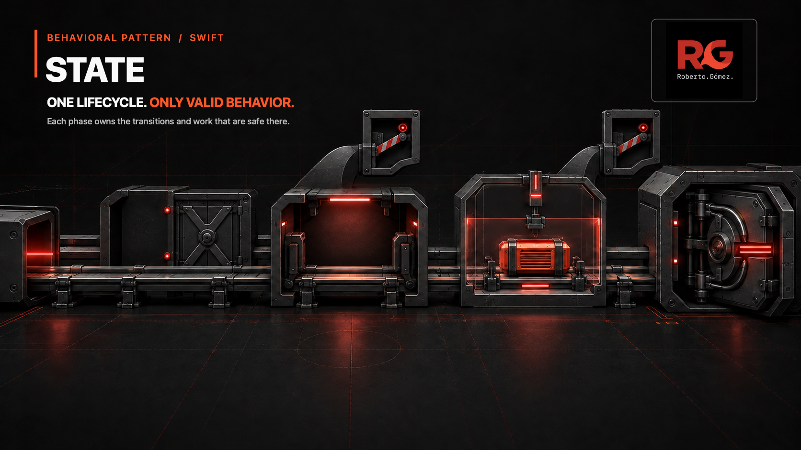
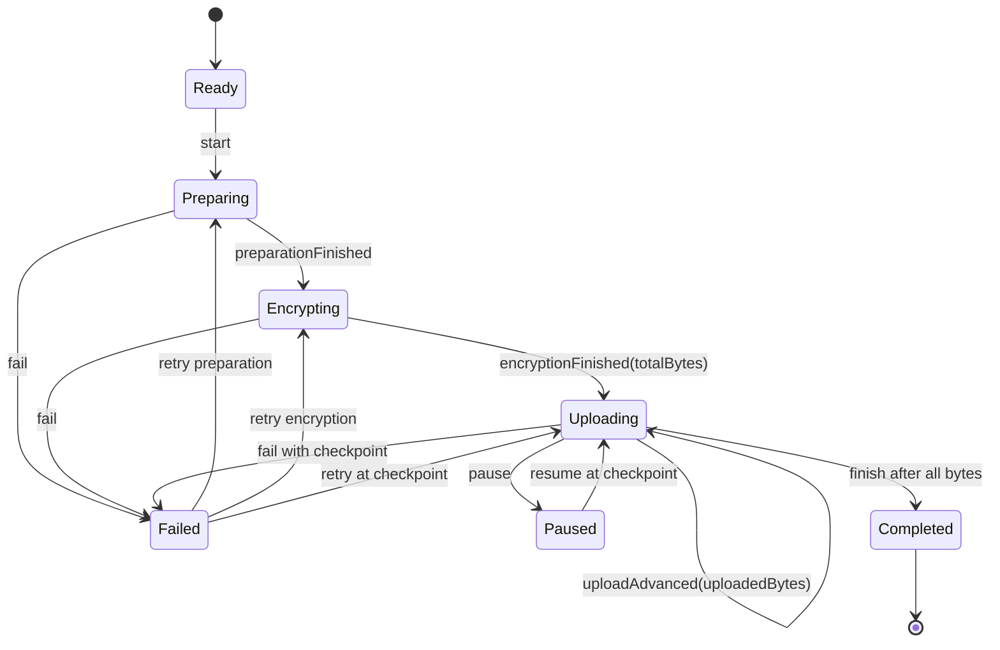

# 🚦 State



> **Caption:** One backup keeps one authoritative phase; that phase unlocks only
> the transitions, actions, and background work that are safe there.

**Category:** Behavioral

## 🎯 The app problem

A secure backup app prepares local files, encrypts them, uploads the encrypted
payload, and records a remote identifier. Connectivity can disappear during
transfer, so pause, resume, failure, and retry must preserve the last accepted
byte without allowing lifecycle jumps.

The backup screen and a background worker also need different answers from the
same lifecycle: the screen may offer Start, Pause, Resume, or Retry, while the
worker may prepare, encrypt, or upload. Those answers must never disagree about
whether work is paused, recoverable, or complete.

## 🪶 Start with direct Swift

[`BackupUploadDirect.swift`](../../Sources/DesignPatterns/State/BackupUploadDirect.swift)
uses one `BackupUploadPhase` enum and the pure
`transitionBackupUpload(from:on:)` reducer. That solution is exhaustive,
testable, and still preferable when transitions are the only phase-dependent
behavior.

There are no state objects in the baseline. One switch keeps the complete
lifecycle visible, associated values make progress valid only where it exists,
and unsupported event-and-phase pairs throw without mutating anything.

## ⚡ The turning point

The [pressure review](../../Documentation/state-pressure.md) added persistence,
a primary screen action, and a background operation. A six-flag snapshot could
encode 64 combinations although only seven were coherent. In an
`isUploading && isPaused` snapshot, the screen offered Resume while the worker
continued Upload.

Replacing the flags with `BackupUploadPhase` would remove impossible values,
but free functions or computed properties would leave three separate switch
owners: transitions, UI behavior, and worker behavior. The useful State
boundary appears when those rules change together per phase.

## 🧭 Pattern intent

State lets a backup change its behavior when its internal phase changes. The
`BackupUpload` context delegates each event and each phase-dependent decision
to its current private state, then replaces that state only after a successful
transition.

This is a lifecycle, not a runtime-selected policy. The client does not choose
an Uploading or Failed algorithm; prior events determine the current state and
therefore which behavior is legal next.

## 🧩 Participants and responsibilities

| App role | Swift element | Responsibility |
| --- | --- | --- |
| Context | [`BackupUpload`](../../Sources/DesignPatterns/State/BackupUpload.swift) | Own the current state, expose its phase and decisions, persist one typed phase, and install a next state only after success. |
| State contract | private `BackupUploadState` | Keep transition handling, screen action, and worker operation beside one phase. |
| Concrete states | private Ready, Preparing, Encrypting, Uploading, Paused, Failed, and Completed structs | Accept only legal events and construct the exact next state. |
| Persisted value | [`BackupUploadPhase`](../../Sources/DesignPatterns/State/BackupUploadDirect.swift) | Encode one of seven lifecycle shapes with only phase-valid associated data. |
| Client inputs | `BackupUploadEvent` | Describe facts and commands without choosing the next state directly. |

The protocol and concrete state types are private. Callers cannot manufacture a
custom lifecycle, and the public API stays smaller than the implementation
mechanism used to organize its rules.

## ⚙️ How the Swift implementation works

1. `BackupUpload()` starts with `ReadyBackupUploadState`, whose only screen
   action is Start.
2. `handle(_:)` asks the current state to process an event. A valid event
   returns a new state; an invalid event throws before the context changes.
3. Each concrete state owns its own `phase`, `primaryAction`,
   `backgroundOperation`, and accepted transitions. Uploading alone validates
   progress and completion; Failed alone knows its recovery point.
4. The context exposes `BackupUploadPhase` for UI, diagnostics, and `Codable`
   persistence without exposing private state objects.
5. Restoration contains the implementation's only all-phase switch. That
   switch is a serialization boundary: it validates persisted associated data
   and rebuilds the matching private state, rather than deciding ongoing app
   behavior.

`BackupUpload` is a value type. Copying it produces an independent lifecycle,
which is clearer for this local domain model than introducing shared reference
identity solely to resemble a class-oriented pattern diagram.

## 🗺️ Diagram



Observe that every arrow begins at the state that owns the event. Pause and
connection failure retain the Uploading checkpoint; invalid arrows do not
exist and are rejected without changing the context.

**Accessible description:** A backup starts Ready, then moves through Preparing
and Encrypting to Uploading. Uploading can advance, pause, fail, or complete
after all bytes arrive. Paused resumes at the same progress. Failed retries the
exact Preparing, Encrypting, or Uploading recovery point. Completed is terminal.

## ▶️ Run the example

From the repository root:

```sh
swift build -Xswiftc -warnings-as-errors
swift test -Xswiftc -warnings-as-errors --filter StateTests
```

The example uses Foundation only for whitespace validation and `Codable`. File
I/O, cryptography, network transport, background scheduling, and UI remain
outside the teaching unit.

## 🧪 Tests

[`StateTests.swift`](../../Tests/DesignPatternsTests/StateTests.swift) proves:

- all seven states own the expected screen and worker behavior;
- legal preparation-to-completion order;
- pause and retry preserve the exact upload checkpoint;
- decisions change when the state changes;
- rejected events leave the context unchanged;
- `Codable` round trips one authoritative typed phase;
- invalid restored terminal data is rejected.

The earlier problem and pressure suites remain executable so the direct reducer
and impossible-flag evidence do not become unverified prose.

## ⚖️ Trade-offs

### What improves

- Transition rules and phase-dependent decisions change together.
- A persisted enum permits seven meaningful shapes instead of 64 flag
  combinations.
- Invalid events cannot partially mutate the context.
- Private concrete states keep the public API focused and prevent arbitrary
  behavior injection.
- Adding a genuinely new phase gives its rules one owner instead of requiring
  synchronized precedence changes in several consumers.

### What it costs

- Seven small state types and existential dispatch replace one exhaustive
  transition switch.
- The complete transition graph is distributed across implementations, so the
  README diagram matters for whole-lifecycle review.
- `BackupUpload` cannot synthesize `Codable`; restoration must explicitly map a
  persisted phase back to a concrete state.
- New cross-state invariants may still require shared helpers or context-level
  validation.
- A public phase snapshot and private state objects describe the same current
  lifecycle for different purposes and must remain aligned.

## 🔀 Alternatives considered

| Alternative | Prefer it when | Why it does not meet this example now |
| --- | --- | --- |
| Enum plus pure reducer | Transitions are the only state-specific behavior and the graph fits comfortably in one switch. | UI action and worker operation now duplicate phase knowledge outside the reducer. |
| Enum computed properties | The lifecycle is closed and a few read-only decisions remain cohesive. | Three behavior families already change together per phase; another phase would still expand central switches. |
| Transition table | Events and next states are data-driven and actions have one uniform shape. | Screen actions, worker operations, validation, and recovery carry different types and data. |
| Strategy | A caller selects one interchangeable policy for the same operation. | Backup behavior changes because events move internal state; callers do not select phases. |
| Workflow framework | Persistence, retries, distributed workers, and observability require a production orchestration engine. | This teaching unit has one in-process lifecycle and no evidence for framework-level machinery. |

## 🚫 When not to use it

- Keep an enum and exhaustive reducer when legal transitions are the only
  behavior that varies.
- Use enum computed properties when two or three simple phase queries remain
  readable and change rarely.
- Do not create a protocol and type per enum case merely because a lifecycle
  has named phases.
- Use Strategy when clients select behavior without changing internal state.
- Use a durable workflow engine when recovery spans processes, devices, or
  distributed services and needs operational guarantees beyond `Codable`.

## 🗂️ Source map

- [`BackupUpload.swift`](../../Sources/DesignPatterns/State/BackupUpload.swift) — value-semantic context, private State implementations, decisions, and persistence boundary.
- [`BackupUploadDirect.swift`](../../Sources/DesignPatterns/State/BackupUploadDirect.swift) — direct enum-and-reducer baseline and shared domain values.
- [`BackupUploadPressure.swift`](../../Sources/DesignPatterns/State/BackupUploadPressure.swift) — executable contradictory-flag evidence.
- [`StateTests.swift`](../../Tests/DesignPatternsTests/StateTests.swift) — State behavior, lifecycle, persistence, and rejection tests.
- [`StateProblemTests.swift`](../../Tests/DesignPatternsTests/StateProblemTests.swift) — direct reducer acceptance tests.
- [`StatePressureTests.swift`](../../Tests/DesignPatternsTests/StatePressureTests.swift) — contradictory consumer decisions.
- [`state-problem.md`](../../Documentation/state-problem.md) — requirements, invariants, and direct solution decision.
- [`state-pressure.md`](../../Documentation/state-pressure.md) — measured pressure and smaller alternatives.
- [`state-header.png`](../../Documentation/Assets/Patterns/behavioral/state-header.png) — editorial header.
