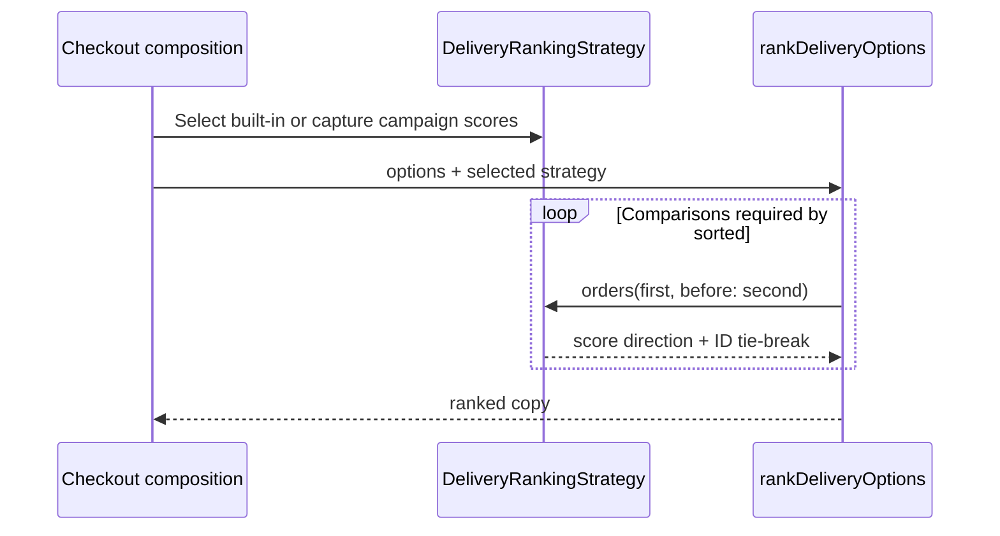

# ♟️ Strategy


> **Caption:** Checkout selects one ranking lane while each strategy keeps its scoring knowledge and campaign data outside the ranker.

**Category:** Behavioral

## 🎯 The app problem

A commerce checkout receives normalized delivery options and must rank the same
values by lowest cost, earliest arrival, or lowest carbon. A partner campaign
adds a fourth policy: sponsored options rank by a score map that changes
independently from fulfillment data and sorts in the opposite direction.

Ranking changes presentation order only. Eligibility, delivery promises,
selection, and booking remain outside this example.

### Requirements

- Select a ranking policy at runtime before checkout renders.
- Keep delivery options as app-owned immutable values.
- Let campaign scores change without changing the fulfillment response.
- Treat a missing campaign score as zero.
- Resolve equal scores by stable option identity.
- Return a reordered copy rather than mutate the source response.

## 🪶 Start with direct Swift

The initial solution was an enum and a pure function with one exhaustive
`switch`. It was the clearest design while three built-in policies each read one
integer from `DeliveryOption`. No protocol, object, registry, or type erasure was
needed.

Day 012 added `partnerSponsored` and `DeliveryRankingContext` without hiding the
cost. That direct implementation is preserved in commit `7719540` and explained
in the [pressure review](../../Documentation/strategy-pressure.md).

## ⚡ The turning point

The fourth case did more than add another sort key. The central function learned
that campaign data comes from another source, missing values mean zero, and this
policy sorts descending. A change to campaign semantics now edited a ranker that
should only order values.

An enum remained possible, but it no longer kept the independently changing
policy knowledge together. Passing a comparison closure directly would remove
the switch, yet every caller would have to preserve the shared identity
tie-breaker and direction rules. The useful boundary is therefore a small named
value that carries one scoring function and its immutable inputs.

## 🧭 Pattern intent

Strategy makes a family of ranking algorithms interchangeable at runtime so the
ranker can use one selected behavior without knowing which policy supplied it.
In Swift, that behavior can be a captured `@Sendable` function inside a value
type; the pattern does not require a protocol or class hierarchy.

## 🧩 Participants and responsibilities

| Pattern role | Swift element | Responsibility |
| --- | --- | --- |
| Client | Checkout composition code | Select a built-in strategy or construct the current campaign strategy. |
| Context | [`rankDeliveryOptions(_:using:)`](../../Sources/DesignPatterns/Strategy/DeliveryRankingStrategy.swift) | Sort a copy using the selected behavior and return the result. |
| Strategy value | [`DeliveryRankingStrategy`](../../Sources/DesignPatterns/Strategy/DeliveryRankingStrategy.swift) | Own the scoring function, direction, and deterministic identity tie-breaker. |
| Policy input | `pointsByOptionID` captured by `partnerSponsored(pointsByOptionID:)` | Keep one immutable campaign snapshot beside the behavior that interprets it. |
| Domain value | [`DeliveryOption`](../../Sources/DesignPatterns/Strategy/DeliveryOption.swift) | Supply normalized delivery facts without knowing how checkout ranks them. |

There are no `ConcreteStrategy` types. Static values represent the three
data-local policies, and one constructor captures campaign data for the fourth.
That collapse is deliberate: the algorithms share one shape and need no
independent lifecycle.

## ⚙️ How the Swift implementation works

1. Checkout composition selects `.lowestCost`, `.earliestArrival`, or
   `.lowestCarbon`, or builds `.partnerSponsored(pointsByOptionID:)` from the
   current campaign snapshot.
2. `rankDeliveryOptions(_:using:)` asks that value to order each comparison; it
   contains no preference enum, campaign context, or policy switch.
3. The strategy evaluates its captured score function, applies ascending or
   descending order, and uses `DeliveryOption.id` when scores tie.
4. `sorted` returns a new array, so both the fulfillment response and captured
   campaign dictionary remain immutable and parallel-test safe.

## 🗺️ Diagram



Observe that checkout chooses behavior once and the ranker never branches on a
preference. Campaign data travels inside the selected strategy rather than
through a context bag understood by every policy.

**Accessible description:** Checkout first selects a DeliveryRankingStrategy,
optionally capturing partner campaign scores. It passes delivery options and
that strategy to rankDeliveryOptions. During sorting, the ranker delegates each
comparison to the strategy, which applies its score direction and stable ID
tie-breaker. Checkout receives a newly ordered array.

## ▶️ Run the example

From the repository root:

```sh
swift build -Xswiftc -warnings-as-errors
swift test -Xswiftc -warnings-as-errors --filter StrategyTests
```

The example uses app-owned values and deterministic dictionaries. It needs no
network, UI framework, credentials, or process-wide mutable state.

## 🧪 Tests

[`StrategyTests`](../../Tests/DesignPatternsTests/StrategyTests.swift) prove:

- All three built-in strategies rank the same delivery values through one API.
- Stable option identity resolves equal primary scores.
- Ranking leaves the fulfillment response unchanged.
- The sponsored strategy owns its campaign snapshot and missing-score fallback.
- A new snapshot changes sponsored ordering without editing the ranker.

## ⚖️ Trade-offs

### What improves

- The ranker no longer owns a growing policy switch or generic context bag.
- Campaign data and the function that interprets it change together.
- Every policy is a small immutable `Sendable` value that callers can select at
  runtime and tests can substitute directly.
- Shared direction and tie-breaking invariants stay inside one boundary.

### What it costs

- The score closure hides its implementation from equality, encoding, and
  exhaustive compiler checks.
- A named value and `using:` call add indirection compared with a local enum.
- The current design compares one integer score per strategy. Multi-stage or
  asynchronous ranking would require an explicit contract change.
- Captured campaign snapshots are intentionally immutable; callers must create
  a new strategy when campaign data changes.

## 🔀 Alternatives considered

| Alternative | Prefer it when | Why it does not meet this example now |
| --- | --- | --- |
| Enum plus `switch` | Policies are closed, use the same local data, and change together. | Campaign scoring owns independent data, direction, and fallback semantics that made the central ranker change. |
| Plain comparison closure | One call site needs a local, obvious ordering and no shared invariant. | Repeated callers could drift on descending order, missing scores, or identity tie-breaking. |
| Protocol with one type per policy | Policies need different dependencies, async operations, lifecycle, or isolated tests as distinct objects. | Four synchronous integer scorers share one shape; separate conforming types would add ceremony without reducing risk. |
| State | Behavior must change because an object transitions through valid internal states. | Checkout selects a ranking policy; ranking does not transition or remember state. |
| Bridge | Two independent dimensions must vary and combine without a class explosion. | This example varies one behavior family over one stable array operation. |
| Template Method | A stable multi-step algorithm needs subclass-overridable steps. | There is one replaceable scoring behavior and no inheritance workflow. |

## 🚫 When not to use it

- Keep an enum and exhaustive `switch` when the policy set is small, closed, and
  based on the same local values.
- Pass a function when variation is local to one call site and has no shared
  rules or independently changing inputs.
- Use `sorted(by:)` directly for a one-off ordering that needs no runtime
  selection.
- Do not create a protocol and several types merely to rename simple closures.
- Do not use Strategy to model lifecycle transitions; that pressure belongs to
  State.

## 🗂️ Source map

- [`DeliveryOption.swift`](../../Sources/DesignPatterns/Strategy/DeliveryOption.swift) — normalized app-owned delivery facts.
- [`DeliveryRankingStrategy.swift`](../../Sources/DesignPatterns/Strategy/DeliveryRankingStrategy.swift) — value-based Strategy and context operation.
- [`StrategyTests.swift`](../../Tests/DesignPatternsTests/StrategyTests.swift) — executable acceptance, substitution, and campaign tests.
- [`strategy-problem.md`](../../Documentation/strategy-problem.md) — direct baseline and visual thesis.
- [`strategy-pressure.md`](../../Documentation/strategy-pressure.md) — requirement that earned the boundary.
- [`strategy-header.png`](../../Documentation/Assets/Patterns/behavioral/strategy-header.png) — editorial header.
