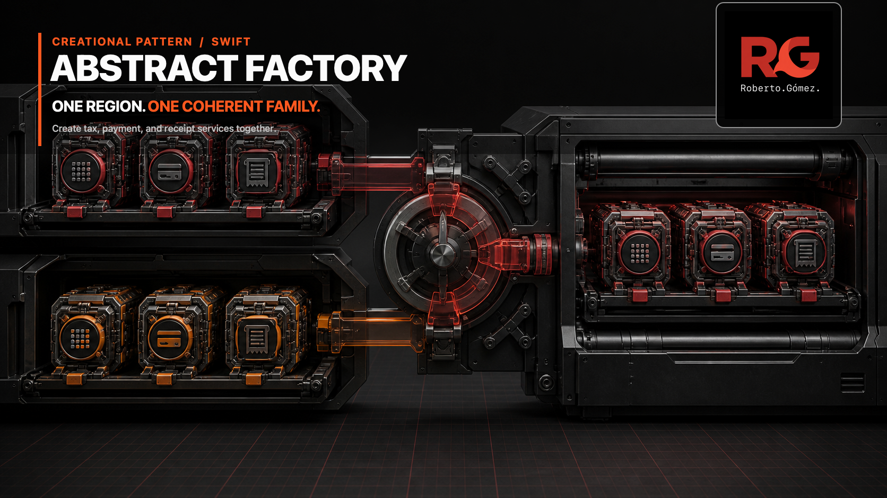
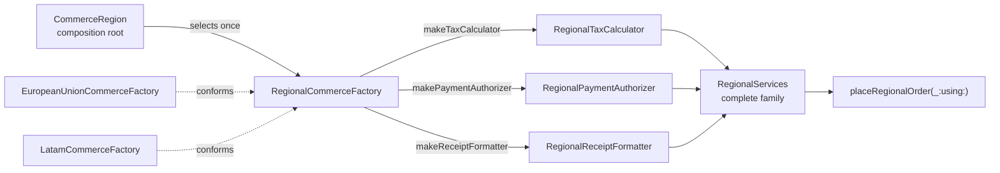

# Abstract Factory



> **Caption:** One regional decision creates the tax, payment, and receipt services that belong together.

**Category:** Creational

## The app problem

A white-label commerce app runs one checkout flow in the European Union and
LATAM. Each region needs three related service policies:

- tax calculation: EU VAT or LATAM IVA;
- payment authorization: EU card or LATAM Pix;
- receipt formatting: EU standard or LATAM fiscal.

These products form a family. Selecting the EU region should never quietly pair
VAT with the LATAM payment policy, and checkout should not need to coordinate
three independent regional decisions.

## Start with direct Swift

The original solution used concrete enum values and a small composition-root
switch. That was the right baseline while all three settings changed together:

```swift
switch region {
case .europeanUnion:
    RegionalServices(
        region: .europeanUnion,
        taxCalculator: .euVAT,
        paymentAuthorizer: .euCard,
        receiptFormatter: .euStandard
    )
case .latam:
    RegionalServices(
        region: .latam,
        taxCalculator: .latamIVA,
        paymentAuthorizer: .latamPix,
        receiptFormatter: .latamFiscal
    )
}
```

The [problem baseline](../../Documentation/abstract-factory-problem.md) keeps
that decision visible. There was no benefit in adding a factory when one
closed switch already returned the complete immutable value.

## The turning point

Tax, payment, and receipt settings began arriving independently. Two regions
across three selectable products exposed 16 declared assemblies: only two were
coherent and 14 had to be rejected at runtime. The
[pressure review](../../Documentation/abstract-factory-pressure.md) makes that
matrix executable.

The problem was not that the switches were long. The creation API treated
compatible family members as unrelated choices. A complete-family boundary now
removes those three independent selections from the normal composition path.

## Pattern intent

Abstract Factory provides creation operations for a family of related products
without making the client assemble those products independently. In this app,
one `RegionalCommerceFactory` creates the tax calculator, payment authorizer,
and receipt formatter for a single region.

The products remain small Swift enums. They do not need one protocol hierarchy
per service merely to make the example resemble a class-oriented diagram.

## Participants and responsibilities

| App role | Swift type | Responsibility |
| --- | --- | --- |
| Abstract factory | [`RegionalCommerceFactory`](../../Sources/DesignPatterns/AbstractFactory/RegionalCommerce.swift) | Declares the region and the three related product creation operations. |
| Concrete factories | `EuropeanUnionCommerceFactory`, `LatamCommerceFactory` | Return one compatible regional family. |
| Products | `RegionalTaxCalculator`, `RegionalPaymentAuthorizer`, `RegionalReceiptFormatter` | Perform the three deterministic checkout policies and expose their regional identity. |
| Family value | `RegionalServices` | Carries the complete product family; external callers cannot invoke its initializer. |
| Client | `placeRegionalOrder(_:using:)` | Uses the family without selecting or constructing individual products. |
| Composition root | `makeRegionalServices(for:)` | Selects one concrete factory from the app-owned region enum. |

## How the Swift implementation works

1. The composition root receives one `CommerceRegion` and chooses one concrete
   factory.
2. `makeRegionalServices(using:)` asks that factory for all three product
   values and creates `RegionalServices` inside the module boundary.
3. Checkout validates the factory contract defensively, calculates tax,
   authorizes payment, and formats the receipt through the selected values.
4. Adding another region means adding one concrete factory and one
   composition-root case; existing families and checkout remain unchanged.

`RegionalServices` has a `fileprivate` initializer. This prevents app callers
from recreating the invalid 16-combination assembly surface. The coherence
check remains because the abstract factory is public and a custom external
conformer could still violate its contract. Making misuse uncommon and
detectable is more useful here than pretending protocols can prove semantic
compatibility.

## Diagram



Observe that the region selects a factory once. The three products converge on
one `RegionalServices` value before checkout sees them; checkout never chooses
a tax, payment, or receipt region independently.

**Accessible description:** The composition root maps EU or LATAM to its
regional factory. That factory creates the matching tax calculator, payment
authorizer, and receipt formatter. Those three values are bundled as one
regional service family and passed to the unchanged checkout operation.

## Run the example

From the repository root:

```sh
swift build -Xswiftc -warnings-as-errors
swift test -Xswiftc -warnings-as-errors --filter AbstractFactoryTests
```

The example is local and deterministic. It requires no network, regional tax
service, payment SDK, credentials, or localization dependency.

## Tests

[`AbstractFactoryTests.swift`](../../Tests/DesignPatternsTests/AbstractFactoryTests.swift)
proves:

- EU and LATAM factories each create one coherent three-product family;
- the composition root selects the same family as the corresponding concrete
  factory;
- checkout behavior and immutable input remain unchanged;
- an external factory that mixes regions is rejected before checkout returns;
- a non-payable subtotal still fails explicitly.

The two valid families use parameterized Swift Testing cases so each region has
independent diagnostics without duplicated test logic.

## Trade-offs

### What improves

- One regional choice replaces three independently coordinated product choices.
- Standard callers cannot construct `RegionalServices` member by member.
- Each concrete factory keeps compatibility decisions together.
- Checkout depends on one complete family and remains unchanged as regions are
  added.
- Product values stay lightweight and preserve value semantics.

### What it costs

- One protocol, two concrete factory values, and existential dispatch add
  indirection compared with a closed switch returning an aggregate.
- A custom public factory can still break the semantic family contract, so the
  runtime coherence check remains valuable.
- The composition root still selects a factory; Abstract Factory does not make
  regional configuration discovery disappear.
- Adding a new product requires updating the factory contract and every
  concrete family.

## Alternatives considered

| Alternative | Prefer it when | Why it does not meet this example now |
| --- | --- | --- |
| Direct switch returning `RegionalServices` | A small closed set of products always changes together. | Independent configuration produced 14 invalid assemblies for two valid families. |
| Memberwise initializer | Callers legitimately compose products in arbitrary combinations. | Compatibility is an invariant, not caller customization. |
| Simple Factory | One function creates one aggregate or one product. | The client needs a named family of three related creation operations with multiple implementations. |
| Factory Method | A creator workflow delegates creation of one product to concrete creators. | Checkout needs three compatible products created together, not one parser chosen inside a workflow. |
| Dependency injection | A composition root already receives a known complete family. | Injection transports a decision; it does not by itself define which products are compatible. |

A single concrete factory would not justify Abstract Factory. With only EU, a
direct immutable `RegionalServices` value is clearer because there is no family
selection or variation to abstract.

## When not to use it

- Keep a direct switch when one closed regional decision already returns a
  complete value safely.
- Do not add an abstract factory for one product; use an initializer, function,
  Simple Factory, or Factory Method according to the actual workflow.
- Avoid product protocols when enums and value types already express the
  behavior and no boundary needs substitution.
- Prefer dependency injection of a concrete aggregate when the composition
  root has already made the family decision.
- Do not use Abstract Factory to hide arbitrary service-locator configuration;
  compatible products and their invariant must remain explicit.

## Source map

- [`RegionalCommerce.swift`](../../Sources/DesignPatterns/AbstractFactory/RegionalCommerce.swift) — domain values, products, factories, family assembly, and checkout.
- [`AbstractFactoryTests.swift`](../../Tests/DesignPatternsTests/AbstractFactoryTests.swift) — family creation, composition selection, checkout, defensive validation, and value-semantics tests.
- [`abstract-factory-problem.md`](../../Documentation/abstract-factory-problem.md) — direct baseline and initial visual thesis.
- [`abstract-factory-pressure.md`](../../Documentation/abstract-factory-pressure.md) — measured invalid-combination pressure.
- [`abstract-factory-header.png`](../../Documentation/Assets/Patterns/creational/abstract-factory-header.png) — editorial header.
