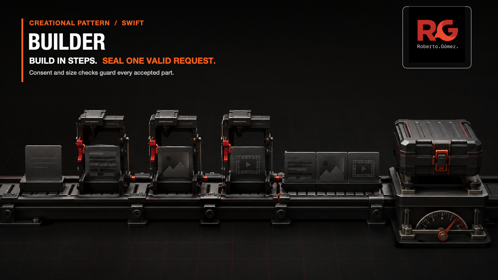
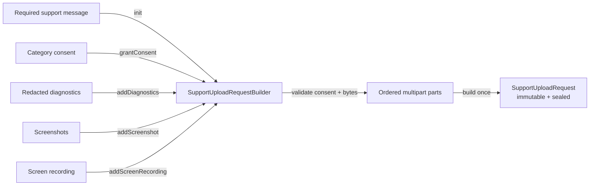

# Builder



> **Caption:** Build the support upload across verified steps, then seal one immutable request.

**Category:** Creational

## The app problem

A commerce app lets a customer report a failed checkout. A support ticket starts
with a required message and may later gain redacted diagnostics, screenshots,
and a screen recording as the customer moves through separate screens.

Each attachment category requires explicit consent before its first payload.
The app must also reject the draft as soon as accepted bytes exceed the support
API limit. Once the request is built, the same construction value must not accept
more private data.

HTTP encoding, retries, authentication, persistence, and raw-log redaction stay
outside this example. They would obscure the construction decision without
changing it.

## Start with direct Swift

When every value arrived on one Submit action, a throwing initializer with
optional values was the clearest solution:

```swift
let request = try SupportUploadRequest(
    ticketID: ticketID,
    message: message,
    diagnostics: redactedDiagnostics,
    screenshots: selectedScreenshots,
    screenRecording: recording,
    consent: consent,
    maximumPayloadSizeInBytes: uploadLimit
)
```

The initializer could validate once and return one immutable value. Default
arguments kept message-only tickets readable. Builder was not justified by the
number of parameters or by a preference for chained syntax.

The [problem baseline](../../Documentation/builder-problem.md) records that
simpler API and its acceptance rules.

## The turning point

Construction moved across ordered UI interactions. The direct extension passed
an array of six `SupportUploadAssemblyStep` cases to the request initializer.
That made four invalid order families representable: a step before the message,
a duplicate message, a step after finalization, and no finalization at all.

The [pressure review](../../Documentation/builder-pressure.md) preserves the
measurements. The issue was no longer optional data. The public input had become
an invalid-state-rich construction language that every caller had to assemble
correctly.

## Pattern intent

Builder moves incremental construction into one dedicated value and exposes the
finished product only through `build()`. In this example,
`SupportUploadRequestBuilder` owns the evolving multipart parts, consent state,
byte-limit checks, and sealed state while `SupportUploadRequest` remains an
immutable product.

The message is required by the builder initializer, so three of the four raw
sequence failures disappear from the public API. Runtime checks remain for the
privacy, size, and sealing rules that a small Swift type graph cannot usefully
prove at compile time.

## Participants and responsibilities

| App role | Swift type | Responsibility |
| --- | --- | --- |
| Builder | [`SupportUploadRequestBuilder`](../../Sources/DesignPatterns/Builder/SupportUploadRequest.swift) | Starts from a valid message, records consent, appends validated parts, and seals construction. |
| Product | [`SupportUploadRequest`](../../Sources/DesignPatterns/Builder/SupportUploadRequest.swift) | Holds the immutable ticket identity, ordered multipart values, and measured payload size. |
| Part values | `SupportUploadPart`, `RedactedSupportDiagnostics`, `SupportScreenshot`, `SupportScreenRecording` | Carry app-owned payloads and preserve privacy-relevant distinctions. |
| Client | Support-flow composition code | Retains the builder across screens and calls only the operation matching the current user action. |

There is one concrete builder because the app produces one product shape. A
builder protocol would create a substitution point with no second implementation,
and a director would merely replay a UI sequence the screens already own.

## How the Swift implementation works

1. `SupportUploadRequestBuilder.init` requires the message and a positive byte
   limit. It creates the first multipart part and rejects an oversized message
   immediately.
2. `grantConsent(for:)` records a category-specific decision on the builder
   value.
3. Each `add...` operation checks that the matching consent exists and that the
   new total stays within the configured limit before mutating the part list.
4. `build()` returns one immutable `SupportUploadRequest` and seals that builder
   value. A later mutation or second build fails with `requestAlreadyBuilt`.

```swift
var builder = try SupportUploadRequestBuilder(
    ticketID: ticketID,
    message: message,
    maximumPayloadSizeInBytes: uploadLimit
)
try builder.grantConsent(for: .diagnostics)
try builder.addDiagnostics(redactedDiagnostics)
let request = try builder.build()
```

The builder is a `struct`. Copying a draft creates independent construction
state, which is useful for local preview or branching without introducing shared
mutable reference state.

## Diagram



Observe that every optional payload enters through the same builder boundary,
where consent and size are checked before the ordered parts change. Only
`build()` crosses from mutable construction state to the immutable request.

**Accessible description:** A required support message creates the builder.
Consent decisions and three kinds of optional private attachments enter that
builder over time. The builder validates consent and total bytes as parts are
accepted, then one build operation produces a sealed immutable support request.

## Run the example

From the repository root:

```sh
swift build -Xswiftc -warnings-as-errors
swift test -Xswiftc -warnings-as-errors --filter BuilderTests
```

The example is local and deterministic. It needs no support vendor, network,
credentials, media framework, or filesystem access.

## Tests

[`BuilderTests.swift`](../../Tests/DesignPatternsTests/BuilderTests.swift) proves:

- message-only and complete consented requests preserve deterministic part order;
- diagnostics, screenshots, and recording each fail before category consent;
- blank messages, invalid limits, and oversized initial or appended payloads fail
  at the boundary that receives them;
- the exact byte limit succeeds;
- a built value rejects later consent and a second `build()` call;
- copied builders evolve and build independently.

The three attachment-consent cases use one parameterized Swift Testing behavior,
keeping the category contract visible without duplicating test bodies.

## Trade-offs

### What improves

- The initializer makes the required first step impossible to omit or repeat.
- Named methods guide callers through real UI actions instead of accepting a raw
  sequence language.
- Consent and payload-size failures occur when the attachment is offered, not at
  an unrelated final screen.
- `SupportUploadRequest` cannot be created partially outside its source file.
- Value semantics avoid shared mutable construction state.

### What it costs

- The builder adds a mutable intermediate value where one atomic initializer used
  to be enough.
- Callers must retain the builder across screens and handle throwing mutation.
- Privacy and size rules still need runtime errors; Builder organizes them but
  does not turn domain consent into a compile-time proof.
- A copied builder can create a separate valid request branch, which must be an
  intentional use of value semantics.

## Alternatives considered

| Alternative | Prefer it when | Why it does not meet this example now |
| --- | --- | --- |
| Memberwise or throwing initializer | All inputs arrive together and validation happens once. | Attachments now arrive across screens and must fail immediately at each step. |
| Default arguments | Optional values are the only source of complexity. | Defaults do not express consent-before-attachment or sealing. |
| Helper function | Construction remains one atomic operation. | A function cannot retain the verified intermediate state without becoming a builder under another name. |
| Staged generic builder | Invalid order must be statically impossible across a large, stable workflow. | It would multiply types and make optional attachment combinations harder to read than the remaining runtime checks. |
| Director | Several clients must reproduce the same construction recipe. | The UI owns one interactive sequence; there is no reusable recipe to coordinate. |
| Factory Method | A creator workflow must choose which product implementation to instantiate. | This flow incrementally assembles one product rather than selecting among product types. |

Fluent chaining is deliberately absent. Mutating operations map more honestly to
events arriving on different screens and keep thrown intermediate failures at the
line that caused them.

## When not to use it

- Keep a throwing initializer when all required and optional values arrive at
  once.
- Use default arguments when the only issue is a readable list of optional
  parameters.
- Do not add a builder solely to make call sites chainable.
- Avoid a protocol or director when there is only one product representation and
  no reusable construction recipe.
- Prefer a small validated form value when the UI edits fields but does not need
  ordered intermediate effects.
- Do not replace meaningful consent or byte-limit errors with a large staged-type
  graph unless compile-time ordering has demonstrated product value.

## Source map

- [`SupportUploadRequest.swift`](../../Sources/DesignPatterns/Builder/SupportUploadRequest.swift) — domain values, concrete builder, intermediate validation, and immutable product.
- [`BuilderTests.swift`](../../Tests/DesignPatternsTests/BuilderTests.swift) — construction, privacy, validation, sealing, and value-semantics evidence.
- [`builder-problem.md`](../../Documentation/builder-problem.md) — atomic initializer baseline and initial visual thesis.
- [`builder-pressure.md`](../../Documentation/builder-pressure.md) — measured invalid-sequence pressure and solution boundary.
- [`builder-header.png`](../../Documentation/Assets/Patterns/creational/builder-header.png) — editorial header.
