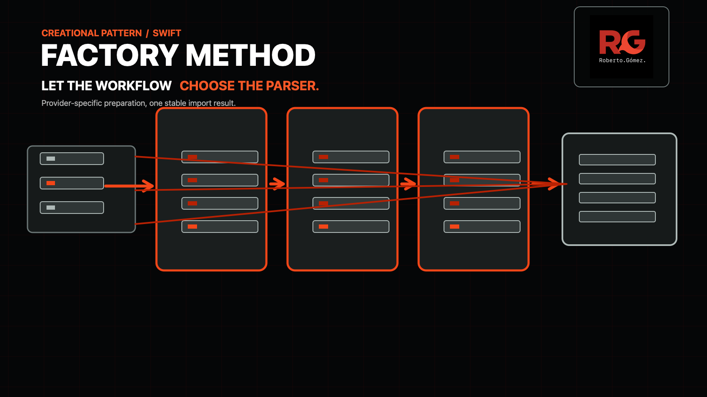

# Factory Method



> **Caption:** Each bank workflow prepares its own feed and chooses the parser that can create the same app-owned import result.

**Category:** Creational

## The app problem

A personal-finance app imports transactions from Northstar CSV, Mercado Sur
OFX, and Lumen open-banking JSON. The institutions do not return the same
transport envelope, but categorization and reconciliation need one stable
`BankStatementImport` value.

The pressure is a workflow change, not a format count. Each provider needs its
own preparation rules before parsing, and that preparation can grow to include
authentication, pagination, or cursor handling without changing the normalized
result contract.

## Start with direct Swift

The first solution was an exhaustive provider switch. It prepared each payload,
selected a parser, translated failures, and returned the common result from one
function. That was appropriate while the workflows were small and closed; the
baseline and its evidence remain in [`factory-method-problem.md`](../../Documentation/factory-method-problem.md)
and [`factory-method-pressure.md`](../../Documentation/factory-method-pressure.md).

```swift
switch request.provider {
case .northstar:
    transactions = try parseNorthstarCSV(prepareNorthstarPayload(request.payload))
case .mercadoSur:
    transactions = try parseMercadoSurOFX(prepareMercadoSurPayload(request.payload))
case .lumenOpenBanking:
    transactions = try parseLumenJSON(prepareLumenPayload(request.payload))
}
```

## The turning point

The central function began to own two decisions for every provider: how its
transport response is prepared and which parser understands that prepared
value. A new provider workflow therefore edits the same selection point even
when all other workflows and the shared result stay unchanged.

A Simple Factory could hide parser construction behind `makeParser(for:)`, but
it would leave preparation and workflow ordering centralized. The useful
boundary is a creator workflow whose factory method chooses the product it uses
while the shared import operation remains fixed.

## Pattern intent

Factory Method lets each concrete import workflow decide which parser it creates
and uses, while the common workflow contract keeps account identity, provider
identity, and normalized transaction output consistent. The creator variation
is local to the provider workflow; callers no longer coordinate preparation and
parser pairing themselves.

## Participants and responsibilities

| App role | Swift type | Responsibility |
| --- | --- | --- |
| Creator contract | [`BankStatementImportWorkflow`](../../Sources/DesignPatterns/FactoryMethod/BankStatementImport.swift) | Defines provider identity, preparation, parser creation, and the shared import operation. |
| Concrete creators | [`NorthstarBankStatementWorkflow`](../../Sources/DesignPatterns/FactoryMethod/BankStatementImport.swift), [`MercadoSurBankStatementWorkflow`](../../Sources/DesignPatterns/FactoryMethod/BankStatementImport.swift), [`LumenBankStatementWorkflow`](../../Sources/DesignPatterns/FactoryMethod/BankStatementImport.swift) | Own provider-specific preparation and choose their parser in `makeParser()`. |
| Product contract | [`BankStatementParser`](../../Sources/DesignPatterns/FactoryMethod/BankStatementImport.swift) | Normalizes one prepared provider payload into app-owned transactions. |
| Concrete products | `NorthstarCSVParser`, `MercadoSurOFXParser`, `LumenOpenBankingParser` | Parse one provider's prepared representation. |
| Client/composition root | [`importBankStatement(_:)`](../../Sources/DesignPatterns/FactoryMethod/BankStatementImport.swift) | Selects the workflow from the app-owned provider enum and invokes the common operation. |

The parser implementations are private because callers need the product
contract, not provider parser identity. The public workflow types are value
types: they carry no mutable session or network state in this executable
example.

## How the Swift implementation works

1. `importBankStatement(_:)` selects a concrete workflow at the composition
   root from `BankStatementProvider`.
2. The shared `importStatement(accountID:payload:)` operation asks that creator
   to prepare its provider envelope, then calls `makeParser()`.
3. The concrete parser receives only its prepared payload and returns normalized
   `ImportedBankTransaction` values.
4. The shared operation builds `BankStatementImport`, preserving account and
   provider identity and propagating preparation or parser errors unchanged.

The Factory Method is `makeParser()`. Preparation remains an explicit creator
step so the example does not pretend that parser construction alone is the
workflow variation. The provider switch at the composition root is a closed
selection helper, not a second factory hierarchy.

## Diagram

```mermaid
flowchart LR
    Client["importBankStatement(_:)\ncomposition root"] -->|selects provider workflow| Creator["BankStatementImportWorkflow"]
    Creator -->|preparePayload| Prepared["Prepared provider payload"]
    Creator -->|makeParser()| Parser["BankStatementParser"]
    Prepared --> Parser
    Parser -->|parse| Result["BankStatementImport\nnormalized ledger"]
    Northstar["Northstar workflow"] -. conforms .-> Creator
    Mercado["Mercado Sur workflow"] -. conforms .-> Creator
    Lumen["Lumen workflow"] -. conforms .-> Creator
```

Observe that each concrete workflow owns the arrow from preparation to its
parser, while the client sees one operation and one normalized result. Adding
another provider extends the creator/product pair without changing the shared
import operation's invariant result construction.

**Accessible description:** The composition root chooses one of three provider
workflows. The chosen workflow prepares its raw payload and creates the parser
for that payload. The parser produces one normalized bank-statement result,
which the shared import operation returns to the client.

## Run the example

From the repository root:

```sh
swift build -Xswiftc -warnings-as-errors
```

The package uses local fixtures and deterministic parser behavior; no network,
credentials, or external SDKs are required.

## Tests

```sh
swift test -Xswiftc -warnings-as-errors --filter FactoryMethodProblemTests
```

[`FactoryMethodProblemTests.swift`](../../Tests/DesignPatternsTests/FactoryMethodProblemTests.swift)
proves:

- all three creators prepare their provider envelope and create the matching parser;
- Northstar CSV, Mercado Sur OFX, and Lumen JSON normalize to the same domain value;
- mismatched payloads and malformed envelopes fail explicitly;
- the request remains an immutable value.

The full package suite also verifies the existing Adapter, Bridge, Strategy, and
package-boundary examples.

## Trade-offs

### What improves

- Provider preparation and parser pairing move out of one growing import
  function and into the workflow that owns them.
- The shared import operation centralizes the stable result and error contract.
- A workflow can evolve its preparation steps without editing other providers.
- Parser products remain focused and testable behind one app-owned contract.

### What it costs

- Three creator values, a parser protocol, and existential dispatch add
  indirection around a small closed catalogue.
- The composition root still has a provider selection switch; Factory Method
  does not remove product selection from the app boundary.
- New creators and parsers must preserve the prepared-payload invariant and
  translate provider failures correctly.

## Alternatives considered

| Alternative | Prefer it when | Why it does not meet this example now |
| --- | --- | --- |
| Direct enum switch | A few closed formats share preparation and change together. | Provider workflows now have distinct preparation and release cadence. |
| Simple Factory | One centralized function only needs to return a parser for a format. | It would hide construction but leave provider workflow coordination centralized. |
| Abstract Factory | Several related products must be created as a coherent family. | Each provider creates one parser product; there is no family of compatible products. |
| Strategy | One operation needs interchangeable algorithms. | The creator owns a construction workflow and parser lifecycle, not a selected ranking algorithm. |
| Template Method | A stable algorithm has subclass-overridable steps. | The variation here is the product created by each workflow; no inheritance skeleton is needed. |

Factory Method differs from Simple Factory by moving the creation decision into
the concrete creator. It differs from Abstract Factory because this example
creates one product type, not a coordinated family.

## When not to use it

- Keep the direct switch when formats are closed and provider preparation is
  absent or shared.
- Prefer a Simple Factory when parser construction is the only variation and
  no creator workflow owns additional steps.
- Do not add a protocol and creator types for one parser or one call site.
- Prefer Swift enums, functions, or a memberwise initializer when they express
  the construction rules without a separate workflow boundary.

## Source map

- [`BankStatementImport.swift`](../../Sources/DesignPatterns/FactoryMethod/BankStatementImport.swift) — creators, Factory Method, parser products, and domain values.
- [`FactoryMethodProblemTests.swift`](../../Tests/DesignPatternsTests/FactoryMethodProblemTests.swift) — creator, preparation, normalization, failure, and value-semantics tests.
- [`factory-method-problem.md`](../../Documentation/factory-method-problem.md) — direct baseline and initial thesis.
- [`factory-method-pressure.md`](../../Documentation/factory-method-pressure.md) — measured workflow pressure and Simple Factory comparison.
- [`factory-method-header.png`](../../Documentation/Assets/Patterns/creational/factory-method-header.png) — editorial header.
