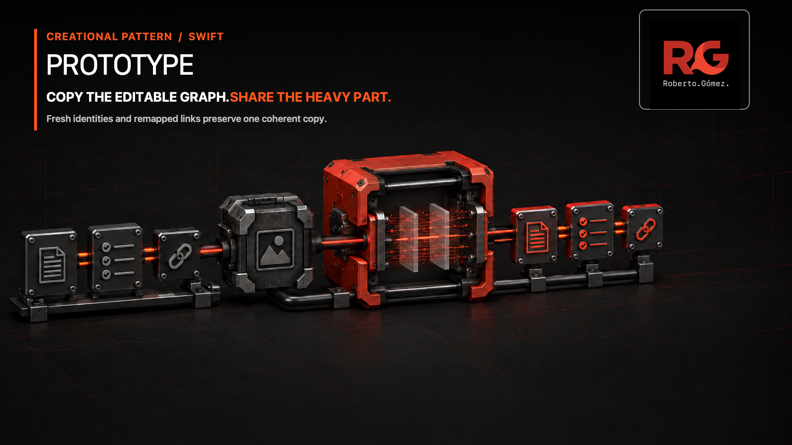
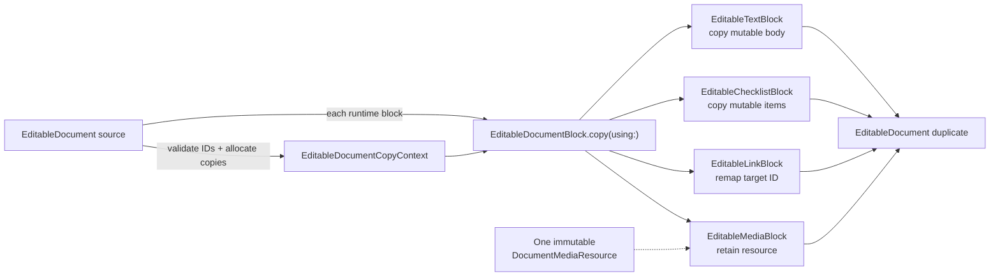

# 🧬 Prototype



> **Caption:** Give editable blocks fresh identities and repaired links while one
> immutable media resource bypasses duplication.

**Category:** Creational

## 🎯 The app problem

A collaborative writing app lets an editor duplicate a release document and
adapt the result without changing the source. The document contains live block
objects retained by selection and observation code: text, checklists, internal
links, and uploaded media.

The duplicate must preserve each runtime block kind and its state, but ordinary
reference assignment would keep every mutable block shared. Copying every object
blindly is also wrong: internal links must target the new graph, while the large
immutable media resource should remain shared deliberately.

### Requirements

- Give every copied editable block a fresh object and domain identity.
- Preserve runtime block kind and kind-specific state.
- Remap internal links so the duplicate never points into the source graph.
- Share immutable media resources instead of duplicating their payload identity.
- Reject duplicate source identities and links to blocks outside the graph.

Persistence, collaboration, serialization, upload, and editor UI lifecycle are
outside this example. They do not change the controlled-copy boundary.

## 🪶 Start with direct Swift

The first product was a value-only `DocumentConfiguration`. Ordinary assignment
already gives it an independent copy:

```swift
var releaseNotes = weeklyUpdate
releaseNotes.title = "Release retrospective"
releaseNotes.sections[0].heading = "What shipped"
```

Swift value semantics and collection copy-on-write satisfy that version of the
problem. A cloning protocol would only rename a language guarantee. The
[problem baseline](../../Documentation/prototype-problem.md) proves this
no-pattern case with executable tests.

When live block identity became a requirement, the first correct extension was
still a direct function. It allocated fresh identifiers and reconstructed four
known concrete block classes in one exhaustive switch. That operation correctly
remapped links and shared media, so Prototype was not introduced merely because
classes appeared.

## ⚡ The turning point

The [pressure review](../../Documentation/prototype-pressure.md) measures the
remaining coupling: every independently introduced block type required another
branch in `duplicateEditableDocument(_:)`. The central routine had to know each
subtype's initializer, private state, and ownership policy even though the
subtype already owned those decisions.

A fifth quote block made the extension point concrete. It should be able to join
the document graph and preserve itself without editing the graph duplicator.
That is the pressure that earns Prototype here—not construction cost, a desire
for `clone()` syntax, or speculative subclassing.

## 🧭 Pattern intent

`EditableDocumentBlock` is the explicit prototype boundary for the reference-
backed part of the model. Each conforming block creates the right runtime type
when given one `EditableDocumentCopyContext`. The document remains responsible
for graph-wide identity allocation; concrete blocks remain responsible for
their own state and ownership policy.

The API uses the domain-specific `copy(using:)` name instead of a context-free
`clone()`. A block cannot copy itself correctly without the old-to-new identity
map, and that requirement should remain visible at the call site.

## 🧩 Participants and responsibilities

| App role | Swift type | Responsibility |
| --- | --- | --- |
| Graph duplicator | [`duplicateEditableDocument(_:)`](../../Sources/DesignPatterns/Prototype/EditableDocumentGraph.swift) | Validates source identity, allocates every fresh block ID, and asks each runtime block to copy itself. |
| Prototype boundary | [`EditableDocumentBlock`](../../Sources/DesignPatterns/Prototype/EditableDocumentGraph.swift) | Exposes block identity and the contextual copy capability shared by the four real block kinds. |
| Copy context | [`EditableDocumentCopyContext`](../../Sources/DesignPatterns/Prototype/EditableDocumentGraph.swift) | Provides the complete old-to-new identity map without learning subtype state. |
| Concrete prototypes | `EditableTextBlock`, `EditableChecklistBlock`, `EditableLinkBlock`, `EditableMediaBlock` | Preserve their own state; links remap targets and media blocks retain the immutable resource. |
| Shared resource | `DocumentMediaResource` | Represents an immutable upload identity intentionally referenced by source and duplicate. |

There is one protocol because four immediate implementations vary at runtime.
There is no prototype registry, factory, base class, or copy coordinator.

## ⚙️ How the Swift implementation works

1. `duplicateEditableDocument(_:)` validates that source block IDs are unique.
2. It allocates a new ID for every source block before any block is copied. This
   makes the complete graph mapping available even for forward links.
3. It creates one `EditableDocumentCopyContext` and calls `copy(using:)` through
   each block's runtime conformance.
4. Text and checklist blocks copy mutable state into fresh objects. Link blocks
   resolve their target through the context. Media blocks create a fresh block
   identity but retain the same immutable `DocumentMediaResource` reference.
5. The function returns a document value containing the copied block graph. Any
   duplicate source ID or missing link target fails before an invalid copy is
   presented as complete.

```swift
let context = EditableDocumentCopyContext(copiedIDs: copiedIDs)
let copiedBlocks = try source.blocks.map {
    try $0.copy(using: context)
}
```

The context initializer is file-private. Clients ask to duplicate a document;
they do not construct partial identity maps or invoke graph-copy phases out of
order.

## 🗺️ Diagram



Observe that the document creates the shared context before dispatching to the
runtime block types. Each subtype owns only its local copy policy; the identity
map repairs graph relationships, and the media resource is referenced rather
than recreated.

**Accessible description:** The source document first produces a complete map
of fresh block identities. That context and every runtime block enter the
prototype boundary. Text, checklist, link, and media blocks then create their
appropriate copies, with the link target remapped and one immutable media
resource retained, before the results form the duplicate document.

## ▶️ Run the example

From the repository root:

```sh
swift build -Xswiftc -warnings-as-errors
swift test -Xswiftc -warnings-as-errors --filter Prototype
```

The example is local and deterministic apart from the generated fresh UUID
values. It needs no editor framework, persistence layer, media upload, network,
or credentials.

## 🧪 Tests

[`PrototypeProblemTests.swift`](../../Tests/DesignPatternsTests/PrototypeProblemTests.swift),
[`PrototypePressureTests.swift`](../../Tests/DesignPatternsTests/PrototypePressureTests.swift),
and [`PrototypeTests.swift`](../../Tests/DesignPatternsTests/PrototypeTests.swift)
prove that:

- value-only configurations remain independent through ordinary assignment;
- assigning a reference-backed graph shares mutable blocks and is not a copy;
- controlled duplication creates fresh editable objects and identities;
- text and checklist subtype state survives duplication;
- internal links target the duplicate graph and immutable media remains shared;
- a new quote block participates by conforming to `EditableDocumentBlock`, with
  no change to `duplicateEditableDocument(_:)`;
- duplicate source IDs and external link targets fail explicitly.

## ⚖️ Trade-offs

### What improves

- The graph duplicator no longer contains one reconstruction branch per subtype.
- A new block keeps its initializer, mutable state, and copy policy together.
- One precomputed context makes link repair explicit and supports forward links.
- Selective sharing remains visible; Prototype does not imply blind deep copy.
- Invalid graph identity fails instead of leaking a partially repaired duplicate.

### What it costs

- Every reference-backed block must implement and maintain `copy(using:)`.
- The existential block array adds dynamic dispatch and runtime downcasts for
  block-specific editor behavior.
- Adding mutable state requires updating that subtype's copy implementation and
  tests, or the new state may be silently omitted.
- Copying allocates one new block object and UUID per editable node.
- The two-phase ID-map rule is an invariant that a context-free clone cannot
  express.

## 🔀 Alternatives considered

| Alternative | Prefer it when | Why it does not meet this example now |
| --- | --- | --- |
| Value assignment | The model is composed of structs, enums, and value collections. | Live editor owners require stable block references, and assignment shares those objects. |
| Closed enum with associated values | The set of block kinds is closed and reference identity is unnecessary. | It would change the required identity model to avoid defining its copy semantics. |
| Central copy switch | The reference types form a small, closed set. | Block kinds now vary independently, so every subtype addition changes unrelated graph code. |
| `NSCopying` | Objective-C interoperability is the actual boundary. | A context-free `copy(with:)` does not naturally expose graph ID remapping or selective resource sharing. |
| Encode then decode | Persistence format fidelity is already the source of truth. | It hides subtype registration in serialization and obscures link repair and media ownership. |
| Factory Method | A creator workflow chooses which product type to instantiate. | This operation reproduces existing runtime objects and their state within one graph context. |
| Memento | The goal is to capture and restore prior state without exposing internals. | This flow creates an independently editable graph rather than restoring one owner to a snapshot. |

Prototype and copy-on-write solve different problems. Swift collections may
defer storage copying efficiently, but they do not turn a collection of class
instances into independent objects or repair identity-based relationships.

## 🚫 When not to use it

- Use ordinary assignment for value-only models such as
  `DocumentConfiguration`.
- Prefer a closed value enum when runtime reference identity is not a product
  requirement.
- Keep a direct copy function or switch when the concrete kinds are few and
  intentionally closed.
- Do not introduce a generic `Cloning` protocol for types whose copy policy is
  unrelated or context-free.
- Avoid Prototype when callers actually need a factory-selected fresh default,
  a persisted snapshot, or undo/redo semantics.
- Do not deep-copy immutable resources solely because they are reachable from a
  mutable graph.

## 🗂️ Source map

- [`DocumentConfiguration.swift`](../../Sources/DesignPatterns/Prototype/DocumentConfiguration.swift) — value-semantics baseline where no pattern is needed.
- [`EditableDocumentGraph.swift`](../../Sources/DesignPatterns/Prototype/EditableDocumentGraph.swift) — graph model, copy context, concrete prototypes, and document duplication entry point.
- [`PrototypeProblemTests.swift`](../../Tests/DesignPatternsTests/PrototypeProblemTests.swift) — direct value-copy evidence.
- [`PrototypePressureTests.swift`](../../Tests/DesignPatternsTests/PrototypePressureTests.swift) — reference-sharing failure and controlled-copy policy.
- [`PrototypeTests.swift`](../../Tests/DesignPatternsTests/PrototypeTests.swift) — subtype-owned extension and invalid-graph failures.
- [`prototype-problem.md`](../../Documentation/prototype-problem.md) — requirements and no-pattern baseline.
- [`prototype-pressure.md`](../../Documentation/prototype-pressure.md) — measured centralized-switch pressure.
- [`prototype-header.png`](../../Documentation/Assets/Patterns/creational/prototype-header.png) — editorial header.
- [`Prototype.md`](Prototype.md) and [`TaskPrototype.swift`](TaskPrototype.swift) — historical task-cloning draft retained for comparison, not part of the package.
