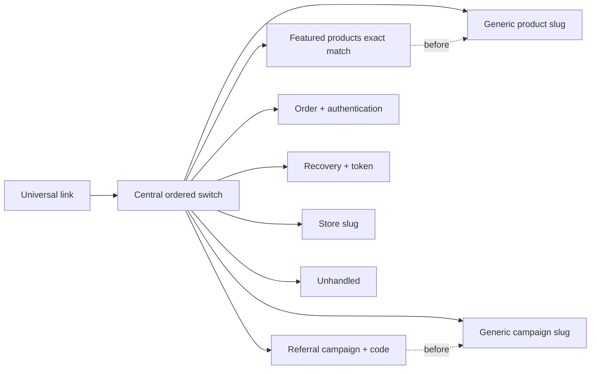

# Chain of Responsibility Pressure: One Switch, Three Feature Teams

Pressure-review date: 2026-09-29

Internal Day 054 adds three credible universal-link requirements to the direct
router from Day 053. Merchandising owns a featured-products landing page,
growth owns referral campaigns, and retail owns store pages. All three still
have to edit the same central switch even though they evolve independently.

Two additions also overlap existing generic routes. `/products/featured` is
more specific than `/products/{slug}`, and `/campaigns/referral?code={code}` is
more specific than `/campaigns/{slug}`. The router must evaluate those
specialized rules first or select the wrong destination.

## The requirements that changed

- `/products/featured` opens the curated featured-products experience rather
  than a product whose slug happens to be `featured`.
- `/campaigns/referral?code={code}` opens referral redemption only when its code
  is non-empty; an invalid referral link stays unhandled.
- `/stores/{slug}` opens a retail store page without depending on session state.
- Existing product, campaign, order, and recovery behavior must not regress.

These are routing decisions, not broadcast notifications. Exactly one feature
may handle a link, and processing terminates on the first accepted destination.

## The direct router retained

[`UniversalLinkPressure.swift`](../Sources/DesignPatterns/ChainOfResponsibility/UniversalLinkPressure.swift)
adds `DirectExpandedCommerceLinkRouter`. It deliberately keeps one tuple switch
and concrete destinations. There is still no handler protocol, handler array,
mutable `next` link, middleware engine, type erasure, or dependency container.

The specialized product clause appears before the generic product clause. The
referral clause likewise appears before generic campaigns and performs its code
validation there. This order is observable behavior:

1. moving generic products first turns the featured page into an ordinary
   product destination;
2. moving generic campaigns first turns an invalid referral into a valid
   campaign landing page;
3. returning `.handled` stops routing, while `.unhandled` leaves ownership
   available to the caller.

The switch remains understandable, but its source order now encodes precedence
between independently owned features.

## Measured pressure

The expanded direct router contains:

- **five feature families** in one switch: product merchandising, orders,
  campaigns, account recovery, and retail stores;
- **eight handling clauses plus one default pass-through clause**;
- **three new feature-owned decisions** that all modify the same router type;
- **two specialized-before-generic ordering constraints**;
- **two query-value validation branches**, for referrals and recovery;
- **two authentication outcomes** for the same order route.

Adding one independent feature grew the central branch set; adding two
specializations made source order part of correctness. A future handler owned
by one feature should not require a central router author to understand every
other feature's precedence, but distributing the clauses is useful only if the
final order remains explicit and testable.

## Executable evidence

[`ChainPressureTests.swift`](../Tests/DesignPatternsTests/ChainPressureTests.swift)
uses parameterized Swift Testing cases to verify:

- featured products win over the generic product slug;
- referral redemption wins over the generic campaign slug;
- a referral without a code remains unhandled instead of falling back to the
  generic campaign;
- ordinary product and campaign links still reach their existing destinations;
- store routing joins the same central decision point;
- signed-out order routing still retains its destination through sign-in.

Run the focused evidence with:

```sh
swift test -Xswiftc -warnings-as-errors --filter ChainPressureTests
```

## Where order becomes policy



Observe that all feature routes meet at one decision point, while two pairs
have an explicit precedence edge from the specialized rule to its generic
sibling. An accessible equivalent is: every universal link enters one ordered
switch; exact featured and referral rules must be considered before the generic
product and campaign rules, and the first accepted destination ends routing.

## Why this points to Chain of Responsibility

The pressure is not optional behavior around one operation, so it is not
Decorator. The handlers will not all observe the link, so it is not Observer.
The router does not simplify a multi-subsystem workflow, so it is not Facade.

The emerging requirement is ordered ownership: each feature can decide
`handled` or `unhandled`, and the next feature is asked only after a pass. Day
055 may introduce Chain of Responsibility if it can distribute those decisions
without hiding their deterministic order or termination rule.

## Smaller alternatives considered

The current switch is still the better choice for one team and a stable, closed
route set. An exhaustive route enum would improve compile-time coverage after a
separate URL parser, but it would keep feature decisions centralized. A table
of closures could distribute syntax while leaving ordering and dependencies in
one untyped configuration list.

Independent feature router functions called in sequence are the smallest
credible alternative to a formal handler protocol. Day 055 should prefer them
if functions preserve explicit order and test seams without needing a shared
abstraction.

## Boundary carried into Day 055

Chain of Responsibility may replace the central switch only if it:

- preserves exact-match precedence before generic sibling routes;
- exposes handled versus unhandled as an explicit result at every step;
- stops after the first handler accepts a link;
- keeps order authentication and referral validation inside their owning
  feature decisions;
- makes chain order visible at composition time and deterministic in tests;
- uses the minimum handler boundary and concrete feature handlers;
- avoids mutable `next` links, generic middleware infrastructure, navigation
  frameworks, analytics, and speculative fallback behavior.

## Day 054 decision

Three independently changing features now modify one switch, and two route
pairs rely on source order for correctness. Chain of Responsibility has earned
a narrow trial, but only if Day 055 keeps pass/handle semantics and precedence
more explicit than the central switch does today.
