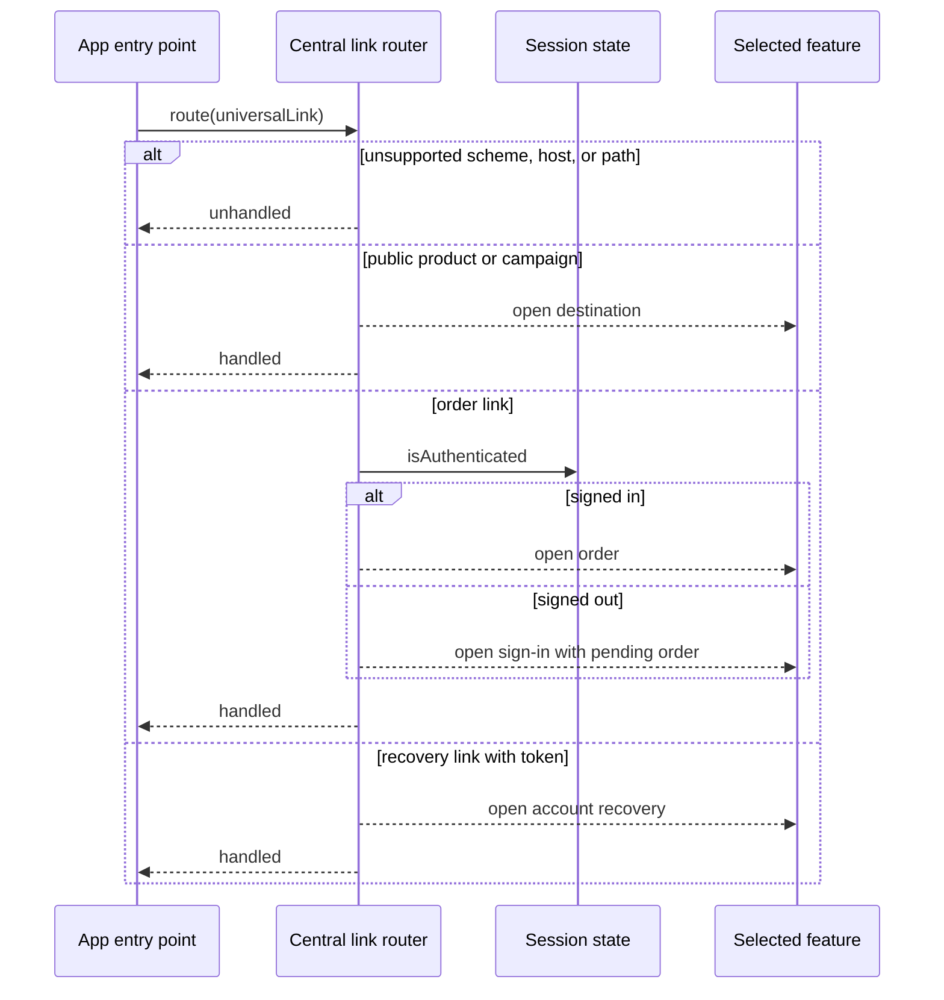

# Chain of Responsibility Problem: Universal-Link Routing

Problem-definition date: 2026-09-28

Internal Day 053 defines the direct baseline for universal-link routing in a
commerce app. Product, order, campaign, and account-recovery links enter through
one application boundary. The app either selects exactly one destination or
returns the link as unhandled so another owner may inspect it.

The route set is small and closed today. A Chain of Responsibility has not
earned handler types or ordering policy yet.

## Product scenario

The app owns links under `https://shop.example.com`. Product and campaign links
are public. Order links require an authenticated customer; a signed-out customer
must reach sign-in without losing the order they intended to open. Account
recovery requires a non-empty token and must work regardless of the current
session. Links for another host, an insecure scheme, or an unsupported path stay
unhandled.

Navigation frameworks, scene lifecycle, web fallback, analytics, deferred link
storage, and real authentication are outside this teaching unit. The behavior
under review is the routing decision: which destination owns a valid link, and
when the app must explicitly decline it.

## Requirements and invariants

| Link shape | Session requirement | Observable decision |
| --- | --- | --- |
| `/products/{slug}` | None | Open the requested product. |
| `/orders/{id}` | Authenticated | Open the requested order. |
| `/orders/{id}` | Signed out | Open sign-in and retain the order destination. |
| `/campaigns/{slug}` | None | Open the requested campaign. |
| `/account/recovery?token={token}` | None | Open recovery with the non-empty token. |
| Any unowned or malformed shape | Irrelevant | Return `.unhandled`. |

The direct router preserves these rules:

1. Only HTTPS links for the configured commerce host are eligible.
2. A link selects at most one destination.
3. Public product and campaign routes do not depend on session state.
4. An order route checks authentication before exposing order content.
5. Sign-in retains the exact order identifier needed after authentication.
6. Account recovery requires a token and is independent of the current session.
7. Unsupported links return `.unhandled` instead of inventing a fallback route.

## Direct Swift first

[`UniversalLinkDirect.swift`](../Sources/DesignPatterns/ChainOfResponsibility/UniversalLinkDirect.swift)
uses one concrete `DirectCommerceLinkRouter`. Its `route(_:isAuthenticated:)`
method validates scheme and host, extracts path segments, and exhaustively
switches over the four route families. The two order cases make the
authentication prerequisite visible beside the destination it protects.

`CommerceLinkRoutingResult` names the only two outcomes that callers need:
`.handled(destination)` and `.unhandled`. This is deliberately not a Chain of
Responsibility. There is no handler protocol, linked list, type erasure,
middleware array, mutable `next` reference, or feature-owned routing object.

For a closed route set, the switch is an advantage. A compiler-visible list of
paths and one deterministic return point are easier to inspect than several
objects passing a URL between them. The central router should remain until
independent feature evolution makes that ownership measurably costly.

## Acceptance tests

[`ChainProblemTests.swift`](../Tests/DesignPatternsTests/ChainProblemTests.swift)
uses Swift Testing to verify:

- public product and campaign routes while signed out;
- authenticated order routing;
- sign-in that retains the intended order while signed out;
- account recovery in both signed-in and signed-out sessions;
- explicit pass-through for insecure, foreign-host, unknown, incomplete, and
  over-specific links.

Run the focused suite with:

```sh
swift test -Xswiftc -warnings-as-errors --filter ChainProblemTests
```

## Initial problem flow



Observe that one router knows every path and decides whether to handle or pass
the link onward. The order branch also owns authentication precedence. An
accessible equivalent is: the app sends a link to one central decision point;
unsupported input returns untouched, public destinations open directly, orders
first resolve session state, and a token-bearing recovery link opens recovery.

## Evidence required on Day 054

Chain of Responsibility has not earned a protocol merely because the router has
several branches. Day 054 must introduce credible feature ownership and measure
the cost of keeping every decision centralized:

- How many independently changing feature routes edit the same switch?
- Which authentication or link-shape guards can be accidentally reordered?
- Does adding a feature require unrelated router dependencies or knowledge?
- Can handled versus unhandled behavior remain explicit at every step?
- Is exactly one feature allowed to handle a link, or should several observers
  see it? The latter would not be this pattern.
- Would a table of closures or another exhaustive enum remain simpler than a
  chain?

If the route set stays small, closed, and owned by one team, this router should
remain. Day 055 may introduce a chain only when ordered feature-owned handlers
remove verified central branching without obscuring termination.

## Initial editorial thesis

**Thesis:** One switchboard is the clearest router until feature ownership turns
every new route into a change at the same junction.

**Scene:** A single dark industrial link capsule enters from the left and reaches
one precise charcoal switchyard. Four mechanically distinct tracks leave toward
product, order, campaign, and recovery chambers. The order track alone crosses
a warm-red authentication gate; an unsupported track continues straight through
the switchyard untouched. The central mechanism is intentionally legible and
compact, with no text, UI screens, floating icons, or decorative circuitry.

The final Day 055 header should keep this switchyard metaphor only if measured
feature pressure justifies replacing the central junction with ordered handler
stations. It must follow [`visual-style.md`](visual-style.md); no header asset is
generated during problem definition.

## Day 053 decision

The routing problem is real and executable, but Chain of Responsibility has not
earned its types. One exhaustive switch, one explicit handled/unhandled result,
and one visible authentication guard are the smallest correct design for the
current closed route set.
