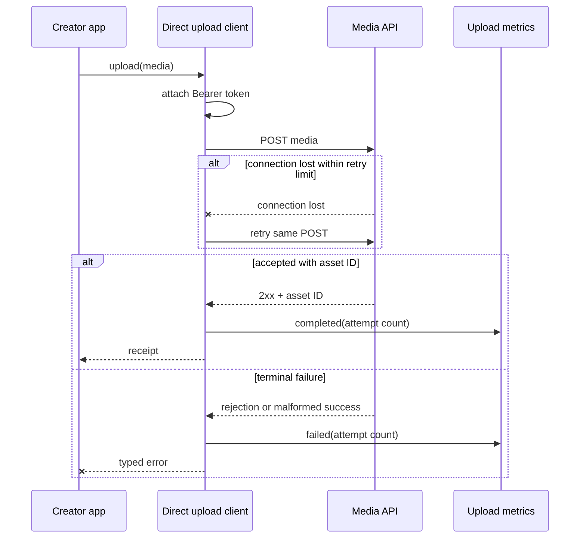

# Decorator Problem: A Fixed Media Upload Pipeline

Problem-definition date: 2026-09-22

This document defines Internal Day 046. It fixes the creator-media upload
behavior, the direct Swift baseline, acceptance evidence, and the initial visual
thesis before Decorator is considered.

## Product scenario

A creator app uploads large videos to its media service. Every upload in the
first deployment must carry an access token, retry a lost connection up to a
small fixed limit, and produce one terminal metric that includes the number of
HTTP attempts.

The example uses a deterministic scripted transport so request construction,
retry count, failure classification, and metrics are executable without a
network. Streaming bodies, progress reporting, cancellation, token refresh,
backoff delays, resumable uploads, persistence, and background execution are
outside this teaching unit. The behavior under review is whether optional HTTP
client behavior later needs independent composition.

## Responsibilities and invariants

| Concern | Direct responsibility | Observable invariant |
| --- | --- | --- |
| Request | Build one `POST` from app-owned media data. | Path, content type, upload ID, and body reach every attempt unchanged. |
| Authentication | Attach the deployment's Bearer token. | No request leaves the client without `Authorization`. |
| Retry | Repeat only after a lost connection. | Total attempts never exceed the initial attempt plus the retry limit. |
| Metrics | Record the final product outcome. | Exactly one completion or failure event exists per upload call. |
| Response | Return the service's asset identity. | A 2xx response without a non-empty asset ID is rejected. |

The flow also preserves these rules:

1. Upload identifiers, absolute destination paths, payloads, and content types
   are non-empty before any transport call.
2. An access token is required when the concrete client is created.
3. HTTP rejections are terminal and are not confused with lost connections.
4. Every retry sends the same authenticated request.
5. The terminal metric reports the actual number of attempts.
6. A failed upload never returns a receipt.

## Direct Swift first

[`MediaUploadDirect.swift`](../Sources/DesignPatterns/Decorator/MediaUploadDirect.swift)
keeps the complete policy in one concrete `DirectMediaUploadClient`. Its
`upload(_:)` method builds the authenticated request, owns a bounded retry loop,
classifies the final response, and records the terminal metric.

This is deliberately not Decorator. There is no shared client protocol, base
component, wrapper, type erasure, middleware array, or dynamically assembled
chain. Authentication, retry, and metrics are mandatory in the only deployment,
so their order is visible in one function and no runtime composition problem
exists. `ScriptedMediaUploadTransport` is a deterministic stand-in for the
external HTTP boundary, not an abstraction hierarchy.

For one fixed pipeline this direct implementation is cheaper than a pattern:
there is one control flow, one retry budget, and one owner of terminal metrics.

## Acceptance tests

[`DecoratorProblemTests.swift`](../Tests/DesignPatternsTests/DecoratorProblemTests.swift)
uses Swift Testing to verify:

- a successful upload sends the exact authenticated request and returns the
  remote asset identity;
- one terminal success metric records the actual attempt count;
- a lost connection retries the same authenticated request;
- exhaustion stops after the configured retry budget and records one failure;
- an HTTP rejection is terminal and is not retried;
- a malformed 2xx response is rejected and measured;
- invalid media input, an empty token, and a negative retry limit fail before
  transport work starts.

Run the focused suite with:

```sh
swift test -Xswiftc -warnings-as-errors --filter DecoratorProblemTests
```

## Initial problem flow



Observe that the concrete client owns all three cross-cutting behaviors and
their order: authentication happens before the first send, retry encloses only
transport loss, and metrics describe the whole logical upload rather than each
attempt. An accessible equivalent is: the app gives media to one client; that
client authenticates a POST, repeats the same request only after a lost
connection, then records one success or failure before returning a receipt or
throwing an error.

## Evidence required on Day 047

Decorator has not earned wrappers merely because one method performs three
steps. Day 047 must add credible deployment requirements in which signing,
retry, and metrics are independently optional, then measure the pressure of
keeping those choices inside one concrete client:

- How many valid behavior combinations exist, and how many flags or branches
  does the direct client need to represent them?
- Does retry measure one logical upload or accidentally emit one metric per
  attempt when ordering changes?
- Must signing occur once per logical upload or again for every HTTP attempt?
- Can small function composition express the required order more clearly than
  identity-bearing wrappers?

If every deployment keeps the same pipeline, this direct client should remain.
Decorator is justified only when independently selectable behavior can preserve
one client contract while ordered composition removes demonstrated branching or
subclass growth.

## Initial editorial thesis

**Thesis:** One fixed upload pipeline needs no pattern; the design pressure
starts when the same behaviors must be stacked independently and order changes
what they mean.

**Scene:** A dark industrial media conduit runs left to right from one video
cartridge to a remote storage chamber. The cartridge passes through three
integrated stations in a single rigid housing: a warm-red authentication seal,
a mechanical return loop for retry, and one terminal measurement ring around
the whole conduit. The stations are visibly fixed rather than detachable,
making today's simplicity and tomorrow's composition pressure legible without
labels or decorative network imagery.

The final Day 048 header should keep this upload-conduit metaphor only if the
measured pressure justifies Decorator. It must follow
[`visual-style.md`](visual-style.md); no header asset is generated during problem
definition.

## Day 046 decision

The media-upload behavior is real and executable, but Decorator has not earned
its wrappers. One concrete method remains the smallest correct design while all
deployments require the same authentication, retry, and metrics policy.
