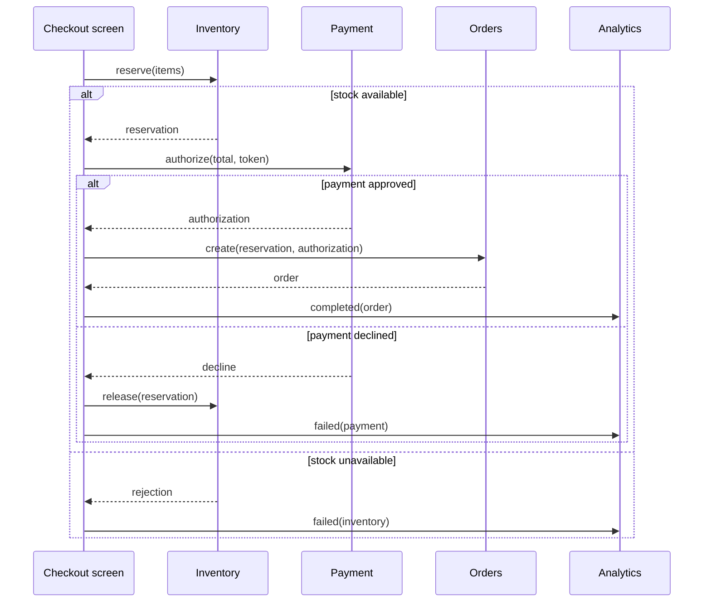

# Facade Problem: Checkout Orchestration at the Screen Boundary

Problem-definition date: 2026-09-19

This document defines Internal Day 043. It fixes the checkout responsibilities,
the direct Swift baseline, acceptance evidence, and the first visual model before
a Facade is considered.

## Product scenario

A commerce app submits a cart from its checkout screen. One user action must
reserve inventory, authorize the exact cart total, create an order that links
both external results, and record the final product outcome. A declined payment
must release the reservation so stock does not remain stranded.

The example uses deterministic in-memory components so orchestration is
executable without a backend. Network transport, authentication challenges,
taxes, discounts, shipping, capture, persistence, retries, and distributed
transactions are outside this teaching unit. The behavior under review is which
app boundary owns the sequence and its compensation.

## Responsibilities and invariants

| Component | Responsibility | Observable invariant |
| --- | --- | --- |
| `CheckoutInventory` | Reserve all requested quantities or reject the cart. | Payment never starts after an inventory rejection. |
| `CheckoutPayments` | Authorize the computed minor-unit total. | A decline creates no authorization. |
| `CheckoutOrders` | Link customer, reservation, and payment in one order. | An order exists only after both earlier steps succeed. |
| `CheckoutAnalytics` | Record the terminal product outcome. | Exactly one completion or failure is recorded per attempt. |

The flow must also preserve these rules:

1. Line-item identifiers are non-empty and quantities and prices are positive.
2. A checkout has an identity, a customer, at least one item, and a payment token.
3. Stock is decremented only after every line can be reserved.
4. A declined payment restores the complete reservation before the error escapes.
5. An order stores the identifiers returned by inventory and payment rather than
   reconstructing them.
6. Amounts use integer minor units from cart through payment, order, and analytics.

## Direct Swift first

[`CheckoutDirect.swift`](../Sources/DesignPatterns/Facade/CheckoutDirect.swift)
keeps four concrete value-semantic components on `DirectCheckoutScreen`. Its
`placeOrder(from:)` method calls them in order and performs the one required
compensation explicitly:

1. Reserve the cart with `CheckoutInventory`.
2. Authorize the computed total with `CheckoutPayments`.
3. Release that reservation if authorization fails.
4. Create the order with `CheckoutOrders` after both operations succeed.
5. Record one terminal event with `CheckoutAnalytics`.

This is deliberately not a Facade. The screen-level client knows every
component, their call order, the data passed between them, and the compensation
rule. There is no `CheckoutFacade`, subsystem protocol, repository, coordinator,
use-case object, or general workflow engine. With one client and one short flow,
keeping the sequence local is easier to read than extracting a new abstraction.

## Acceptance tests

[`FacadeProblemTests.swift`](../Tests/DesignPatternsTests/FacadeProblemTests.swift)
uses Swift Testing to verify:

- a successful attempt reserves inventory, authorizes the exact amount, creates
  the linked order, and records one completion;
- unavailable inventory prevents payment and order creation;
- a declined payment releases stock, removes the reservation, and prevents the
  order;
- repeated SKU lines are aggregated before stock changes, so reservation stays
  all-or-nothing;
- failure analytics distinguish inventory rejection from payment decline;
- malformed line items and an empty cart fail before orchestration begins.

Run the focused suite with:

```sh
swift test -Xswiftc -warnings-as-errors --filter FacadeProblemTests
```

## Initial problem flow



Observe that the screen touches all four components and owns both the happy
path and compensation. An accessible equivalent is: the checkout screen asks
inventory first; if inventory succeeds it asks payment; approval permits order
creation and completion analytics, while a decline releases inventory and logs
failure; an inventory rejection skips payment and order creation entirely.

## Evidence required on Day 044

Facade has not earned an abstraction merely because checkout calls four
components. Day 044 must introduce credible additional clients or entry points
that need the same use case and measure the knowledge they duplicate:

- How many clients must know the subsystem order and compensation rule?
- Which subsystem types and intermediate identifiers escape into those clients?
- Does changing analytics or reservation cleanup require synchronized client
  edits?
- Can a narrow checkout operation hide that knowledge without hiding useful
  lower-level capabilities or becoming a god object?

If the screen remains the only consumer and the flow stays this small, the
direct method should remain. A Facade is justified only when a stable use-case
boundary reduces demonstrated client coupling.

## Initial editorial thesis

**Thesis:** Checkout looks like one action to the customer, but today the screen
must conduct four subsystems and repair a broken middle step.

**Scene:** A dark retail checkout lane runs left to right through four precise
industrial stations: stock reservation, payment authorization, order sealing,
and a final signal beacon. One warm-red cart token crosses the stations while a
single return rail loops from payment back to inventory. The screen-side control
panel visibly drives every connection, making the orchestration burden the focal
point rather than decorating the scene with generic commerce icons.

The final Day 045 header should retain this checkout-lane metaphor only if the
measured pressure justifies Facade. It must follow
[`visual-style.md`](visual-style.md); no header asset is generated during problem
definition.

## Day 043 decision

The direct checkout is executable and correct for one screen. Facade has not
earned a type: Day 044 must first prove that repeated clients or change pressure
make the screen-owned subsystem knowledge costly.
