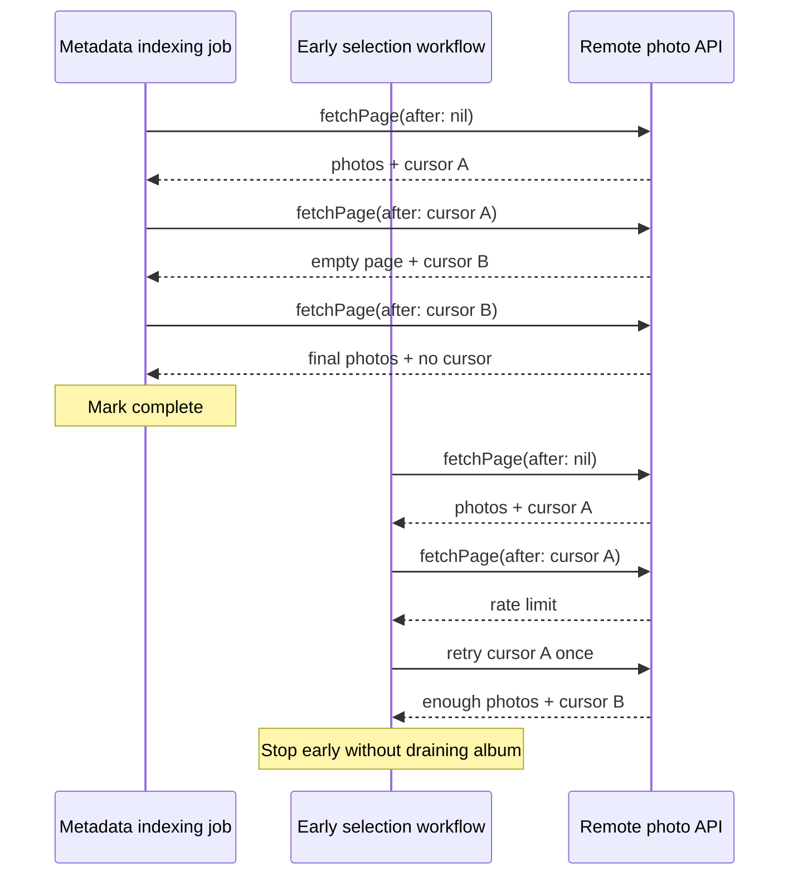

# Iterator Pressure: Every Consumer Operates the Cursor

Pressure-review date: 2026-10-06

Internal Day 061 adds two credible consumers to the cursor-paginated photo API
from Day 060. A background job indexes the complete remote library, while a
selection workflow stops as soon as it has enough photos. Both implementations
remain direct so the repeated traversal responsibility is visible before an
Iterator boundary is introduced.

## The requirements that changed

The photo-library screen is no longer the only client. The app must now:

- index every remote photo in stable service order without UI state;
- continue through an empty intermediate page when it still has a cursor;
- cancel background work before another remote request is issued;
- select only the first requested number of photos without draining the album;
- let indexing surface rate limiting as a terminal job failure; and
- let interactive selection retry one rate limit, then propagate a second
  failure instead of retrying forever.

Prefetching, parallel page requests, cursor persistence, decoding, disk caches,
retry delays, and production networking remain outside this pressure exercise.
They would obscure whether sequential traversal itself has earned a reusable
abstraction.

## Two more direct traversals

[`PhotoLibraryPressure.swift`](../Sources/DesignPatterns/Iterator/PhotoLibraryPressure.swift)
adds `DirectPhotoMetadataIndexingJob` and `DirectPhotoSelectionWorkflow`.
Neither uses a protocol, iterator, `AsyncSequence`, repository, generic page
loader, type erasure, or unstructured worker task.

The indexing job owns an optional cursor, loops until a page returns no next
cursor, checks cooperative cancellation before and after every fetch, and
appends complete pages to its result. It deliberately propagates a rate-limit
error because a scheduler outside this example would decide when to rerun a
failed background job.

The selection workflow owns another optional cursor and another termination
flag. It repeats the same fetch-and-advance mechanics but stops when it has the
requested count. Its one-retry helper sends the unchanged cursor again after a
rate limit; a second failure escapes. The policy is local to this interactive
consumer rather than hidden in the remote API.

## Measured duplication

The direct Day 060 screen and the two Day 061 consumers now contain:

| Repeated responsibility | Observed sites |
| --- | ---: |
| Consumer-owned cursor properties | 3 |
| Consumer-owned completion flags | 3 |
| Methods that request a page with the current cursor | 3 |
| Multi-page fetch loops | 2 |
| Successful cursor-advance assignments | 3 |
| Missing-cursor termination decisions | 3 |
| Explicit consumer cancellation checkpoints | 5 |
| Distinct rate-limit policies | 3 |

The three rate-limit policies are intentionally different: the foreground
screen surfaces every rate limit and lets the UI decide when to retry; the
indexer terminates its run; and selection retries exactly once. That variation
must remain consumer-owned. The duplicated cursor advancement, empty-page
handling, and missing-cursor termination do not vary and are the pressure that
Iterator should remove.

The table counts concrete responsibilities in the current source, not runtime
performance. Two short loops alone would not justify a pattern; three clients
repeating opaque token ownership and termination semantics create a credible
change risk if the service contract evolves.

## Cancellation and termination evidence

[`IteratorPressureTests.swift`](../Tests/DesignPatternsTests/IteratorPressureTests.swift)
uses isolated value fixtures and Swift Testing to verify:

- the indexer crosses an empty intermediate page and stops only at a missing
  cursor;
- a rate limit terminates indexing without marking the job complete;
- an already-cancelled indexing task records no remote request;
- selection stops after its requested count without fetching the final page;
- selection retries the same cursor once and never enters an unbounded retry;
  and
- an already-cancelled selection task also records no remote request.

The cancellation tests cancel the current structured task before traversal.
Both consumers check cancellation before the API call, so the scripted API's
request log stays empty. This proves cancellation prevents remote work instead
of allowing work to finish and merely discarding the returned photos.

Run the focused evidence from the repository root:

```sh
swift test -Xswiftc -warnings-as-errors --filter IteratorPressureTests
```

## Pressure flow



Observe what repeats and what differs. Both consumers manually send and replace
opaque cursors and interpret a missing cursor as completion. The indexer keeps
going through an empty page, while selection can stop before remote completion
and owns a bounded retry decision. An accessible equivalent is: the indexer
turns three cursor-linked responses into one ordered collection; the selector
uses the same cursor transitions but exits as soon as its local count is met.

## Smaller alternatives still in contention

Keep direct state in the Day 060 screen when a feature loads one page per user
action. A reusable asynchronous traversal would add indirection without
removing a loop there unless the screen also chooses to consume a stream.

A function returning `[LibraryPhoto]` is sufficient when all data is already in
memory or when every caller truly needs the complete remote library. It is a
poor fit here because selection must stop early and cancellation should avoid
fetching later pages.

A callback-based page loader could share cursor advancement, but callbacks add
lifetime and error-channel complexity that Swift's native asynchronous
iteration already models. A generic pagination framework would also be broader
than the one photo-domain traversal currently demonstrated.

## Boundary carried into Day 062

Iterator may replace the repeated mechanics only if the result:

- exposes photos incrementally through native `AsyncSequence` traversal;
- keeps the remote API's cursors private to the iterator;
- crosses empty intermediate pages without falsely terminating;
- stops fetching when a consumer breaks early or its task is cancelled;
- preserves service order and propagates terminal errors;
- leaves retry-versus-fail policy explicit at the consumer boundary; and
- avoids a protocol hierarchy, type erasure, prefetch engine, repository, or
  generic pagination framework.

## Day 061 decision

Iterator has now earned one narrow boundary. Three consumers repeat the same
opaque cursor advancement and missing-cursor termination rules, while two of
them also repeat multi-page cancellation checkpoints. The next day may hide
only those stable mechanics behind `AsyncSequence`; accumulation, selection
limits, indexing, and retry policy stay with their consumers.
