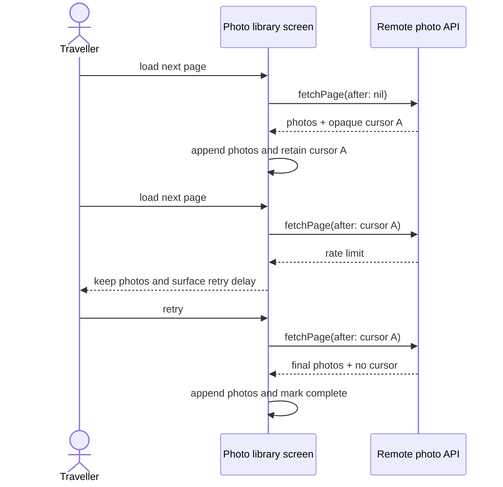

# Iterator Problem: Cursor-Paginated Photo Library

Problem-definition date: 2026-10-05

Internal Day 060 defines a direct pagination baseline for a photo-backup app.
Its library screen requests one remote page when the user reaches the end of
the visible grid. The remote API can return a partial page, an opaque cursor for
the next request, a terminal page, or a rate-limit error.

One screen currently owns the loop state, so keeping its cursor beside the
loaded photos is clearer than introducing an iterator protocol or
`AsyncSequence` before another consumer exists.

## Product scenario

A traveller opens a cloud album containing photos uploaded from several
devices. The album API returns photos in capture order but limits each response
to a page chosen by the service. A short page does not imply completion: only a
missing continuation cursor ends traversal. If the service rate-limits a
request, the screen keeps its visible photos and retries the same cursor after
the UI has respected the supplied delay.

This teaching unit covers one foreground screen, one page request per user
action, stable remote order, completion, and retryable rate limiting. Image
decoding, thumbnails, disk caches, prefetch thresholds, authentication,
backoff scheduling, and offline persistence are outside today's scope.

## Requirements and invariants

| Requirement | Observable behavior |
| --- | --- |
| Initial request | The screen sends no cursor for the first page. |
| Continue | Each successful nonterminal page supplies the next opaque cursor. |
| Partial page | A short page remains nonterminal when it includes a cursor. |
| Preserve order | Photos append in remote page and item order. |
| Complete | A page without a cursor prevents any further request. |
| Empty library | One empty terminal page completes traversal. |
| Rate limit | The error is propagated without changing photos or the cursor. |
| Retry | The next attempt sends the same cursor that was rate-limited. |

The direct screen also preserves these constraints:

1. The API owns cursor creation; the screen stores and returns tokens without
   interpreting them.
2. Visible photos change only after a page succeeds.
3. A failed request cannot skip a page.
4. An extra load request after completion is a no-op.
5. Cancellation is checked at the asynchronous API boundary, before a remote
   request is recorded.

## Direct Swift first

[`PhotoLibraryDirect.swift`](../Sources/DesignPatterns/Iterator/PhotoLibraryDirect.swift)
uses one concrete `ScriptedPhotoLibraryAPI` and one value-semantic
`DirectPhotoLibraryScreen`. The scripted API gives the executable guide
deterministic remote pages and errors without network calls. Its
`fetchPage(after:)` method records the received opaque token and returns the
next configured outcome.

`DirectPhotoLibraryScreen.loadNextPage()` is intentionally straightforward. It
guards terminal state, asks for a page with its current cursor, appends the
photos after success, stores the returned cursor, and derives whether another
page can be loaded. Because assignment occurs after `await`, a thrown rate-limit
error leaves both the visible collection and continuation state untouched.

This baseline has no library protocol, iterator type, `AsyncIteratorProtocol`,
`AsyncSequence`, generic pagination helper, retry scheduler, repository, or
type erasure. With one consumer and one user-driven request at a time, those
types would hide a short and auditable state transition rather than simplify
it.

## Acceptance tests

[`IteratorProblemTests.swift`](../Tests/DesignPatternsTests/IteratorProblemTests.swift)
uses Swift Testing to verify:

- a partial first page remains resumable;
- photos preserve service order across three pages;
- a terminal cursor stops duplicate remote requests;
- an empty library completes after one request; and
- a rate-limit failure preserves visible photos and retries the same cursor.

Run the focused suite with:

```sh
swift test -Xswiftc -warnings-as-errors --filter IteratorProblemTests
```

## Initial problem flow



Observe who owns pagination: the API creates opaque cursors, but the screen
stores each token, chooses the next request, retries failures, and recognizes
termination. An accessible equivalent is: the first request has no token; a
successful response provides token A; a rate limit leaves A unchanged; retry
uses A again; the first response without a token ends loading.

## Evidence to gather on Day 061

Iterator has not earned a reusable traversal boundary from one screen. Day 061
will add credible consumers and measure whether the direct approach repeats
policy rather than merely a small loop:

- Add a background metadata-indexing job that traverses the same album without
  screen state.
- Add a selection workflow that stops early after a requested photo count.
- Count duplicated cursor variables, fetch loops, terminal checks, and
  rate-limit branches.
- Verify cancellation stops remote work rather than merely discarding results.
- Exercise empty intermediate pages that still carry a continuation cursor.
- Preserve each consumer's own decision about retry versus terminal failure.

Only repeated traversal mechanics should move behind an iteration boundary.
UI accumulation, selection limits, indexing work, and retry policy remain
consumer responsibilities.

## Initial editorial thesis

**Thesis:** A photo consumer should see the next image, not operate the remote
service's pagination dial.

**Scene:** A dark film transport crosses the lower frame from left to right.
Three uneven strips of photographic frames enter through separate matte-black
cartridges. Between strips, small warm-red mechanical keys connect one feed to
the next; the viewing gate exposes one continuous ordered ribbon while the
cartridge boundaries and key changes remain visible behind it. One red stop pin
marks the terminal end. The scene uses no screens, labels, decorative circuits,
camera bodies, or generic cloud icons.

The final Day 062 header should keep this continuous film-feed metaphor only if
the measured multi-consumer pressure justifies hiding cursor transitions behind
`AsyncSequence`. It must follow [`visual-style.md`](visual-style.md); no header
asset is generated during problem definition.

## Day 060 decision

The pagination requirement is real and executable, but Iterator has not earned
new participants. One concrete async API, one cursor property, and one guarded
screen method keep ordering, retry, and termination explicit with the fewest
moving parts.
