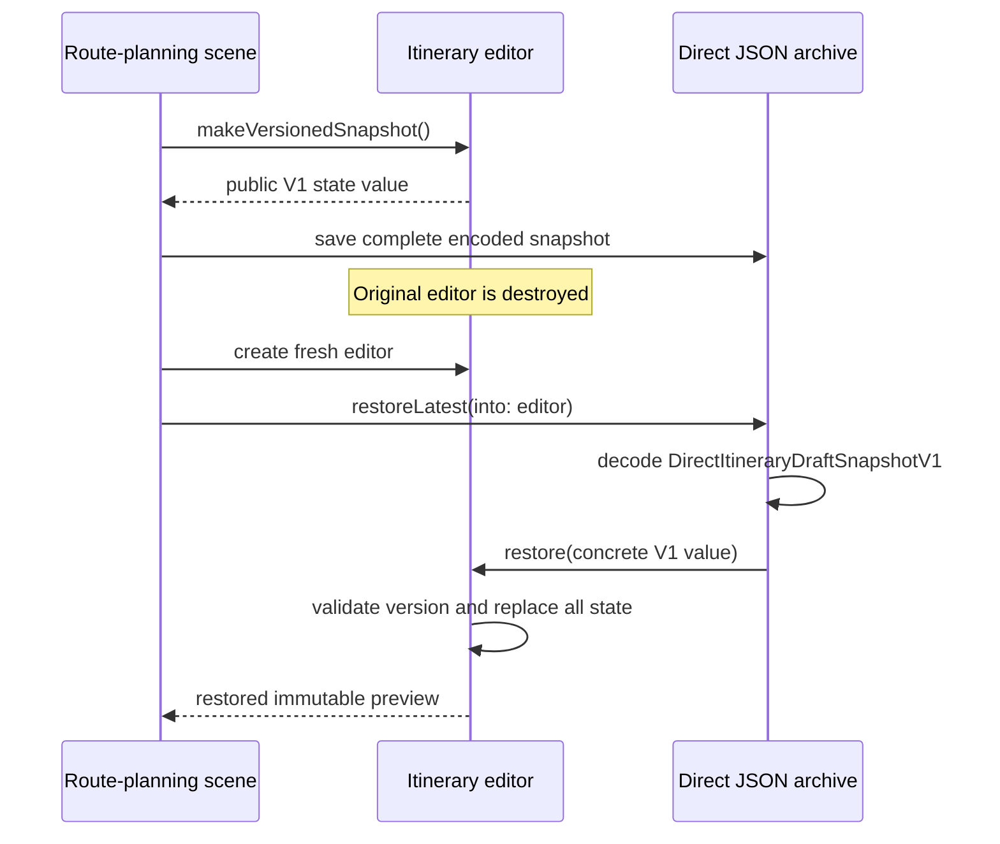

# Memento Pressure: History Outlives the Editor

Pressure-review date: 2026-10-03

Internal Day 058 adds scene recreation and persisted restore points to the
itinerary editor from Day 057. A route-planning scene can now disappear under
memory pressure and be rebuilt later, while its history must remain available.
The implementation stays direct: the editor exports a public, versioned value
and an external archive stores bounded JSON data. There is no opaque memento,
caretaker protocol, persistence repository, migration framework, or type
erasure.

## The requirements that changed

Editor-owned in-memory history is no longer enough. The app must now:

- retain checkpoints after the editor value is destroyed;
- rebuild a fresh editor and restore title, ordered stops, transport, and both
  private routing preferences atomically;
- persist a bounded set of restore points as portable bytes;
- detect an incompatible snapshot version before mutating the editor; and
- keep an unreadable or unsupported checkpoint available for later recovery
  instead of consuming it on failure.

Cross-device synchronization, conflict resolution, encryption, long-term file
storage, and migrations remain outside this pressure exercise. Adding those
would turn a bounded restoration example into a document-storage subsystem.

## Direct versioned snapshots

[`ItineraryDraftDirect.swift`](../Sources/DesignPatterns/Memento/ItineraryDraftDirect.swift)
now exposes `DirectItineraryDraftSnapshotV1`. The value contains the entire
restorable representation: title, stops, transport, and the two booleans that
produce the public route profile. `DirectItineraryDraftEditor` creates the
value and refuses any schema version other than `1` before replacing its
private state.

[`DirectItineraryDraftArchive`](../Sources/DesignPatterns/Memento/ItineraryDraftPressure.swift)
is the direct external owner. It knows the concrete V1 type, encodes it with
`JSONEncoder`, stores a bounded array of `Data`, decodes it with `JSONDecoder`,
and passes the resulting value back to the editor. A restore point is removed
only after decoding and restoration both succeed.

This meets the product behavior, but the cost is now visible: a component whose
job is history retention depends on the editor's field layout, serialization
format, and current schema type. The formerly private scenic-route and
toll-avoidance choices have become public snapshot fields because the external
archive needs a constructible, codable representation.

## Measured snapshot cost

The focused test builds a 250-stop itinerary and saves the same complete state
four times. On the current Swift 6/macOS runner:

| Measurement | Observed value |
| --- | ---: |
| Stops in one snapshot | 250 |
| Encoded bytes in one snapshot | 8,774 |
| Restore points retained | 4 |
| Logical stop entries retained | 1,000 |
| Encoded bytes retained | 35,096 |

The byte count is evidence from this encoder and fixture, not a portable wire
format guarantee. The executable invariant is the growth relationship: four
unchanged checkpoints retain exactly four times the encoded bytes of one full
checkpoint. A larger route, richer stop metadata, or deeper history multiplies
that cost even if only the title changed between saves.

This does not automatically justify a delta format. For small histories, full
snapshots keep restore atomic and make failure behavior easy to reason about.
The measurement establishes a threshold to revisit instead of assuming that
copying is either free or already too expensive.

## Compatibility pressure

The archive accepts previously persisted bytes, so the tests inject otherwise
valid snapshots labelled with schema versions `0` and `2`. Both are rejected
with `ItineraryDraftSnapshotError.unsupportedVersion`, the current editor stays
unchanged, and the archive retains the restore point.

That safe failure also demonstrates the coupling. `DirectItineraryDraftArchive`
must decode `DirectItineraryDraftSnapshotV1` before the originator can decide
whether it understands the state. Every future V2 rename, migration, or format
change therefore risks spreading compatibility branching into the history
owner. The archive does not need to understand route semantics, yet the direct
API makes its compilation and persistence behavior depend on them.

## Executable evidence

[`MementoPressureTests.swift`](../Tests/DesignPatternsTests/MementoPressureTests.swift)
uses Swift Testing to verify:

- an archive restores a fresh editor after the original editor is gone;
- private routing choices return together as `.scenicAndTollFree`;
- a four-entry history grows linearly with a complete 250-stop snapshot; and
- unsupported past and future versions neither mutate the editor nor consume
  their stored data.

Run the focused evidence from the repository root:

```sh
swift test -Xswiftc -warnings-as-errors --filter MementoPressureTests
```

## Pressure flow



Observe that the archive is not a passive owner of history: it names and
decodes the editor's concrete schema before restoration can occur. An
accessible equivalent is: the scene asks the editor for its whole public V1
state, the archive serializes that exact type, and a later editor receives the
decoded value only after the archive has reconstructed it.

## Smaller alternatives still in contention

Keep the Day 057 editor-owned array when history never leaves one editor
session. It avoids serialization, compatibility, and a second history owner.

A versioned document format is the better boundary when the goal is durable
user data, sharing, or cross-device synchronization. Such a format should have
explicit migrations and product-level retention rules; calling it Memento
would not remove those responsibilities.

Reversible operations or deltas can reduce storage when edits are small and
history is deep, but they introduce replay ordering, compaction, and failure
semantics. The 35,096-byte fixture does not yet earn that machinery.

## Boundary carried into Day 059

Memento may replace this direct pressure implementation only if the result:

- lets an external history owner retain checkpoints without understanding
  their fields or schema version;
- keeps capture, compatibility validation, and atomic restoration inside the
  itinerary editor;
- remains bounded and leaves failed checkpoints unconsumed;
- measures full-snapshot storage rather than hiding it;
- documents when a durable versioned document or operation log is the real
  requirement; and
- avoids a protocol hierarchy, generic persistence layer, migration engine, or
  speculative synchronization design.

## Day 058 decision

External ownership has earned a boundary, but not yet a framework. The direct
JSON archive is correct and testable; its concrete V1 dependency is the precise
coupling Memento must remove on Day 059. Full snapshots remain acceptable at
the measured scale, so storage optimization stays out of scope.
