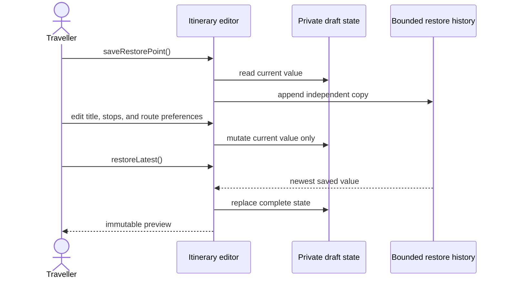

# Memento Problem: Route-Planning Draft History

Problem-definition date: 2026-10-02

Internal Day 057 defines a direct restore-point baseline for a travel-planning
app. An itinerary editor owns an ordered list of stops, a transport choice, and
private routing preferences. A traveller can save a bounded checkpoint, keep
editing, and restore the most recent checkpoint without receiving mutable
access to the editor's internal representation.

The current state is a small Swift value. Copying that value inside the editor
is simpler than introducing Memento participants, opaque tokens, persistence,
or a caretaker object.

## Product scenario

A traveller assembles a multi-city itinerary while comparing rail, road,
flight, and ferry options. Scenic-route and toll preferences affect the route
profile but remain implementation details of the editor. Before trying a large
change, the traveller can create a restore point and later return to it.

This teaching unit covers in-memory draft editing and LIFO restoration in one
editor session. Route calculation, map rendering, autosave, disk persistence,
cross-device synchronization, collaborative editing, and schema migration are
outside today's scope.

## Requirements and invariants

| Requirement | Observable behavior |
| --- | --- |
| Edit a draft | Title, ordered stops, transport, and route profile update together. |
| Save a restore point | The current draft is captured as an independent value copy. |
| Continue editing | Later mutations cannot change an already-saved restore point. |
| Restore | The newest checkpoint replaces every field of the current draft atomically. |
| Bound memory | Saving beyond the configured limit discards the oldest checkpoint. |
| Empty history | Restore returns `false` and leaves the current draft untouched. |
| Protect internals | Callers receive `ItineraryDraftPreview`, not mutable draft storage. |

The direct editor also preserves these constraints:

1. Stops retain user-defined order.
2. Each successful restore consumes exactly one checkpoint.
3. Checkpoints use stack order: newest first.
4. Public editing operations express product intent instead of exposing a
   mutable state object.
5. Routing preference storage stays private; callers observe only the derived
   `ItineraryRouteProfile`.
6. History capacity must be positive and is fixed for the editor's lifetime.

## Direct Swift first

At the Day 057 baseline,
[`ItineraryDraftDirect.swift`](../Sources/DesignPatterns/Memento/ItineraryDraftDirect.swift)
used one value-semantic `DirectItineraryDraftEditor`. Its private `DraftState`
contained the complete mutable representation, while a private array retained
a bounded stack of earlier values. Swift's copy-on-write arrays kept the visible
model simple: mutating a later list of stops did not mutate a saved draft.

`ItineraryDraftPreview` is a read-only projection for UI or tests. Callers edit
through domain operations such as `appendStop(_:)` and
`preferScenicRoutes(_:)`; they never construct, retain, or modify the private
state type. `saveRestorePoint()` copies the current value, and
`restoreLatest()` replaces it as one assignment.

That baseline deliberately had no memento protocol, caretaker, snapshot
hierarchy, encoder, version envelope, repository, or type erasure. While one
editor owned a small in-memory history, those types would only have renamed
simple value copies. Day 058 extends the same source with the versioned direct
API evaluated in the [pressure review](memento-pressure.md).

## Acceptance tests

[`MementoProblemTests.swift`](../Tests/DesignPatternsTests/MementoProblemTests.swift)
uses Swift Testing to verify:

- callers observe a value preview rather than mutable draft storage;
- a checkpoint is unaffected by subsequent title, stop, transport, and routing
  changes;
- restore replaces the entire draft and consumes the checkpoint;
- checkpoints restore newest-first;
- exceeding the limit discards the oldest checkpoint; and
- an empty history leaves the draft unchanged.

Run the focused suite with:

```sh
swift test -Xswiftc -warnings-as-errors --filter MementoProblemTests
```

## Initial problem flow



Observe the ownership boundary: the traveller sends editing intent to the
editor, the editor alone can read or replace its private state, and history
stores value copies without exposing them. An accessible equivalent is: save
copies the entire private draft into a bounded stack; later edits affect only
the current draft; restore pops the newest copy and atomically replaces all
current fields before returning a read-only preview.

## Evidence evaluated on Day 058

Memento did not earn an external snapshot type merely because undo-like
behavior existed. Day 058 added credible restoration pressure and quantified
the cost of continuing with full copies across an external owner:

- The direct JSON archive retains checkpoints when the editor is recreated.
- Both routing-preference booleans must return together to derive a consistent
  route profile.
- A 250-stop fixture occupies 8,774 encoded bytes; four checkpoints retain
  35,096 bytes.
- Unsupported versions fail without mutating the editor or consuming history.
- Smaller reversible operations remain unjustified at the measured depth.
- Durable user data would still require a versioned document format rather
  than Memento terminology.

The [pressure evidence](memento-pressure.md) concludes that full copies remain
acceptable, while the external owner's dependency on a concrete V1 schema is
the coupling Day 059 must address.

## Initial editorial thesis

**Thesis:** A restore point should preserve a route plan, not hand its internal
map to the rest of the app.

**Scene:** A dark route-planning table occupies the lower frame. One precise
warm-red itinerary line crosses several machined city markers. Behind the active
route, two thin charcoal plates preserve earlier complete route configurations
inside a sealed horizontal cassette. A single plate can slide back into the
active planning surface from right to left, while its internal grooves remain
hidden. The mechanism is readable without UI screens, labels, decorative
circuits, or generic document icons.

The final Day 059 header should keep this sealed route-cassette metaphor only
if measured restoration pressure justifies an opaque handoff between editor and
history owner. It must follow [`visual-style.md`](visual-style.md); no header
asset is generated during problem definition.

## Day 057 decision

The restore requirement is real and executable, but Memento has not earned new
participants. A private value state, a bounded array, and a read-only preview
provide independent checkpoints and atomic restoration with the fewest moving
parts.
