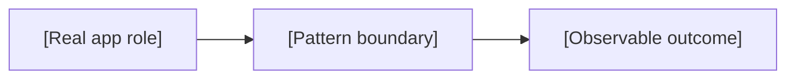

# 📘 Pattern README Template

Use this template when a pattern reaches Day C of its three-day cycle. Replace
every bracketed prompt, remove instructions that do not apply, and keep the
result in the pattern directory as its canonical `README.md`.

Use the pattern's semantic icon from the root catalogue in the title. Keep the
section icons below unchanged across every canonical README so the collection
has one predictable visual hierarchy. Use one icon per heading and do not add
decorative icons to body copy or lower-level headings.

The document must stand on its own. A reader should understand the app problem,
why direct Swift stopped being enough, and what the pattern costs before opening
the implementation.

---

# [Pattern Icon] [Pattern Name]


> **Caption:** [One sentence connecting the visual metaphor to the design
> pressure addressed by the pattern.]

**Category:** [Creational | Structural | Behavioral]

## 🎯 The app problem

[Describe a concrete app scenario, the user or product outcome, and the
constraint that makes the problem worth solving. Name the real domain rather
than placeholder types such as `ProductA`, `Manager`, or `ConcreteCreator`.]

### Requirements

- [Observable requirement.]
- [Observable requirement.]
- [Constraint or failure behavior.]

## 🪶 Start with direct Swift

[Show or explain the smallest reasonable solution using value semantics,
enums, functions, protocol extensions, Observation, `AsyncSequence`, actors, or
another native feature as appropriate. Reference the exact source file.]

```swift
// Keep this excerpt short and identical to verified source.
```

[State why this solution is preferable while the requirements remain simple.]

## ⚡ The turning point

[Identify the new, demonstrated requirement that creates measurable coupling,
branching, invalid states, duplication, lifecycle risk, or test friction. Avoid
hypothetical extensibility. Explain why a local refactor is no longer enough.]

## 🧭 Pattern intent

[Explain in this app's language what responsibility the pattern separates or
what variation it contains. Do not paste a textbook definition.]

## 🧩 Participants and responsibilities

| App role | Swift type | Responsibility |
| --- | --- | --- |
| [Domain participant] | [`TypeName`](path/to/Source.swift) | [One owned decision or behavior.] |
| [Domain participant] | [`TypeName`](path/to/Source.swift) | [One owned decision or behavior.] |

Every protocol in this table must represent an external boundary, a test seam,
or variation already required by the example. Delete ceremonial participants.

## ⚙️ How the Swift implementation works

1. [Trace one real input from the client-facing API.]
2. [Explain the relevant transformation, selection, or delegation.]
3. [End at the observable result or error.]

Call out ownership, value/reference semantics, isolation, cancellation, ordering,
and error propagation wherever they affect correctness. Explain decisions and
invariants, not syntax.

## 🗺️ Diagram



[Explain what the reader should notice in the diagram. Use a creation flow for
a creational pattern, relationships/composition for a structural pattern, and a
sequence or state diagram for a behavioral pattern. Show only necessary
relationships and use domain names.]

**Accessible description:** [Describe the same nodes, direction, and meaning in
plain language so the diagram is not the only source of information.]

## ▶️ Run the example

From the repository root:

```sh
[Exact warning-free build or executable command]
```

[Describe the observable output and any platform requirements. Do not make
`print` output the only proof of behavior.]

## 🧪 Tests

```sh
swift test -Xswiftc -warnings-as-errors --filter [VerifiedTestOrSuiteFilter]
```

The tests prove:

- [Acceptance behavior.]
- [Failure, edge case, or invariant.]
- [The pressure that justified the pattern, when testable.]

Reference the exact test files and keep every command synchronized with the
package.

## ⚖️ Trade-offs

### What improves

- [Verified reduction in coupling, branching, invalid state, duplication, or
  risk.]

### What it costs

- [Additional type, indirection, allocation, ordering rule, ownership burden, or
  maintenance cost introduced by the pattern.]

## 🔀 Alternatives considered

| Alternative | Prefer it when | Why it does not meet this example now |
| --- | --- | --- |
| [Direct Swift solution] | [Simpler condition.] | [Concrete pressure, not speculation.] |
| [Nearby pattern or API] | [Its actual intent.] | [Key distinction in this domain.] |

[Explicitly contrast patterns that are commonly confused, such as Simple
Factory / Factory Method / Abstract Factory, Strategy / State / Bridge, or
Decorator / Proxy / Chain of Responsibility.]

## 🚫 When not to use it

- [The direct Swift solution remains clearer when...]
- [The variation or boundary is absent when...]
- [The pattern's cost exceeds the demonstrated risk when...]

## 🗂️ Source map

- [`Sources/.../Example.swift`](path/to/Example.swift) — [purpose].
- [`Tests/.../ExampleTests.swift`](path/to/ExampleTests.swift) — [behaviors
  verified].
- [`Documentation/Assets/Patterns/.../[pattern]-header.png`](../../Documentation/Assets/Patterns/[category]/[pattern]-header.png)
  — editorial header.

Before merging, verify every name, link, command, snippet, image alt, caption,
and diagram against these files.
