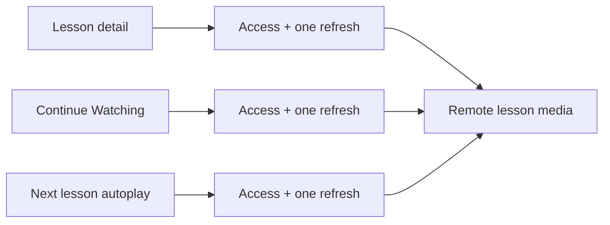

# Proxy Pressure: Three Clients Guarding the Same Lesson

Pressure-review date: 2026-09-26

Internal Day 051 adds two credible playback entry points to the lesson screen
from Day 050. A Continue Watching card can resume an interrupted lesson, while
post-lesson autoplay can start the next lesson. Both need exactly the same
entitlement gate and short-lived URL lifecycle as explicit lesson playback.

The implementation deliberately repeats that policy in each client so its cost
is executable before a Proxy is introduced.

## The requirement that changed

Playback is no longer initiated only from one lesson screen:

- the lesson screen starts a lesson selected by the subscriber;
- a Continue Watching card resumes the subscriber's last lesson;
- post-lesson autoplay starts the next lesson in the course.

Each entry point must deny a locked lesson before remote media work, request a
short-lived URL only after access succeeds, replace that URL only when the
player identifies expiration, and stop after one replacement. These are not
optional features. They are one fixed policy protecting the same logical lesson
resource regardless of where playback begins.

## The direct clients retained

[`LessonPlaybackPressure.swift`](../Sources/DesignPatterns/Proxy/LessonPlaybackPressure.swift)
adds `DirectContinueWatchingShortcut` and `DirectNextLessonAutoplay`. Each owns
concrete `LessonEntitlements`, `ScriptedLessonMediaService`, and
`ScriptedLessonPlayer` values. Their `resume(_:)` and `startNextLesson(_:)`
methods copy the orchestration already present in
`DirectLessonPlaybackModel.play(_:)`:

1. check access;
2. request the initial media URL;
3. ask the player to start it;
4. catch only explicit URL expiration;
5. request one replacement and try it once.

This is still not Proxy. There is no media interface, real subject, substitute,
wrapper, cache, type erasure, or shared helper. The three direct clients remain
independently mutable so the duplicated ownership is visible.

## Measured pressure

The lesson playback feature now contains:

- **three client-owned policy copies** across lesson detail, Continue Watching,
  and next-lesson autoplay;
- **nine concrete dependency slots**, three on every client;
- **three entitlement guards** that must remain before all remote work;
- **six media-service request sites**, one initial and one replacement request
  in every policy copy;
- **six player invocation sites**, again split between initial and replacement
  attempts;
- **three expiration catch clauses** that must distinguish refreshable expiry
  from terminal player failure.

A change such as refreshing twice, translating a new DRM error, or adding a
short-lived URL cache now needs coordinated edits in three methods. A missed
guard can request protected media for a denied lesson; a broad catch can renew
after unrelated player failure; a loop without a request-scoped budget can
refresh forever. Tests can detect current drift, but they do not create one
owner for future policy changes.

## Executable evidence

[`ProxyPressureTests.swift`](../Tests/DesignPatternsTests/ProxyPressureTests.swift)
runs the same acceptance evidence against both new entry points. Parameterized
Swift Testing cases verify that each client:

- rejects denied access before media-service or player work;
- replaces one expired URL and starts the returned replacement;
- propagates a second expiration after exactly two requests and two attempts;
- preserves a non-expiration player failure without requesting a replacement.

Together with the Day 050 baseline, this proves all three copies currently
behave consistently. Run the focused evidence with:

```sh
swift test -Xswiftc -warnings-as-errors --filter ProxyPressureTests
```

## Where the pressure sits



Observe that the clients differ only in the product event that begins playback;
the gate and lifecycle path are repeated before the same remote media resource.
An accessible equivalent is: three app entry points each implement their own
copy of one access check followed by one bounded URL-renewal operation, and all
three copies eventually reach the same media service.

## Why this points to Proxy, not Decorator

Decorator composes independently selectable behavior and makes wrapper order a
configuration choice. These playback clients do not choose whether entitlement
or URL renewal applies, and they must not reorder those rules. Every caller
needs one stable playback operation whose substitute owns mandatory access and
lifecycle policy before forwarding to the real media subject.

The shape is also narrower than a Facade. Clients are not asking for a simpler
surface over a broad subsystem; they already want one logical media operation.
The pressure is consistent controlled access to that resource through the same
interface.

## Smaller alternatives considered

A shared free function could remove the copied statements. It would still need
all three mutable collaborators, expose their ordering at every call site, and
act as the resource operation without naming a substitutable boundary. That is
viable for module-private code, but less useful when previews, tests, or future
local media need to replace the remote implementation.

A distinctly named `EntitledLessonPlaybackService` could communicate policy
more explicitly than a transparent Proxy. Day 052 should prefer that name if
callers need to know they are requesting authorization rather than using a
drop-in lesson-media substitute. The pattern name must not make the API vague.

Caching is not added as extra justification. The verified pressure already
comes from access control and expiring URLs; introducing cache invalidation now
would mix a second lifecycle into the lesson.

## Boundary carried into Day 052

Proxy may replace these direct policy copies only if it:

- exposes one small lesson playback operation used by every entry point;
- keeps access checks ahead of media URL requests;
- refreshes only explicit URL expiration and only once per playback request;
- preserves typed service and player failures;
- lets a real subject remain substitutable without exposing its collaborators;
- uses the minimum protocol, real subject, and proxy types;
- stays distinct from Decorator's optional ordered wrappers;
- avoids caching, generic retry engines, repositories, and framework machinery.

## Day 051 decision

Three app entry points now repeat mandatory access and URL-lifecycle policy
around the same lesson resource. Proxy has earned a narrow trial: Day 052 must
centralize those rules behind one substitutable playback operation without
turning a fixed guard into a configurable pipeline.
