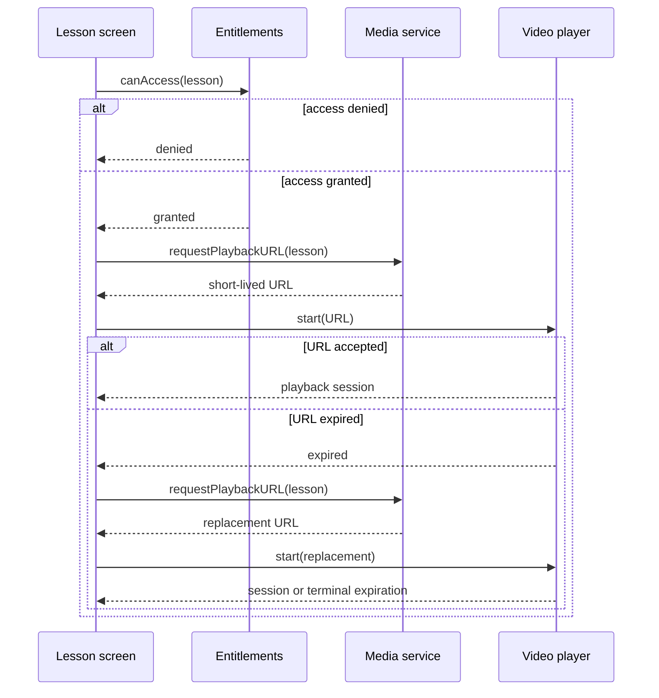

# Proxy Problem: Expiring Lesson Media Access

Internal Day 050 defines the direct baseline for subscription video playback.
The app must deny locked lessons before contacting the media service, request a
short-lived playback URL for an entitled lesson, and refresh that URL once when
the player reports that it expired between issuance and use.

This is real access and lifecycle policy, but one playback model currently owns
it. A Proxy has not earned an interface or wrapper yet.

## App requirements and invariants

The scenario has three concrete collaborators:

| Collaborator | Responsibility | Observable boundary |
| --- | --- | --- |
| `LessonEntitlements` | Decide whether the current subscriber may open a lesson. | Denied lessons never reach the remote media service. |
| `ScriptedLessonMediaService` | Issue a short-lived URL or report service failure. | Every request records its lesson identifier before producing an outcome. |
| `ScriptedLessonPlayer` | Start playback or identify an expired URL. | Only expiration permits one URL renewal; other failures escape. |

The direct flow preserves these rules:

1. Lesson identifiers and titles are non-empty, and playback URLs use HTTPS.
2. Access is checked before a playback URL is requested.
3. A denied lesson performs no media-service or player work.
4. A service failure never reaches the player.
5. A non-expiration player failure never triggers a URL refresh.
6. The model refreshes exactly once after URL expiration.
7. A second expiration escapes instead of creating an unbounded retry loop.
8. A successful session records the exact lesson and URL accepted by the player.

The scripted service and player make the remote boundary deterministic; they do
not model networking, DRM, download storage, or a production media framework.

## Direct Swift first

[`LessonPlaybackDirect.swift`](../Sources/DesignPatterns/Proxy/LessonPlaybackDirect.swift)
keeps the policy in one `DirectLessonPlaybackModel.play(_:)` method:

1. Ask the concrete entitlement store about the lesson.
2. Request a playback URL from the concrete media service.
3. Send that URL to the concrete player.
4. If and only if the player reports expiration, request one replacement and
   try that replacement once.

This is deliberately not a Proxy. There is no shared media protocol, wrapper,
transparent forwarding type, cache, actor, repository, or generic retry policy.
The playback model visibly coordinates access and URL renewal because it is the
only client and the sequence remains short.

An arbitrary retry helper would weaken the policy: expiration is the only
condition that permits renewal, and the single refresh budget belongs to one
playback request. Keeping the two attempts explicit makes that invariant easy to
review.

## Acceptance tests

[`ProxyProblemTests.swift`](../Tests/DesignPatternsTests/ProxyProblemTests.swift)
uses Swift Testing to verify:

- entitled playback checks access, requests one URL, and starts one session;
- denied access stops before remote media or player work;
- service unavailability stops before playback;
- a non-expiration player failure does not refresh the URL;
- an expired first URL is replaced once and the new URL starts playback;
- an expired replacement escapes after exactly two service and player calls;
- malformed lesson values and non-HTTPS URLs fail before orchestration.

Run the focused suite with:

```sh
swift test -Xswiftc -warnings-as-errors --filter ProxyProblemTests
```

## Initial problem flow



Observe that the lesson screen's model knows both policies and their order:
permission gates the remote request, while player-reported expiration permits a
single refresh. An accessible equivalent is: the screen first asks whether the
subscriber may access the lesson; when allowed, it requests and plays one URL;
if that URL has expired, the screen obtains one replacement and either starts it
or returns the final expiration.

## Evidence required on Day 051

Proxy has not earned a wrapper merely because access precedes playback. Day 051
must add credible clients that need the same remote lesson resource and measure
the policy they duplicate:

- How many clients repeat entitlement checks and URL renewal?
- Can a client omit access control or refresh more than once?
- Which remote-service and player details leak into every caller?
- Does one stable media operation let the service remain substitutable without
  turning Proxy into a Decorator pipeline?
- Would a distinctly named access service communicate the boundary better than
  transparent substitution?

If playback remains the only client, this direct method should remain. Proxy is
justified only when several callers need the same resource operation while one
substitute can consistently own access and lifecycle policy.

## Initial editorial thesis

**Thesis:** A lesson looks like one playable resource, but today its client must
guard the gate and replace a key that can expire before it reaches the lock.

**Scene:** A dark media vault runs left to right from one lesson cartridge to a
cinematic playback aperture. A warm-red entitlement gate blocks the route
before a narrow token chamber issues one physical key. Near the player, the
first key is visibly rejected as expired and one contained return track carries
it back to the chamber for a single replacement. The client-side control rail
drives both the gate and return track, making policy ownership clear without
labels, screens, decorative locks, or generic cloud imagery.

The final Day 052 header should keep this guarded-media-vault metaphor only if
the measured pressure justifies Proxy. It must follow
[`visual-style.md`](visual-style.md); no header asset is generated during problem
definition.

## Day 050 decision

The access and URL-lifecycle rules are executable, bounded, and owned by one
client. Proxy has not earned a type: Day 051 must first show that multiple
clients duplicate or inconsistently apply this policy.
