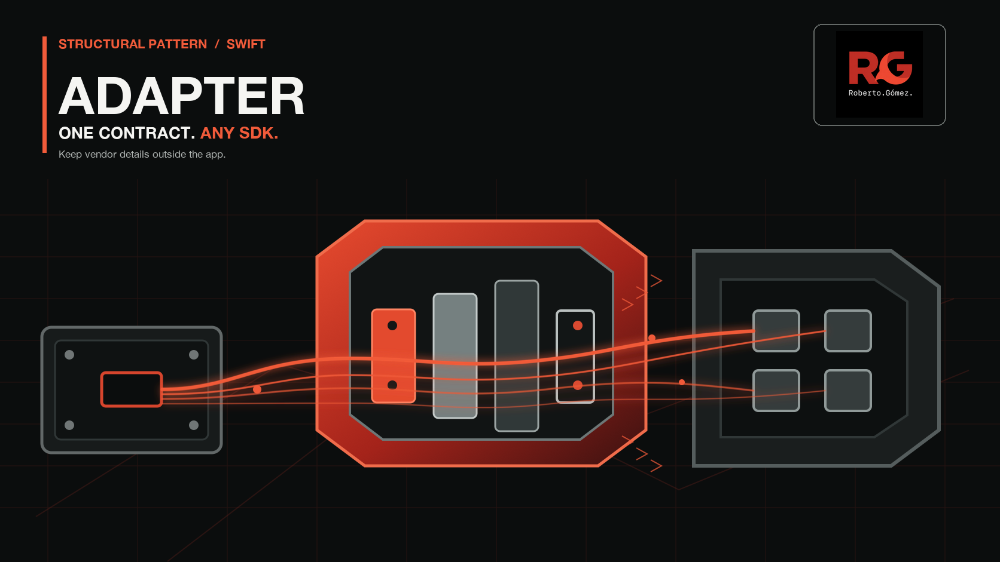
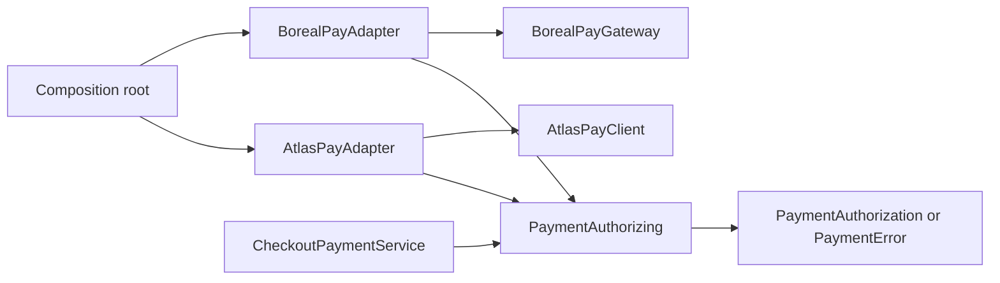

# 🔌 Adapter



> **Caption:** One checkout contract crosses a controlled translation boundary so AtlasPay and BorealPay can remain incompatible outside the app.

**Category:** Structural

## 🎯 The app problem

Checkout must authorize a card payment before placing an order. The app owns
`PaymentRequest`, `PaymentAuthorization`, and the small `PaymentError` vocabulary
that the screen can act on. Payment providers do not share that contract.

AtlasPay exposes `AtlasChargeRequest`, `AtlasChargeResult`, and vendor error
cases. BorealPay uses `BorealAuthorizationInput`, an associated transaction
reference, a pending response, and a different failure taxonomy. Neither SDK is
under app control.

### Requirements

- Preserve integer minor units, currency, order reference, and payment token.
- Return the same domain authorization shape for either provider.
- Hide provider rejection codes and infrastructure errors from checkout.
- Select a provider once at the composition root, not during checkout.
- Reject invalid domain input before invoking a vendor SDK.

## 🪶 Start with direct Swift

The first provider was intentionally integrated directly. Day 009 extended that
solution with a `CheckoutPaymentProvider` enum and a `switch` in
`CheckoutPaymentService`, so each vendor request and error mapping remained
visible in one file. That direct version is preserved in history by commit
`b377a2a` and described in [the pressure review](../../Documentation/adapter-pressure.md).

It was the right starting point for one provider: no protocol, type erasure,
factory, or payment framework was needed. The second provider changed the
decision. Checkout now imported and branched on vendor types, and every new SDK
would extend the same service.

## ⚡ The turning point

The pressure is not that `submit(_:)` and `authorize(payment:)` have different
names. The pressure is that request ownership, success identity, terminal states,
and retryable failures all differ while checkout needs one stable operation.

The direct implementation made that coupling executable: adding Boreal required
a second provider case, a second request mapping, a second success mapping, and
a second error taxonomy inside checkout. A local helper could make a branch
shorter, but it could not stop checkout from knowing which SDK vocabulary to
branch on.

## 🧭 Pattern intent

Adapter gives checkout one app-owned authorization operation and lets each
provider translate its own request, result, and errors at the integration edge.
The pattern contains incompatibility; it does not make the vendors identical or
choose a provider for business logic.

## 🧩 Participants and responsibilities

| App role | Swift type | Responsibility |
| --- | --- | --- |
| Checkout client | [`CheckoutPaymentService`](../../Sources/DesignPatterns/Adapter/CheckoutPaymentService.swift) | Validate domain input and delegate one authorization operation. |
| Target contract | [`PaymentAuthorizing`](../../Sources/DesignPatterns/Adapter/PaymentAuthorizing.swift) | Define the app-owned async payment boundary required by two providers and the composition root. |
| Atlas adapter | [`AtlasPayAdapter`](../../Sources/DesignPatterns/Adapter/AtlasPayAdapter.swift) | Map Atlas requests, approvals, rejection, and SDK failures into domain values. |
| Boreal adapter | [`BorealPayAdapter`](../../Sources/DesignPatterns/Adapter/BorealPayAdapter.swift) | Map Boreal inputs, accepted/pending/denied responses, and failures into the same domain values. |
| External clients | [`AtlasPayClient`](../../Sources/DesignPatterns/Adapter/AtlasPaySDK.swift), [`BorealPayGateway`](../../Sources/DesignPatterns/Adapter/BorealPaySDK.swift) | Represent immutable vendor contracts that the app cannot change. |

The protocol exists because two concrete integrations already vary at this
boundary and because the composition root must substitute one for the other.
There is no protocol for domain values or for provider selection.

## ⚙️ How the Swift implementation works

1. The composition root wraps either SDK in `AtlasPayAdapter` or
   `BorealPayAdapter` and injects it into `CheckoutPaymentService`.
2. Checkout validates positive minor units and a non-empty token, then calls
   `PaymentAuthorizing.authorize(_:)` without naming a provider type.
3. The selected adapter builds its vendor request, awaits the SDK, and maps the
   vendor result or error into `PaymentAuthorization` or `PaymentError`.

The adapters are value types holding `Sendable` client closures. Async work stays
at the vendor boundary; checkout owns no provider-specific cancellation or
retry policy beyond the domain error it receives.

## 🗺️ Diagram



The important relationship is the direction of dependency: checkout sees only
`PaymentAuthorizing`, while each adapter owns one incompatible SDK translation.
Provider choice happens above the client and does not become a checkout branch.

**Accessible description:** The composition root selects either AtlasPayAdapter
or BorealPayAdapter. Both conform to PaymentAuthorizing, which is the only
contract CheckoutPaymentService uses. Each adapter talks to its own vendor SDK
and returns the same authorization or domain error outcome.

## ▶️ Run the example

From the repository root:

```sh
swift build -Xswiftc -warnings-as-errors
```

The package contains deterministic SDK closures rather than live payment
traffic. The executable proof is the Swift Testing suite, so no network or
credentials are required.

## 🧪 Tests

```sh
swift test -Xswiftc -warnings-as-errors --filter AdapterTests
```

[`AdapterTests`](../../Tests/DesignPatternsTests/AdapterTests.swift) prove:

- Atlas and Boreal map their distinct requests into the same domain outcome.
- Provider-specific rejection, pending, and transport semantics do not leak.
- Invalid checkout input stops before a vendor client is invoked.
- Checkout can swap adapters without changing its operation or branching on a
  provider.

## ⚖️ Trade-offs

### What improves

- Checkout no longer imports vendor request, result, or error cases.
- A provider replacement changes one adapter and composition wiring instead of
  the checkout operation.
- Each translation has a focused test seam and can be reviewed independently.

### What it costs

- One protocol and one adapter type per integration add indirection.
- Composition code must select and construct the correct adapter.
- Domain error mapping can hide provider detail that a future product feature
  may need to model explicitly.
- Adapters must preserve async cancellation and error semantics as SDKs evolve.

## 🔀 Alternatives considered

| Alternative | Prefer it when | Why it does not meet this example now |
| --- | --- | --- |
| Direct concrete integration | One stable SDK is used in one place. | The second SDK forced provider branches and vendor mappings into checkout. |
| Enum switch in checkout | A closed provider set is tiny and vendor details are intentionally client-owned. | Every new provider edits the checkout service and its tests. |
| Decorator | Optional behavior such as metrics, retry, or signing wraps one stable interface. | Adapter translates incompatible interfaces; it does not stack behavior. |
| Proxy | Access, caching, or lazy loading should control an otherwise stable subject. | The problem is vocabulary conversion, not access policy. |
| Chain of Responsibility | Independent handlers may handle or pass a request onward. | Both payment adapters must fulfill the same operation; they are not ordered handlers. |

Factory Method is also deliberately absent: provider selection is composition
wiring, not a creator workflow that subclasses extend.

## 🚫 When not to use it

- Keep the direct SDK call when one provider is stable and its mapping is local.
- Prefer a function or enum when the variation is closed, synchronous, and does
  not leak external vocabulary beyond one call site.
- Do not add a protocol only for mocking a single concrete SDK; use the SDK
  closure seam until a second real integration exists.

## 🗂️ Source map

- [`PaymentDomain.swift`](../../Sources/DesignPatterns/Adapter/PaymentDomain.swift) — app-owned request, authorization, and error values.
- [`PaymentAuthorizing.swift`](../../Sources/DesignPatterns/Adapter/PaymentAuthorizing.swift) — minimal target contract.
- [`AtlasPayAdapter.swift`](../../Sources/DesignPatterns/Adapter/AtlasPayAdapter.swift) — Atlas translation boundary.
- [`BorealPayAdapter.swift`](../../Sources/DesignPatterns/Adapter/BorealPayAdapter.swift) — Boreal translation boundary.
- [`CheckoutPaymentService.swift`](../../Sources/DesignPatterns/Adapter/CheckoutPaymentService.swift) — validated client-facing operation.
- [`AdapterTests.swift`](../../Tests/DesignPatternsTests/AdapterTests.swift) — executable acceptance and substitution tests.
- [`adapter-header.png`](../../Documentation/Assets/Patterns/structural/adapter-header.png) — editorial header.
