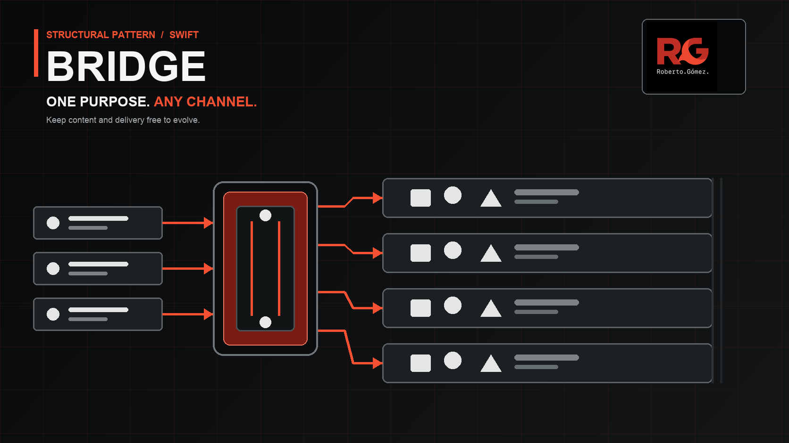
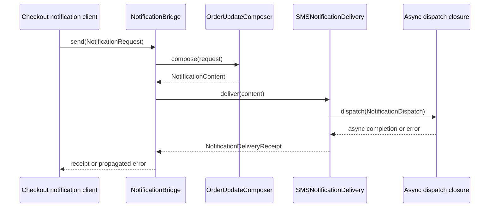

# Bridge



> **Caption:** One notification purpose crosses a stable bridge to reach any channel without copying channel policy into every purpose.

**Category:** Structural

## The app problem

The commerce app sends security alerts, order updates, and promotional reminders.
Each purpose may travel through push, email, the in-app inbox, or SMS. Product
meaning and delivery infrastructure evolve on different schedules: a new
purpose should not edit every transport, and a new channel should not rewrite
the meaning of every message.

The direct baseline in [the pressure review](../../Documentation/bridge-pressure.md)
made the problem executable: twelve purpose-channel combinations passed, but
adding SMS required a branch in all three purpose helpers and copied sender
policy into each one.

## Start with direct Swift

The original `prepareNotification(_:for:)` function used closed enums and one
channel switch per purpose. That is the smallest honest solution while the
matrix is small. Its compiler-checked exhaustiveness and local rules are useful;
the problem is the direction of change, not the number of lines.

Day 016 proved the pressure. A fifth channel would touch every purpose, while a
fourth purpose would have to know every channel. The direct implementation is
preserved in Git history and explained in [the baseline](../../Documentation/bridge-problem.md),
but the canonical example below separates the two axes.

## The turning point

The purpose axis owns semantic content: the category label and the app-owned
request values. The channel axis owns transport policy: subjects, sounds,
sender IDs, opt-out copy, and the asynchronous dispatch boundary. These axes
can now change independently without a class for every combination.

## Pattern intent

Bridge separates an abstraction from its implementation so both can vary
independently. Here `NotificationBridge` joins one purpose composer with one
channel delivery implementation. It does not select a provider, hide business
rules in a registry, or create a hierarchy of twelve message classes.

## Participants and responsibilities

| Role | Swift type | Responsibility |
| --- | --- | --- |
| Abstraction | [`NotificationBridge`](../../Sources/DesignPatterns/Bridge/NotificationBridge.swift) | Compose semantic content, then await one delivery implementation. |
| Purpose implementors | [`SecurityAlertComposer`](../../Sources/DesignPatterns/Bridge/NotificationPurposeComposing.swift), [`OrderUpdateComposer`](../../Sources/DesignPatterns/Bridge/NotificationPurposeComposing.swift), [`PromotionalReminderComposer`](../../Sources/DesignPatterns/Bridge/NotificationPurposeComposing.swift) | Translate an app request into `NotificationContent`. |
| Implementor contract | [`NotificationChannelDelivering`](../../Sources/DesignPatterns/Bridge/NotificationChannelDelivering.swift) | Define the async channel boundary and receipt. |
| Channel implementors | `PushNotificationDelivery`, `EmailNotificationDelivery`, `InAppInboxDelivery`, `SMSNotificationDelivery` | Apply channel metadata and call the injected dispatch closure. |
| Domain values | [`NotificationDelivery.swift`](../../Sources/DesignPatterns/Bridge/NotificationDelivery.swift) | Keep requests, semantic content, dispatches, and receipts immutable. |

The protocols have multiple concrete implementations because the app already
has three purpose rules and four delivery channels. No protocol exists only to
mock one type.

## How the Swift implementation works

1. The composition root chooses a purpose composer and a channel delivery value.
2. `NotificationBridge.send(_:)` asks the composer for `NotificationContent`.
3. The selected channel turns that content into `NotificationDispatch`, applies
   its own policy, awaits the injected `@Sendable` dispatch closure, and returns
   a `NotificationDeliveryReceipt`.
4. A dispatch closure can be replaced by a test recorder or a real transport
   without changing either axis. No network service is required here.

The `makeNotificationPurposeComposer(for:)` switch is only a closed enum
selection helper. It is not Factory Method: callers do not subclass a creator,
and provider construction is not the variation being taught.

## Diagram



The sequence shows the independent boundary: purpose composition finishes before
the channel applies transport policy. The channel remains asynchronous and
testable, while the client depends on neither a purpose-specific formatter nor
a vendor transport.

**Accessible description:** A notification client sends a request to
`NotificationBridge`. The bridge asks an order-purpose composer for semantic
content, passes that content to an SMS delivery implementation, and waits for
an injected asynchronous dispatch closure. The delivery returns a receipt or
propagates its error back to the client.

## Run the example

From the repository root:

```sh
swift build -Xswiftc -warnings-as-errors
```

The default dispatch closures are deterministic no-ops. They model the async
transport boundary without credentials, network calls, or process-lifetime
coordination.

## Tests

```sh
swift test -Xswiftc -warnings-as-errors --filter BridgeTests
```

[`BridgeTests`](../../Tests/DesignPatternsTests/BridgeTests.swift) verifies:

- all twelve purpose-channel combinations deliver successfully;
- purpose composers remain channel-agnostic and preserve semantic values;
- sounds, subjects, sender IDs, and opt-out copy stay on their owning channel;
- asynchronous channel failures reach the caller unchanged;
- the input request remains an immutable value.

## Trade-offs

### What improves

- Adding a channel creates one delivery type instead of editing every purpose.
- Adding a purpose creates one composer instead of editing every channel.
- Transport behavior is asynchronous, injectable, and independently testable.
- The product matrix is represented by composition rather than a class per pair.

### What it costs

- Two protocols and several small value types add indirection around a tiny
  notification domain.
- Composition code must choose compatible purpose and channel values.
- Channel implementations still need semantic metadata such as urgency and
  promotional opt-out rules; Bridge does not remove domain decisions.
- A protocol boundary can obscure a simple flow when the axes are actually
  closed and stable.

## Alternatives

| Alternative | Prefer it when | Why it is not the canonical choice here |
| --- | --- | --- |
| Direct enum switches | The matrix is small, closed, and changes together. | SMS proved each independent axis now edits the other axis. |
| Strategy | One algorithm varies for a stable operation. | Purpose and channel are two cooperating dimensions, not interchangeable ranking policies. |
| Adapter | An incompatible external API needs translation. | These channel types are app-owned behaviors, not vendor vocabulary boundaries. |
| Decorator | Optional behavior should wrap one stable delivery operation. | The channel is the implementation itself; metrics or retries would be decorators around it. |
| Proxy | Access, caching, or lazy loading controls a stable subject. | The problem is independent variation, not access control. |
| Chain of Responsibility | Ordered handlers may handle or pass a request. | Every selected channel must deliver; there is no pass-through chain. |

## When not to use it

- Keep the direct function when there is one purpose and one transport.
- Keep enums and switches when both axes are closed, synchronous, and edited by
  the same team at the same time.
- Prefer a simple function value when only one behavior varies and it does not
  need a second family of implementations.
- Do not introduce Bridge to hide a few repeated literals; extract a local
  helper first and measure whether independent changes still touch both axes.

## Source map

- [`NotificationDelivery.swift`](../../Sources/DesignPatterns/Bridge/NotificationDelivery.swift) — immutable domain values.
- [`NotificationPurposeComposing.swift`](../../Sources/DesignPatterns/Bridge/NotificationPurposeComposing.swift) — purpose axis and selection helper.
- [`NotificationChannelDelivering.swift`](../../Sources/DesignPatterns/Bridge/NotificationChannelDelivering.swift) — channel axis and async implementations.
- [`NotificationBridge.swift`](../../Sources/DesignPatterns/Bridge/NotificationBridge.swift) — composition bridge.
- [`BridgeTests.swift`](../../Tests/DesignPatternsTests/BridgeTests.swift) — executable acceptance tests.
- [`bridge-header.png`](../../Documentation/Assets/Patterns/structural/bridge-header.png) — editorial header.
