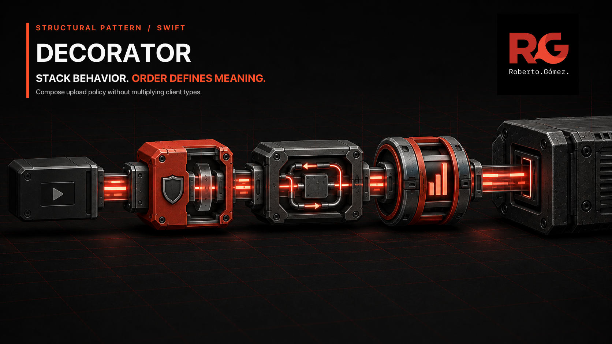

# 🎨 Decorator



> **Caption:** One upload contract passes through independently selectable
> wrappers, and their order decides whether metrics describe the whole upload or
> each transport attempt.

**Category:** Structural

## 🎯 The app problem

A creator app uploads large videos to a media service. Its production client
must authenticate each request, retry a lost connection, and record one terminal
product metric. Other legitimate deployments need different subsets: a
pre-signed upload omits Bearer authentication, a metered-network upload must not
retry automatically, telemetry can be disabled, and a preview fixture needs
only transport behavior.

### Requirements

- Keep one upload operation and the existing typed failures across every
  deployment profile.
- Select authentication, connection-loss retry, and terminal metrics
  independently without encoding all eight Boolean combinations as client
  types.
- Make composition order visible because metrics outside retry describe one
  logical upload, while metrics inside retry describe individual attempts.
- Retry only `transportUnavailable`; HTTP rejection and malformed success stay
  terminal.
- Reuse the same authenticated request across attempts under the current Bearer
  token policy.

## 🪶 Start with direct Swift

[`MediaUploadDirect.swift`](../../Sources/DesignPatterns/Decorator/MediaUploadDirect.swift)
is still the right answer for the original fixed production pipeline. When the
profiles first diverge,
[`MediaUploadPressure.swift`](../../Sources/DesignPatterns/Decorator/MediaUploadPressure.swift)
keeps the variation explicit with one small configuration value:

```swift
public struct MediaUploadBehaviorSelection: Equatable, Sendable {
    public let authenticatesRequests: Bool
    public let retriesConnectionLoss: Bool
    public let recordsMetrics: Bool
}
```

This remains cheaper when the choices are closed, their order cannot change,
and conditional token and retry configuration are acceptable. No pattern is
earned merely because one method performs authentication, retry, and metrics.

## ⚡ The turning point

Three independent switches create eight possible pipelines, five of which are
already required. The flag client carries a token that matters only when one
flag is on, a retry limit that matters only when another is on, and four
conditional behavior sites across request construction and terminal exits.

More importantly, the configuration states *which* behaviors exist but cannot
state *which one encloses another*. Moving metrics inside the retry loop changes
one success-after-retry event into a failed-attempt event followed by a success
event. That is observable product behavior, not a cosmetic implementation
detail.

## 🧭 Pattern intent

Decorator gives every upload behavior the same forwarding boundary. A wrapper
owns one policy, delegates the rest of the operation, and can be included or
omitted at the composition root. The nested construction makes order reviewable
without creating a subclass for every combination or a generic middleware
engine.

## 🧩 Participants and responsibilities

| App role | Swift type | Responsibility |
| --- | --- | --- |
| Shared upload boundary | [`MediaUploadClient`](../../Sources/DesignPatterns/Decorator/MediaUploadDecorator.swift) | Defines the one forwarding operation varied by the concrete component and wrappers. |
| Per-call context | [`MediaUploadCall`](../../Sources/DesignPatterns/Decorator/MediaUploadDecorator.swift) | Carries headers and the attempt count through one wrapper stack without leaking state between uploads. |
| Concrete component | [`TransportMediaUploadClient`](../../Sources/DesignPatterns/Decorator/MediaUploadDecorator.swift) | Creates the HTTP request, performs one transport attempt, and validates the service response. |
| Authentication wrapper | [`AuthenticatedMediaUpload`](../../Sources/DesignPatterns/Decorator/MediaUploadDecorator.swift) | Adds the required Bearer header before forwarding. |
| Retry wrapper | [`RetryingMediaUpload`](../../Sources/DesignPatterns/Decorator/MediaUploadDecorator.swift) | Repeats only a lost-connection failure within a bounded budget. |
| Metrics wrapper | [`MeasuredMediaUpload`](../../Sources/DesignPatterns/Decorator/MediaUploadDecorator.swift) | Records the success or supported failure visible at its position in the stack. |

The protocol exists because four concrete participants vary immediately behind
the same operation. Generics retain value semantics and the concrete stack
shape; no existential box or type-erased wrapper is needed for the fixed
deployment profiles in this example.

## ⚙️ How the Swift implementation works

1. The app invokes the one-argument `upload(_:)` convenience on the outermost
   client. It creates a fresh `MediaUploadCall`, so headers and attempt counts
   cannot cross call boundaries.
2. In the production stack, `MeasuredMediaUpload` starts the logical outcome,
   `AuthenticatedMediaUpload` adds the token once, and `RetryingMediaUpload`
   delegates one or more times to `TransportMediaUploadClient`.
3. The transport component increments the shared attempt count immediately
   before each send, validates the response, and either returns a receipt or
   propagates a typed `MediaUploadError`.
4. Retry catches only `transportUnavailable`. Rejections and malformed 2xx
   responses cross it unchanged.
   The retry wrapper owns a fresh local budget for each invocation. It does not
   use the shared transport-attempt count to decide whether to forward again:
   a wrapped client can fail before any transport send.
5. The outer metrics wrapper sees the final receipt or error and records one
   event with the total number of attempts.

The production composition is intentionally explicit:

```swift
var client = MeasuredMediaUpload(
    wrapped: try AuthenticatedMediaUpload(
        accessToken: accessToken,
        wrapped: RetryingMediaUpload(
            retryLimit: retryLimit,
            wrapped: transportClient
        )
    )
)
```

Reading from the outside in reveals the semantic scope: metrics enclose the
logical upload, authentication prepares the request before retry, and retry
encloses only transport attempts.

## 🗺️ Diagram

```mermaid
flowchart LR
    App["Creator app"] --> Metrics["MeasuredMediaUpload<br/>one logical outcome"]
    Metrics --> Auth["AuthenticatedMediaUpload<br/>Bearer header"]
    Auth --> Retry["RetryingMediaUpload<br/>connection loss only"]
    Retry --> Transport["TransportMediaUploadClient<br/>one attempt"]
    Transport --> API["Media API"]
    API -. "response or connection loss" .-> Transport
    Transport -. "receipt or typed error" .-> Retry
    Retry -. "terminal result" .-> Auth
    Auth -. "terminal result" .-> Metrics
    Metrics -. "measured result" .-> App
```



Observe that every box keeps the same upload direction, while nesting defines
scope. Metrics surround the complete call, authentication runs before the retry
boundary, and only the transport component performs network attempts. Reversing
the metrics and retry boxes changes the events produced even though the upload
eventually succeeds.

**Accessible description:** The creator app sends an upload through an outer
metrics wrapper, then an authentication wrapper, then a connection-loss retry
wrapper, and finally a one-attempt transport client that reaches the media API.
The receipt or typed error returns through the same stack. Because metrics are
outermost, they observe one logical result rather than each retry attempt.

## ▶️ Run the example

From the repository root:

```sh
swift test -Xswiftc -warnings-as-errors --filter DecoratorTests
```

The suite builds several concrete wrapper stacks and verifies their requests,
attempt counts, metrics, receipts, and errors. No network connection or Apple
platform framework is required.

## 🧪 Tests

```sh
swift test -Xswiftc -warnings-as-errors --filter DecoratorTests
swift test -Xswiftc -warnings-as-errors --filter DecoratorProblemTests
swift test -Xswiftc -warnings-as-errors --filter DecoratorPressureTests
```

[`DecoratorTests.swift`](../../Tests/DesignPatternsTests/DecoratorTests.swift)
proves:

- production authenticates two transport attempts but records one completion;
- placing metrics inside retry records one failure and one completion, making
  wrapper-order consequences executable;
- the pre-signed profile omits authentication without a flag;
- the metered profile omits retry without conditional state;
- telemetry opt-out omits the metrics wrapper while retaining retry;
- preview uses the transport component without optional wrappers;
- an HTTP rejection is terminal even when a retry wrapper is present.

[`DecoratorBoundaryTests.swift`](../../Tests/DesignPatternsTests/DecoratorBoundaryTests.swift)
additionally verifies bounded failures before transport, fresh retry budgets and
metric counts across uploads, and terminal malformed-success propagation.

The problem and pressure suites retain the verified direct baselines that
earned the pattern; the final suite verifies the smaller composed replacement.

## ⚖️ Trade-offs

### What improves

- Five deployment profiles become explicit compositions of only the behaviors
  they need; no feature flag or conditionally meaningful dependency remains in
  the final clients.
- Each terminal path no longer has to remember a metrics flag.
- Wrapper order is code at the composition root and is protected by a test.
- A fourth independent behavior adds one focused wrapper instead of doubling a
  Boolean combination matrix from eight to sixteen.

### What it costs

- The pattern adds one protocol, one per-call context, and three forwarding
  types.
- Generic nesting produces different concrete types for different stacks. A
  runtime-selected heterogeneous collection would need deliberate type erasure,
  which this example does not yet justify.
- Order is a correctness rule that callers assembling a stack must understand
  and test.
- Exposing `wrapped` for deterministic inspection couples tests to the concrete
  composition shape; behavior assertions should remain the primary contract.

## 🔀 Alternatives considered

| Alternative | Prefer it when | Why it does not meet this example now |
| --- | --- | --- |
| One direct client | Every deployment uses one short, fixed policy. | Five profiles already select independent behaviors. |
| Flags in a configuration value | Choices and order are closed and conditional dependencies stay small. | Three flags create eight combinations, conditional state, four branch sites, and one hidden order. |
| Free-function or closure composition | Behavior is stateless request/response transformation. | Retry must reinvoke the next operation and metrics retain one attempt count across that scope. |
| Interceptor array | Runtime insertion and homogeneous iteration are requirements. | It adds continuation rules, ordering conventions, and usually type erasure before they are needed. |
| Proxy | Access control, lazy acquisition, or caching should stand in for the same remote resource. | These wrappers add independently composable behavior rather than controlling access to one resource. |
| Chain of Responsibility | Each handler may handle a request or pass it onward. | Every selected upload wrapper participates; none decides whether another handler should own the request. |

Facade hides a collaboration behind one simpler entry point. Decorator preserves
one interface while stacking behavior around it. Proxy usually controls access
to one subject, and Chain of Responsibility searches an ordered set for a
handler. The similar shapes do not imply the same responsibility.

## 🚫 When not to use it

- Keep `DirectMediaUploadClient` when authentication, retry, and metrics are
  always mandatory in one stable order.
- Prefer a parameter or configuration value when there are one or two closed,
  harmless choices without conditional dependencies.
- Prefer a function when the behavior is a stateless transformation that does
  not need to invoke the next operation or retain per-call scope.
- Do not build a wrapper framework in anticipation of features with no current
  deployment or acceptance test.
- Do not use nested generic wrappers when product code must choose arbitrary
  stacks at runtime unless the type-erasure and discoverability costs are
  justified explicitly.

## 🗂️ Source map

- [`MediaUploadDecorator.swift`](../../Sources/DesignPatterns/Decorator/MediaUploadDecorator.swift) — shared boundary, per-call context, concrete transport component, and three ordered wrappers.
- [`MediaUploadDirect.swift`](../../Sources/DesignPatterns/Decorator/MediaUploadDirect.swift) — original fixed-pipeline solution and shared domain values.
- [`MediaUploadPressure.swift`](../../Sources/DesignPatterns/Decorator/MediaUploadPressure.swift) — executable flag matrix that demonstrates the pressure.
- [`DecoratorTests.swift`](../../Tests/DesignPatternsTests/DecoratorTests.swift) — final composition and ordering tests.
- [`DecoratorProblemTests.swift`](../../Tests/DesignPatternsTests/DecoratorProblemTests.swift) — direct fixed-pipeline acceptance tests.
- [`DecoratorPressureTests.swift`](../../Tests/DesignPatternsTests/DecoratorPressureTests.swift) — five flag-configured profile tests.
- [`decorator-problem.md`](../../Documentation/decorator-problem.md) — requirements, invariants, and direct-solution decision.
- [`decorator-pressure.md`](../../Documentation/decorator-pressure.md) — measured combination and ordering pressure.
- [`decorator-header.png`](../../Documentation/Assets/Patterns/structural/decorator-header.png) — editorial header.
