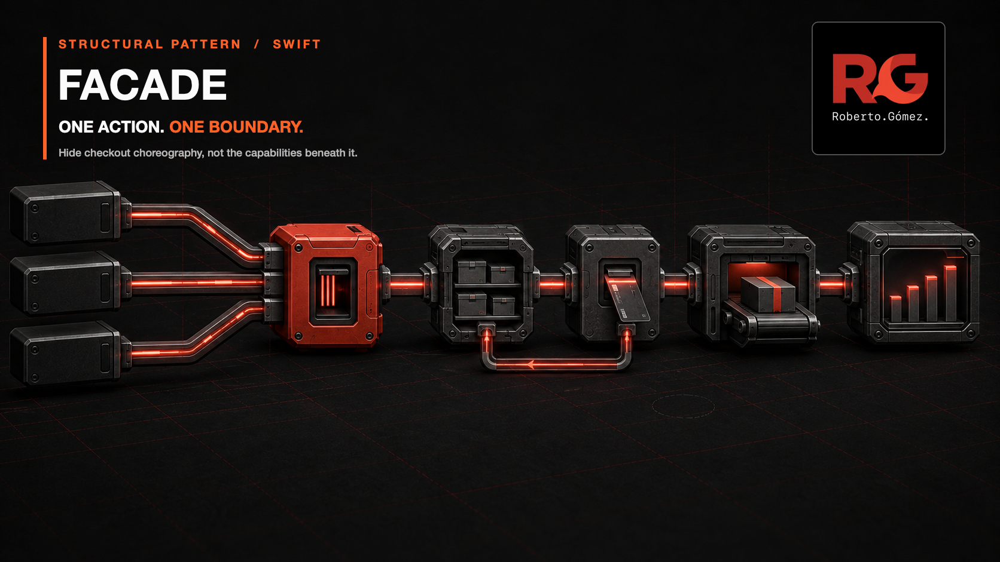
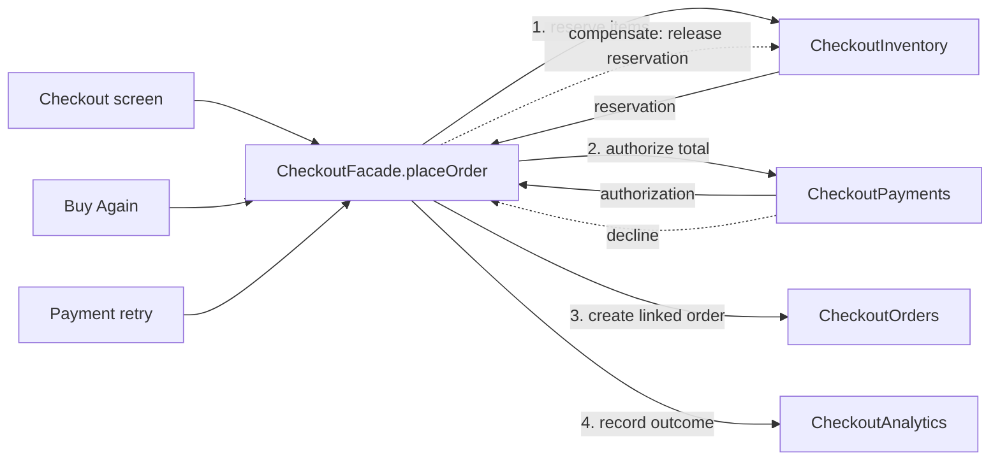

# 🏢 Facade



*Three product entry points cross one checkout boundary; the subsystem stations
remain visible, while their choreography and compensation have one owner.*

**Category:** Structural

## 🎯 The app problem

A commerce app places an order from its checkout screen. The customer sees one
action, but the client must reserve every item, authorize the exact cart total,
create an order linked to both results, record the terminal outcome, and release
the reservation if payment declines.

The flow later appears in order history's **Buy Again** shortcut and in a
payment-retry banner. Their input preparation and presentation differ; their
placement rules do not.

### Requirements

- Inventory rejection must stop payment and order creation.
- Payment decline must restore the complete reservation before the error escapes.
- An order must retain the identifiers returned by inventory and payment.
- Exactly one completion or failure event must describe each attempt.
- Checkout clients should request placement without learning intermediate types,
  ordering, or compensation.
- Inventory, payment, order, and analytics types must remain available to narrower
  use cases that genuinely need them.

## 🪶 Start with direct Swift

[`CheckoutDirect.swift`](../../Sources/DesignPatterns/Facade/CheckoutDirect.swift)
keeps four concrete, value-semantic subsystems on `DirectCheckoutScreen`. Its
`placeOrder(from:)` method makes the complete sequence explicit. With one caller
and one short flow, that is easier to follow than an extra abstraction.

[`CheckoutPressure.swift`](../../Sources/DesignPatterns/Facade/CheckoutPressure.swift)
then adds direct **Buy Again** and payment-retry clients. The code deliberately
retains their duplicate orchestration so the cost is executable evidence rather
than a claim about future reuse.

## ⚡ The turning point

Three clients now expose **12 subsystem dependency slots**, three copies of one
five-stage workflow, three payment-decline compensation branches, and three
terminal analytics decision points. A missed synchronized edit can strand stock
or report the wrong product outcome.

A helper function could remove lines, but four coordinated mutable values would
still need to move into and back out of every caller. The stable requirement is
not code reuse alone: product clients need one checkout-placement boundary that
owns the partial-failure rules.

## 🧭 Pattern intent

Facade presents a focused interface over several subsystem objects. Here,
`CheckoutFacade.placeOrder(from:)` is the product operation. It hides ordering,
identifier handoff, compensation, and terminal analytics without pretending the
subsystems no longer exist.

This is a use-case facade, not a universal commerce API. It does not own cart
editing, navigation, retries, tax, shipping, authentication, or every inventory
and payment capability.

## 🧩 Participants and responsibilities

| App role | Swift type | Responsibility |
| --- | --- | --- |
| Simplified boundary | [`CheckoutFacade`](../../Sources/DesignPatterns/Facade/CheckoutFacade.swift) | Offers one placement operation and owns the coordinated subsystem state. |
| Stock subsystem | [`CheckoutInventory`](../../Sources/DesignPatterns/Facade/CheckoutDirect.swift) | Atomically reserves all requested quantities and releases a reservation during compensation. |
| Payment subsystem | [`CheckoutPayments`](../../Sources/DesignPatterns/Facade/CheckoutDirect.swift) | Authorizes the exact minor-unit total or reports a decline. |
| Order subsystem | [`CheckoutOrders`](../../Sources/DesignPatterns/Facade/CheckoutDirect.swift) | Creates an order linked to the accepted reservation and authorization. |
| Outcome subsystem | [`CheckoutAnalytics`](../../Sources/DesignPatterns/Facade/CheckoutDirect.swift) | Records one terminal completion or failure. |
| Product clients | Checkout screen, Buy Again, payment retry | Build a `CheckoutSubmission`, call the facade, and handle the returned order or domain error. |

No subsystem protocol is introduced. These deterministic components have no
external boundary or immediate implementation variation, so protocols would
increase the example's surface without reducing risk.

## ⚙️ How the Swift implementation works

1. A product client passes a validated `CheckoutSubmission` to
   `CheckoutFacade.placeOrder(from:)`.
2. The facade asks `CheckoutInventory` to reserve all line quantities. A failure
   records `.inventoryUnavailable` and exits before payment.
3. It passes the computed minor-unit total and checkout identity to
   `CheckoutPayments`. A decline releases the exact reservation, records
   `.paymentDeclined`, and rethrows the domain error.
4. Approval lets `CheckoutOrders` create an order from the original submission
   and the two returned subsystem values.
5. The facade records completion only after order creation and returns the order.

The facade owns concrete subsystem values with `public private(set)` access.
Clients cannot mutate coordinated state behind its back, while tests and
read-only product views can inspect outcomes. The subsystem types themselves
remain public and can still be instantiated directly for focused operations such
as stock availability or payment-method validation.

## 🗺️ Diagram



Notice that all three product entry points stop at the same operation. The
facade conducts four focused subsystems and owns the one cross-subsystem recovery
edge, while each subsystem remains a separate type with a narrower purpose.

**Accessible description:** The checkout screen, Buy Again shortcut, and payment
retry all call `CheckoutFacade.placeOrder`. The facade reserves inventory,
authorizes payment, creates the linked order, and records analytics. If payment
declines, the facade releases the inventory reservation before returning the
error.

## ▶️ Run the example

From the repository root:

```sh
swift build -Xswiftc -warnings-as-errors
swift test -Xswiftc -warnings-as-errors --filter FacadeTests
```

The package uses deterministic in-memory values. It needs no backend, payment
SDK, persistent store, or UI framework.

## 🧪 Tests

[`FacadeTests.swift`](../../Tests/DesignPatternsTests/FacadeTests.swift) proves:

- checkout, Buy Again, and payment retry use the same placement boundary;
- successful placement preserves reservation and authorization identifiers;
- inventory rejection prevents payment and order creation;
- payment decline executes exactly one stock compensation path;
- terminal analytics keep the same success and failure semantics;
- a lower-level subsystem remains directly usable outside the facade.

The problem and pressure suites remain executable. They preserve the evidence
that the direct design was initially sufficient and that three clients created
the coupling which earned the final boundary.

## ⚖️ Trade-offs

### What improves

- Three product clients replace 12 subsystem dependencies with one use-case
  dependency each.
- One method owns order, identifier handoff, compensation, and analytics order.
- Reservation cleanup can no longer drift between checkout entry points.
- Domain errors and the `CheckoutOrder` result remain unchanged.
- Lower-level components stay focused and independently available.

### What it costs

- The facade becomes the mutation owner for the subsystem values it receives.
- Its value semantics mean copies do not share later mutations; callers must keep
  the authoritative facade instance where coordinated state matters.
- Adding unrelated commerce operations would quickly turn the narrow boundary
  into a god object.
- The synchronous example models local orchestration, not distributed
  transactions or durable compensation after process failure.
- Read-only subsystem access exposes implementation detail, so clients should use
  it only for a concrete narrower need rather than reconstructing the workflow.

## 🔀 Alternatives considered

| Alternative | Prefer it when | Why it does not meet this example now |
| --- | --- | --- |
| Direct method | One client owns a short, stable sequence. | Three entry points already duplicate risky partial-failure knowledge. |
| Free helper function | Stateless values can be passed through without establishing ownership. | Four coordinated mutable subsystems would still leak through every client. |
| Closure | One local composition root needs a tiny injected action. | Capture and ownership of long-lived checkout state become less explicit. |
| Coordinator | Navigation and screen lifetime are the main responsibilities. | This boundary owns a domain operation, not presentation flow. |
| Strategy | The caller must choose among interchangeable checkout algorithms. | Clients need one stable sequence, not runtime algorithm selection. |
| Decorator | Optional behaviors wrap one shared interface in configurable order. | Inventory, payment, order, and analytics are distinct participants in one orchestration, not interchangeable wrappers. |

Facade simplifies *how clients reach a subsystem collaboration*. Decorator adds
behavior around one interface, Strategy exchanges algorithms, and a coordinator
typically owns UI flow or lifetime. Those responsibilities are deliberately not
combined here.

## 🚫 When not to use it

- Keep the direct call sequence when it has one owner and failure handling is
  already local and obvious.
- Do not add a facade only to rename one subsystem method.
- Prefer a helper function when the work is stateless and no durable boundary or
  ownership decision is needed.
- Do not funnel unrelated inventory, payment, catalogue, account, and navigation
  operations into one convenience object.
- Do not hide useful lower-level capabilities from clients that genuinely need
  them; simplify the common path, not the entire domain.
- Do not treat an in-process facade as a transaction across remote services. Use
  idempotency, durable workflow state, or compensating operations when failures
  must survive process and network boundaries.

## 🗂️ Source map

- [`CheckoutFacade.swift`](../../Sources/DesignPatterns/Facade/CheckoutFacade.swift) — the narrow placement facade and its compensation path.
- [`CheckoutDirect.swift`](../../Sources/DesignPatterns/Facade/CheckoutDirect.swift) — domain values, subsystems, and the original direct screen baseline.
- [`CheckoutPressure.swift`](../../Sources/DesignPatterns/Facade/CheckoutPressure.swift) — executable duplication across Buy Again and payment retry.
- [`FacadeTests.swift`](../../Tests/DesignPatternsTests/FacadeTests.swift) — final shared-boundary, failure, and subsystem-access tests.
- [`FacadeProblemTests.swift`](../../Tests/DesignPatternsTests/FacadeProblemTests.swift) — direct baseline acceptance tests.
- [`FacadePressureTests.swift`](../../Tests/DesignPatternsTests/FacadePressureTests.swift) — duplicated-client pressure evidence.
- [`facade-problem.md`](../../Documentation/facade-problem.md) — original requirements, invariants, and no-pattern decision.
- [`facade-pressure.md`](../../Documentation/facade-pressure.md) — measured coupling that earns the facade.
- [`facade-header.png`](../../Documentation/Assets/Patterns/structural/facade-header.png) — editorial header.
