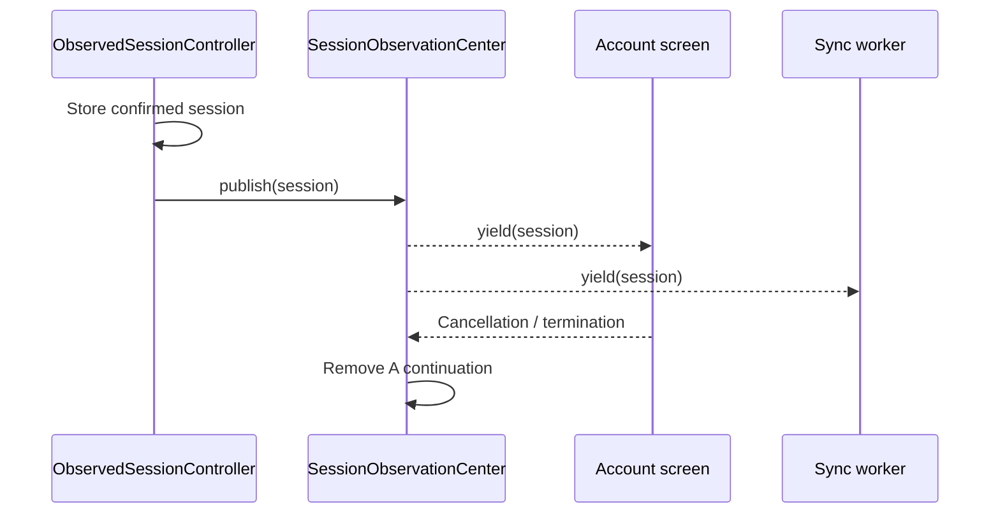

# 👀 Observer


*One confirmed session change reaches every active receiver while a
shorter-lived subscriber can detach without disrupting the others.*

**Category:** Behavioral

## 🎯 The app problem

A commerce app owns one authenticated session, while account UI, cart
ownership, synchronization, analytics, and short-lived screens must react to
confirmed sign-in and sign-out changes. Direct calls are clear while every
consumer shares the controller's lifetime. A screen that appears and
disappears creates an independent subscription lifetime.

## 🪶 Start with direct Swift

[`SessionChangeDirect.swift`](../../Sources/DesignPatterns/Observer/SessionChangeDirect.swift)
keeps the first solution as an exhaustive switch with concrete collaborators.
That is the right choice for a fixed consumer set: there is no registration,
cancellation, buffering, or ordering policy to explain.

## ⚡ The turning point

The pressure review in
[`observer-pressure.md`](../../Documentation/observer-pressure.md) adds a
short-lived session screen. The direct controller must gain another concrete
property and callback, and the screen cannot unregister itself from the source.

## 🧭 Pattern intent

Observer separates the session source from receivers whose lifetimes vary. The
source publishes confirmed state changes, while each receiver independently
chooses when to consume and cancel them.

## 🧩 Participants and responsibilities

| App role | Swift type | Responsibility |
| --- | --- | --- |
| Session source | [`ObservedSessionController`](../../Sources/DesignPatterns/Observer/SessionObservation.swift) | Owns the current session and filters duplicate snapshots. |
| Subscription boundary | [`SessionObservationCenter`](../../Sources/DesignPatterns/Observer/SessionObservation.swift) | Fans out values and removes terminated streams. |
| Receiver | `AsyncStream<UserSession>` | Lets each consumer control iteration and cancellation. |

## ⚙️ How the Swift implementation works

1. A consumer requests an `AsyncStream` from the observation center.
2. The controller changes its actor-isolated session only when the value differs.
3. The center yields that value to every active continuation.
4. Cancelling a consumer terminates its stream and removes its continuation.

## 🗺️ Diagram



The controller owns the source-of-truth transition. The center distributes the
same event to active receivers, and the screen can terminate without affecting
the sync worker.

**Accessible description:** A session controller stores a confirmed session and
publishes it to a center. The center sends the value independently to an
account screen and a sync worker. When the screen cancels, the center removes
only that screen's continuation; the sync worker remains subscribed.

## ▶️ Run the example

From the repository root:

```sh
swift build -Xswiftc -warnings-as-errors
```

## 🧪 Tests

```sh
swift test -Xswiftc -warnings-as-errors --filter ObserverTests
```

The tests prove fan-out to active subscribers, duplicate filtering, and
independent cancellation in [`ObserverTests.swift`](../../Tests/DesignPatternsTests/ObserverTests.swift).

## ⚖️ Trade-offs

### What improves

- Receivers can subscribe and terminate independently.
- Actor isolation protects the continuation registry.
- Swift provides the asynchronous sequence and termination model.

### What it costs

- Delivery becomes asynchronous and requires consumption tasks.
- Buffering, cancellation, and receiver lifetime are now part of the design.
- A slow consumer may skip intermediate snapshots because the stream retains
  only the newest pending value.
- The center allocates and retains one continuation per active subscriber.

## 🔀 Alternatives considered

| Alternative | Prefer it when | Why it does not meet this example now |
| --- | --- | --- |
| Direct callbacks | The receiver set and lifetimes are fixed. | A disappearing screen cannot unregister from the direct source. |
| Swift Observation | UI reads one observable model directly. | This example needs multiple independent async consumers and cancellation. |
| Custom notification framework | A product has verified cross-module event semantics. | It would duplicate `AsyncStream` without a demonstrated need. |

## 🚫 When not to use it

- When a view can read one observable session model directly.
- When one local closure is clearer than a subscription registry.
- When asynchronous buffering and cancellation would obscure a synchronous
  state update.

## 🗂️ Source map

- [`SessionChangeDirect.swift`](../../Sources/DesignPatterns/Observer/SessionChangeDirect.swift)
  — direct baseline and measured pressure.
- [`SessionObservation.swift`](../../Sources/DesignPatterns/Observer/SessionObservation.swift)
  — actor-isolated AsyncStream observer boundary.
- [`ObserverProblemTests.swift`](../../Tests/DesignPatternsTests/ObserverProblemTests.swift)
  — direct baseline behavior.
- [`ObserverPressureTests.swift`](../../Tests/DesignPatternsTests/ObserverPressureTests.swift)
  — lifecycle pressure.
- [`ObserverTests.swift`](../../Tests/DesignPatternsTests/ObserverTests.swift)
  — subscription, duplicate, and cancellation semantics.
