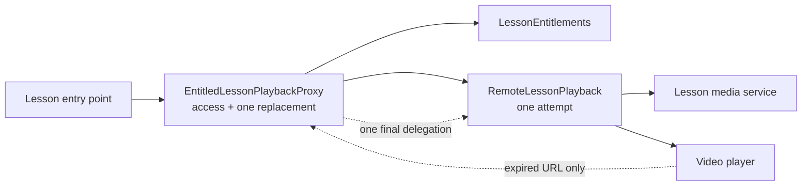

# 🛡️ Proxy


> **Caption:** One playback substitute guards the remote lesson resource and
> contains its single-use URL renewal policy for every app entry point.

**Category:** Structural

## 🎯 The app problem

A subscription learning app plays lessons through short-lived media URLs. The
lesson detail screen, a Continue Watching card, and next-lesson autoplay all
need the same guarantees: reject a locked lesson before contacting the media
service, request a URL only for an entitled subscriber, and replace that URL
once when the player reports explicit expiration.

### Requirements

- Present one lesson playback operation to every app entry point.
- Check entitlement before requesting protected media.
- Perform no remote or player work after denied access.
- Replace only an explicitly expired URL, and only once per playback request.
- Preserve media-service and non-expiration player failures unchanged.
- Keep the remote subject usable behind the same interface as the guarded
  substitute.

## 🪶 Start with direct Swift

[`LessonPlaybackDirect.swift`](../../Sources/DesignPatterns/Proxy/LessonPlaybackDirect.swift)
keeps the original policy in one `DirectLessonPlaybackModel.play(_:)` method.
That is the better design while only the lesson detail screen needs playback:
the access check, initial request, and one expiration-specific replacement fit
in one visible control flow.

The direct version deliberately has no interface, wrapper, cache, repository,
generic retry helper, or framework integration. Its explicit second attempt is
safer than an arbitrary retry abstraction because only
`expiredPlaybackURL` earns another media request.

## ⚡ The turning point

[`LessonPlaybackPressure.swift`](../../Sources/DesignPatterns/Proxy/LessonPlaybackPressure.swift)
adds Continue Watching and next-lesson autoplay as credible clients. The result
is three copies of one mandatory policy:

- three entitlement guards;
- nine concrete dependency slots;
- six media-service request sites;
- six player invocation sites; and
- three expiration catch clauses.

The clients differ only in the product event that initiates playback. If a
fourth caller forgets the gate, protected media is requested before access is
known. If it catches every player error, an unavailable player is mistaken for
an expired URL. Tests can expose those mistakes, but they cannot create one
owner for the rule.

## 🧭 Pattern intent

Proxy supplies a substitute for the remote lesson subject. Both offer the same
`play(_:)` operation, but the proxy controls access and the short-lived URL
lifecycle before or around delegation. Callers depend on the resource operation
rather than on entitlements, URL issuance, or player details.

This is a protection and lifecycle Proxy, not a transparent network cache. The
type name deliberately says `EntitledLessonPlaybackProxy` so the authorization
boundary remains visible at the composition root.

## 🧩 Participants and responsibilities

| App role | Swift type | Responsibility |
| --- | --- | --- |
| Subject boundary | [`LessonPlayback`](../../Sources/DesignPatterns/Proxy/LessonPlaybackProxy.swift) | Defines the single lesson-resource operation shared by the real subject and proxy. |
| Real subject | [`RemoteLessonPlayback`](../../Sources/DesignPatterns/Proxy/LessonPlaybackProxy.swift) | Requests one short-lived URL and asks the player to start it exactly once. |
| Proxy | [`EntitledLessonPlaybackProxy`](../../Sources/DesignPatterns/Proxy/LessonPlaybackProxy.swift) | Denies unauthorized access, delegates to the subject, and permits one second delegation only after explicit URL expiration. |
| Access collaborator | [`LessonEntitlements`](../../Sources/DesignPatterns/Proxy/LessonPlaybackDirect.swift) | Answers whether the subscriber may open a lesson and records the checked identifier. |
| Remote collaborators | [`ScriptedLessonMediaService`](../../Sources/DesignPatterns/Proxy/LessonPlaybackDirect.swift) and [`ScriptedLessonPlayer`](../../Sources/DesignPatterns/Proxy/LessonPlaybackDirect.swift) | Make URL issuance and playback outcomes deterministic without production networking or media frameworks. |

The protocol has two immediate implementations. The three demonstrated entry
points can now receive the same guarded operation instead of coordinating its
collaborators. The generic proxy preserves the concrete subject and value
semantics; there is no existential storage or type-erased box because runtime
selection is not a requirement.

## ⚙️ How the Swift implementation works

1. `RemoteLessonPlayback.play(_:)` requests one URL from the media service and
   gives it to the player. It contains no entitlement decision and no retry.
2. `EntitledLessonPlaybackProxy.play(_:)` checks the lesson identifier before
   delegating. A rejection exits before the real subject performs any work.
3. An authorized request delegates through the same `LessonPlayback` operation.
4. The proxy catches only `LessonPlaybackError.expiredPlaybackURL` from the
   first delegation and invokes the subject one more time.
5. The second call is not wrapped by another catch, so a second expiration is
   terminal. Media unavailability and player unavailability also pass through
   unchanged.

The composition root remains explicit:

```swift
var playback = EntitledLessonPlaybackProxy(
    entitlements: LessonEntitlements(
        accessibleLessonIDs: subscribedLessonIDs
    ),
    subject: RemoteLessonPlayback(
        mediaService: mediaService,
        player: player
    )
)

let session = try playback.play(lesson)
```

Continue Watching, lesson detail, and autoplay can store or receive that same
operation. They no longer coordinate three mutable collaborators or own the
order of the guard and replacement rule.

## 🗺️ Diagram



Observe that the client and proxy use one playback operation, while the real
subject performs one remote attempt. The proxy owns the only gate and the only
decision to delegate again; the remote subject never decides who may access a
lesson or how many replacements are allowed.

**Accessible description:** A lesson entry point asks the proxy to play a
lesson. The proxy first consults entitlements. When access is allowed, it asks
the real remote playback subject to request a URL and start the player. Only if
the player reports that URL as expired does the proxy call the subject one more
time; every other result returns directly to the entry point.

## ▶️ Run the example

From the repository root:

```sh
swift test -Xswiftc -warnings-as-errors --filter ProxyTests
```

The suite runs entirely against deterministic value types. It requires no
network connection, subscription backend, DRM system, or Apple media framework.

## 🧪 Tests

```sh
swift test -Xswiftc -warnings-as-errors --filter ProxyTests
swift test -Xswiftc -warnings-as-errors --filter ProxyProblemTests
swift test -Xswiftc -warnings-as-errors --filter ProxyPressureTests
```

[`ProxyTests.swift`](../../Tests/DesignPatternsTests/ProxyTests.swift) proves:

- the real subject performs exactly one URL request and player attempt;
- the proxy substitutes on the same playback operation;
- denied access never reaches the real subject;
- every playback request rechecks access and requests a fresh URL rather than
  caching either decision;
- one expiration causes exactly one additional subject invocation;
- a second expiration remains terminal; and
- media-service and non-expiration player failures are not retried, including
  media failure while replacing an expired URL.

The problem and pressure suites retain the executable direct baseline and the
three-client evidence that earned the boundary.

## ⚖️ Trade-offs

### What improves

- Three clients stop owning entitlement and URL-lifecycle orchestration.
- The access-before-remote-work invariant has one implementation.
- The one-replacement budget is visible in a two-call control flow rather than
  hidden in a generic retry engine.
- Tests and future local-media subjects can use the same narrow operation.
- The real subject stays focused on one remote playback attempt.

### What it costs

- The final design adds one protocol, one real-subject type, and one proxy type.
- The proxy must expose or otherwise preserve mutable subject state when a value
  type wraps deterministic collaborators.
- Generic nesting fixes the concrete subject at composition time. Runtime
  switching among unrelated subjects would require a closed enum, an
  existential, or deliberate type erasure.
- The word “proxy” alone does not communicate policy, so the concrete type name
  must keep the entitlement responsibility explicit.

## 🔀 Alternatives considered

| Alternative | Prefer it when | Why it does not meet this example now |
| --- | --- | --- |
| One direct playback model | Only one client owns a short, stable policy. | Three clients already repeat the gate and URL lifecycle. |
| Shared free function | The operation is module-private and substituting the resource has no value. | It still accepts all mutable collaborators and gives the resource boundary no concrete owner. |
| Distinct authorized playback service | Callers must explicitly request authorization rather than use a substitute transparently. | It is a valid naming alternative; the current proxy name already exposes the entitlement policy while preserving the subject operation. |
| Decorator | Behaviors are independently optional and order is a configuration choice. | Entitlement and bounded renewal are mandatory, fixed policy for every caller. |
| Facade | A client needs a simpler operation over a broad subsystem. | Clients already want one lesson-resource operation; the issue is controlled substitution, not hiding a large API. |
| Chain of Responsibility | One ordered handler may own a request or pass it onward. | The proxy always guards one known subject; it is not searching for a handler. |

Decorator and Proxy can have similar forwarding shapes. Their product decisions
are different: Decorator lets a composition root select and order upload
behaviors, while this Proxy presents one mandatory guarded substitute for one
remote lesson resource. Reordering or omitting the entitlement gate is not a
supported configuration.

## 🚫 When not to use it

- Keep `DirectLessonPlaybackModel` while only one caller owns the short policy.
- Prefer a free function when the boundary is private, stateless, and will not
  be substituted in production or tests.
- Do not add a Proxy merely to rename a service or forward every call without
  access, lifecycle, lazy-loading, location, or caching responsibility.
- Do not add caching to this example without evidence for freshness,
  invalidation, memory limits, and concurrent request behavior.
- Do not use a configurable wrapper stack when every caller requires the same
  guard in the same order.
- Do not hide authorization so completely that security-sensitive callers
  cannot identify where access is enforced.

## 🗂️ Source map

- [`LessonPlaybackProxy.swift`](../../Sources/DesignPatterns/Proxy/LessonPlaybackProxy.swift) — shared boundary, one-attempt remote subject, and entitled proxy.
- [`LessonPlaybackDirect.swift`](../../Sources/DesignPatterns/Proxy/LessonPlaybackDirect.swift) — domain values, deterministic collaborators, and original direct solution.
- [`LessonPlaybackPressure.swift`](../../Sources/DesignPatterns/Proxy/LessonPlaybackPressure.swift) — duplicated Continue Watching and autoplay policies.
- [`ProxyTests.swift`](../../Tests/DesignPatternsTests/ProxyTests.swift) — final subject and proxy behavior tests.
- [`ProxyProblemTests.swift`](../../Tests/DesignPatternsTests/ProxyProblemTests.swift) — direct baseline acceptance tests.
- [`ProxyPressureTests.swift`](../../Tests/DesignPatternsTests/ProxyPressureTests.swift) — parameterized multi-client pressure evidence.
- [`proxy-problem.md`](../../Documentation/proxy-problem.md) — requirements, invariants, and direct-design decision.
- [`proxy-pressure.md`](../../Documentation/proxy-pressure.md) — measured duplication and pattern boundary.
- [`proxy-header.png`](../../Documentation/Assets/Patterns/structural/proxy-header.png) — editorial header.
